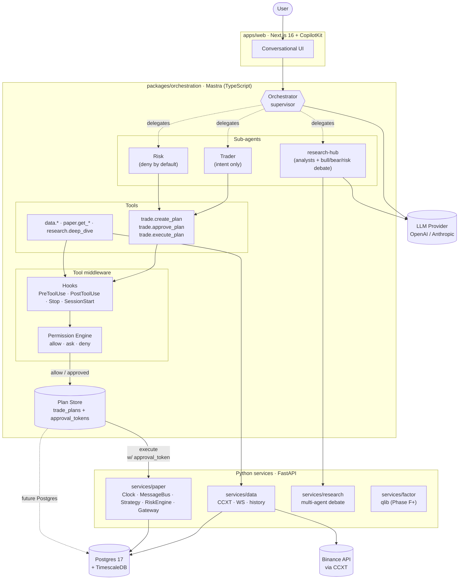

<div align="center">


<h1>Inalpha</h1>

<p><em>Find alpha with a fox's eye.</em></p>

<p>The quant familiar &nbsp;·&nbsp; backtest = paper = live</p>

<p>
  <strong>English</strong> &nbsp;|&nbsp; <a href="README.zh-CN.md">中文</a>
</p>

<p>
  <a href="LICENSE"></a>
  
  
  
</p>

</div>

---

## Overview

Inalpha is an **open-source quant trading framework designed for serious research**. It brings together multi-agent LLM collaboration, a unified trading kernel, and a declarative engineering harness in a single system. Backtest, paper, and live execution share one strategy codebase. Research, decision-making, and risk control are carried out by agents holding opposing positions — not by treating the LLM as an opaque signal source.

The name combines **Ina**ri (the Japanese fox deity of prosperity) with **alpha** (the quant term for excess return) — *find alpha with a fox's eye.*

---

## Design Principles

| Principle | Substance |
|---|---|
| **Unified kernel** | One strategy codebase runs across backtest, paper, and live. Behavior must be consistent across all three, or none of it is meaningful. |
| **Agents are first-class** | Research, decision, risk, and review have dedicated agents — opposing stances, distinct toolsets, traceable decisions. Not a chat wrapper. |
| **Transparency over precision** | Prefer an agent that says "I don't know" over one that sounds certain but cannot show its evidence. |
| **Engineering discipline over clever shortcuts** | Decision records, tests, declarative guards come first. Clever code is a bug nursery. |
| **Long-horizon compounding** | Solid infrastructure before flashy features. Surviving long matters more than running fast. |

---

## Architecture



Three independent layers with explicit protocols between them: the UI expresses intent through conversation, the orchestration layer schedules agents and tools, and the kernel services preserve event-driven determinism in Python.

**LLM has no direct path to placing an order.** Every trade intent must travel through `trade.create_plan → trade.approve_plan → trade.execute_plan`, layered behind a Hooks middleware (5 lifecycle events) and a declarative Permission Engine (allow / ask / deny). The `approval_token` is one-shot and expires by default after 5 minutes. See [`docs/04-current-state.md`](docs/04-current-state.md) for the live implementation status, including which modules have landed and what is still in flight.

---

## Core Modules · Finding Alpha

The name **Inalpha** combines Inari with *alpha*. Finding alpha is the project's center of gravity — and these three modules are where it happens.

### 1. Factor Discovery — agents that actually surface alpha

**The problem.** Traditional factor research is bottlenecked by the researcher's manual loop: read paper → translate to expression → backtest → check for lookahead bias → check for multiple-testing artifacts → repeat. A single human can validate maybe 5–10 hypotheses a day.

**The design.** A four-tier progressive framework (L0 → L3) that lets agents do the dirty work — safely:

- **L0 · Conversational exploration.** Eight `factor.*` tools — `formalize`, `compute`, `future_return_stats`, `ic_test`, `correlation_with_library`, `multiple_testing_check`, `propose`, `register` — let users discuss a hypothesis in natural language and validate it in seconds.
- **L1 · Hypothesis-to-validation workflow.** A fixed pipeline with an `economic_story_gate`; no step may be skipped.
- **L2 · Multi-agent research crew.** HypothesisHunter / Formalizer / Coder / Backtester / Critic / Curator divide and conquer.
- **L3 · Automated swarm + cron.** Weekly scan of 50–200 candidates → top survivors enter the review queue.

**The safeguards.** Five `PreToolUse` hooks deterministically intercept the classic factor-mining mistakes — `lookahead-check`, `universe-survival-check`, `param-search-cap`, `min-sample-check`, `normalization-leak-check`. Multiple-testing correction is mandatory. `factor.register` is permanently `modelInvocable: false` — the agent cannot push to production on its own.

### 2. Strategy Evolution — strategies that improve themselves

**The problem.** Human-written strategies hit a velocity ceiling. Traditional genetic algorithms only tune parameters; they cannot discover structural innovations such as "add an RSI filter to the SMA cross."

**The design.** A FunSearch / AlphaEvolve-style triad — *LLM as mutation operator + Island Model + MAP-Elites* — operating on full Python source code, not AST or parameter vectors:

- **Mutation.** The LLM receives the current strategy source plus the last backtest report and returns a unified diff. Diffs are short (cache-friendly), reviewable, and rollback-safe.
- **Diversity.** A MAP-Elites grid (annual return × turnover) preserves the best individual in each behavioral cell — the population never collapses to a single Sharpe-maximizing clone.
- **Robustness.** Island Model runs 3–5 independent populations in parallel with periodic migration, preventing premature convergence.
- **Safety.** Three sandbox gates (AST audit / subprocess isolation / `Strategy` protocol contract) precede every candidate run. The fitness function is multi-objective (Sharpe + Calmar − turnover penalty − drawdown veto), so the LLM cannot game a single metric.

The framework progresses E1 (single-generation closed loop) → E4 (MCP tool exposed to the Mastra orchestrator), with each tier requiring two weeks of stable operation before the next.

### 3. Swarm — scaling research and backtesting

**The problem.** Real research is inherently concurrent: 5 symbols × 3 factor families × 4 time windows = 60 parallel backtests. Running them sequentially on the Node orchestration layer is a dead end — single-threaded and CPU-bound.

**The design.** A clean separation between **what the orchestrator does** and **where compute lives**:

- The Mastra workflow does only `expand → dispatch → await → aggregate`. No CPU-heavy work in Node.
- The real worker pool lives inside `services/paper`'s backtest engine (Python multiprocessing with `ulimit`-bounded subprocesses).
- The same swarm pattern drives backtest, paper, and (eventually) live — switching is a Gateway change, not a rewrite.
- `foreach({ concurrency: N })` controls in-flight job count; the engine pulls jobs at its own pace.

**What this enables.** "Run momentum / mean-reversion / breakout across BTC, ETH, SOL, BNB, AVAX for 2024" becomes a single workflow call — fan out 15 backtests, aggregate, present a Pareto frontier. The same primitives drive paper-account batch evaluation and, later, multi-strategy live execution.

---

## Built on the shoulders of

Inalpha is not invented from scratch. It selectively inherits proven designs from prior work, with explicit boundaries around **what we take and what we leave**:

| Project | What we inherit | What we don't |
|---|---|---|
| [**Nautilus Trader**](https://github.com/nautechsystems/nautilus_trader) | The `backtest = paper = live` invariant; event-driven kernel; unified Clock / MessageBus abstractions | Rust implementation (Python first for ecosystem depth; revisit critical paths in Rust later) |
| [**vnpy**](https://github.com/vnpy/vnpy) | Gateway abstraction and multi-market access philosophy | CTP / XTP-style domestic Chinese venues (crypto-focused for now) |
| [**Microsoft qlib**](https://github.com/microsoft/qlib) | Factor expression DSL, the Alpha158 paradigm, point-in-time universe design | End-to-end ML training pipeline (we use qlib as a factor lab, not a replacement) |
| [**TradingAgents**](https://github.com/TauricResearch/TradingAgents) | Multi-agent opposing stances (bull / bear / risk), debate-driven decisions | Demo-grade prompt scaffolding (we engineer the same pattern through hooks and plan-exec) |
| [**Anthropic Claude Code**](https://claude.com/claude-code) | Hooks (PreToolUse / PostToolUse / Stop), declarative permissions, Plan/Exec separation, MCP, subagent isolation, prompt-cache engineering | Coding-specific tools like Bash / file editing (tool set redesigned for trading) |
| [**Mastra**](https://mastra.ai) | TypeScript agent orchestration scaffolding, `createTool` / `createWorkflow` primitives | — |

---

## Design Advantages

Inalpha's edge is not "more features" — it is "several things done right at the same time":

### 1. One codebase, three environments

Strategy classes are written once and execute against three interchangeable Gateways. When backtest and live behavior diverge, the cause is no longer "two different code paths" — it can be isolated to genuine physical differences: matching slippage, latency, data precision.

### 2. Opposing agents that cooperate

The Trader wants to place an order. The Risk agent rejects by default. The Research agent supplies independent evidence. The Portfolio agent considers correlations. This is the TradingAgents paradigm — but **engineered**: all inter-agent messages flow through the MessageBus, all decisions are replayable, and every order intent passes a two-phase Plan/Exec approval.

### 3. Declarative guardrails, not vibe-coding

Hooks are declared in `config/hooks.yaml`. Permissions in `permissions.yaml`. MCP servers in manifests. **Changing the guardrails does not touch business code; a failing guardrail has a single point of debug.** This is the "engineered agent" idea borrowed from Claude Code.

### 4. AI-tool neutral

[`CLAUDE.md`](CLAUDE.md) gives Claude Code users project-level memory. [`AGENTS.md`](AGENTS.md) gives Cursor / Codex / Aider / Cline / Continue users the same hard constraints. Switching tools doesn't lose discipline.

### 5. Local-first, open-first

Strategies, data, and decision records live locally. LLM calls go to external providers, but **structured outputs and cache control are owned by the repository** — observable, auditable, provider-swappable.

---

## For whom

| Audience | Value |
|---|---|
| Quant researchers and students | LLM agents accelerate research; one tech stack for backtest and live |
| Trading system engineers | A reference integration of modern agents with traditional kernels, cross-referenced against Nautilus / qlib / vnpy |
| AI agent developers | Real-world financial deployment of multi-agent + hooks + permissions |
| Individual traders (research-oriented) | A research companion you can talk to, plus an engineered home for your strategies |

| Not for you if you want | Look here instead |
|---|---|
| Subscription "AI signals" or copy-trading | Inalpha is a tool, not a product |
| Millisecond high-frequency trading | [Nautilus Trader](https://github.com/nautechsystems/nautilus_trader) (Rust kernel) |
| Market making or cross-exchange arbitrage | [Hummingbot](https://github.com/hummingbot/hummingbot) |
| A plug-and-play production system | Nautilus Trader (mature) |

---

## Quick Start

```bash
pnpm i                                  # Node packages (packages/orchestration)
uv sync                                 # Python packages (services/_shared, data, paper)

# Start services (in separate terminals)
cd services/data  && uv run python -m inalpha_data.main
cd services/paper && uv run python -m inalpha_paper.main
cd packages/orchestration && pnpm dev   # mastra dev
```

Open the `mastra dev` playground to start a conversation with the orchestrator agent.

---

## AI Collaboration

Inalpha is **built for human–AI collaboration**. Regardless of which AI coding tool you use, the hard constraints (naming, brand name, untouchable directories, commit conventions, the three-part tool-description style) are declared in:

- [`CLAUDE.md`](CLAUDE.md) — Claude Code project-level memory
- [`AGENTS.md`](AGENTS.md) — common entry point for Cursor / OpenAI Codex / Aider / Continue / Cline
- `scripts/check-consistency.sh` — mechanical cross-file consistency checks

---

## Acknowledgments

Inalpha stands on the shoulders of giants. Sincere thanks to the following projects, authors, and communities:

**Trading System Paradigms**

- [Nautilus Trader](https://github.com/nautechsystems/nautilus_trader) and its maintainers, for showing what the "same-code invariant" looks like as an engineering philosophy
- The [vnpy](https://github.com/vnpy/vnpy) community, pioneers of the Chinese-language quant open-source ecosystem
- The [Microsoft qlib](https://github.com/microsoft/qlib) team, for distilling the quant factor pipeline into a textbook-quality open-source reference
- [Hummingbot](https://github.com/hummingbot/hummingbot) and [Freqtrade](https://github.com/freqtrade/freqtrade), for defining what is possible in open-source crypto trading tooling

**Agent and LLM Engineering**

- [TradingAgents](https://github.com/TauricResearch/TradingAgents) and Tauric Research, for bringing multi-agent debate into finance
- [Anthropic](https://anthropic.com) and the [Claude Code](https://claude.com/claude-code) team, for turning hooks / permissions / plan-exec / MCP into engineering primitives others can borrow
- The [Mastra](https://mastra.ai) team, for a mature TypeScript agent orchestration scaffold
- The [Model Context Protocol](https://modelcontextprotocol.io) specification and its contributors

**Infrastructure**

- [PostgreSQL](https://postgresql.org) · [TimescaleDB](https://timescale.com) · [FastAPI](https://fastapi.tiangolo.com) · [CCXT](https://github.com/ccxt/ccxt) · [Next.js](https://nextjs.org) · [CopilotKit](https://copilotkit.ai) · [uv](https://github.com/astral-sh/uv) · [pnpm](https://pnpm.io) — the foundation Inalpha stands on

**Spiritual Kinship**

- Every quant researcher who refuses to accept opaque "AI signals" — this project is written for you

May Inalpha, in time, give back.

---

## License

**[PolyForm Noncommercial 1.0.0](LICENSE)** — open source, but **commercial use is prohibited**.

- Allowed: personal research, academic, educational, nonprofit, and open-source integration
- Prohibited: any commercial use (including commercial consulting, SaaS, and commercial internal use)
- Commercial licensing: please open an issue to discuss

---

<div align="center">
  <sub>
    <strong>Inalpha</strong> &nbsp;·&nbsp; Where Inari meets alpha &nbsp;·&nbsp; 2026
  </sub>
</div>
