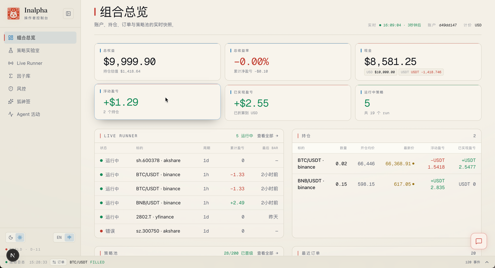
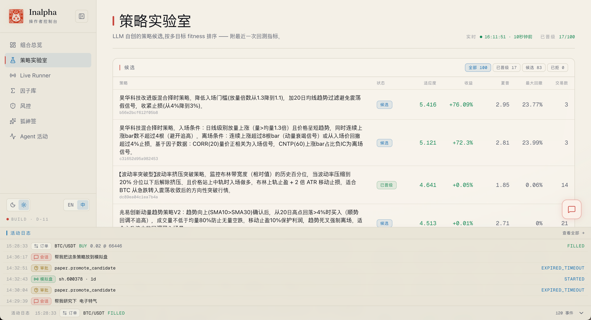
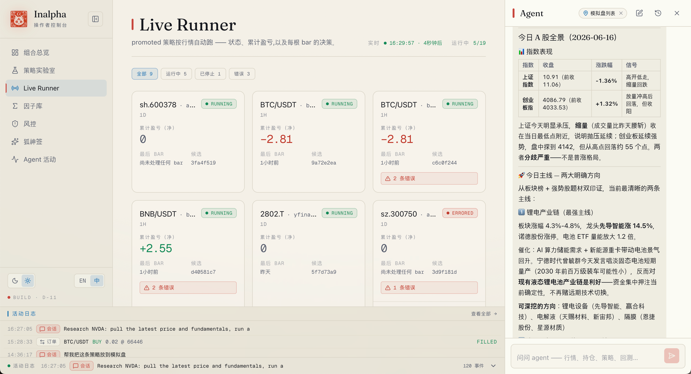
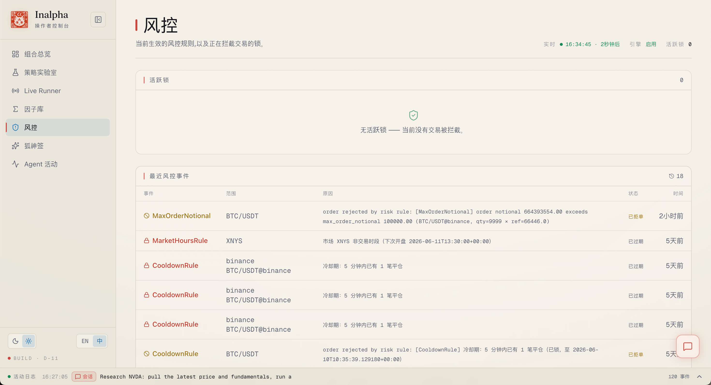
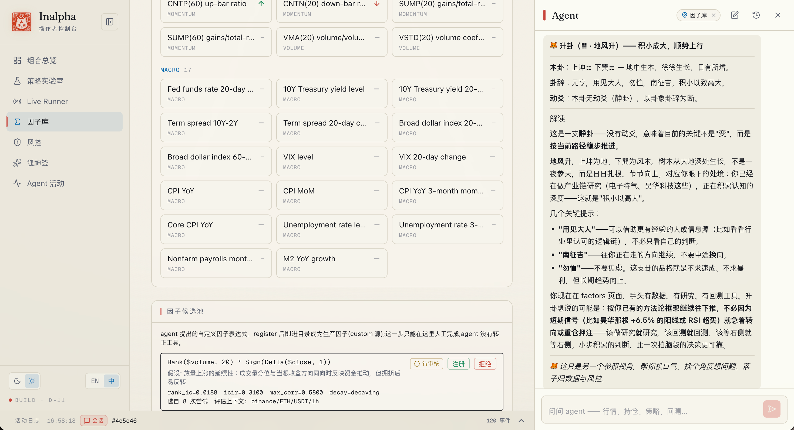

<div align="center">


<h1>Inalpha 🦊</h1>

<p><strong>可审计的量化 agent，能进化的策略。</strong></p>

<p><em>问卜有签，落子有据。</em></p>

<p>有效因子择时 &nbsp;·&nbsp; 多视角研究 &nbsp;·&nbsp; 因子实验室 &nbsp;·&nbsp; 风控引擎 &nbsp;·&nbsp; 策略进化 &nbsp;·&nbsp; 机器审批下单 &nbsp;·&nbsp; 狐神签</p>

<p>
  <a href="README.md">English</a> &nbsp;|&nbsp; <strong>中文</strong>
</p>

<p>
  <a href="LICENSE"></a>
  
  
  
  
</p>

<p><em>每个因子提案、每次策略变异、每笔订单路由——都有日志、有版本、可复核。Agent 自己挑当前有效的因子来择时、自己写策略、自己进化；LLM 只负责写代码，工程纪律为每个决策背书。</em></p>

</div>

---

## Overview

Inalpha 是一个**用工程纪律驱动的专业量化 agent 框架**。它不把 LLM 当作黑箱信号源，而把它视作受 hooks / permissions / plan-exec / 一次性签名约束的代码协作者——每一步关键动作都留痕、可版本化、可复核。

**Agent 自己挑当前有效的因子来择时。** 不写死一组指标，而是按时序 Rank IC 选出"当下最灵"的因子（`factor.timing`），给研究和择时背书。数据则默认带来源、`as_of` 时点与 freshness 校验——agent 不会悄悄拿着过期数据继续讲故事。

在这套护栏之上，铺开几条能力线：

- **因子实验室 + 有效因子择时。** Agent 负责 formalize、compute、IC 检验、多重检验校正、register；并按时序 Rank IC 挑出当前有效的因子来择时。每个假设都带作者、时间戳与经济故事门的判定记录。
- **多视角研究。** 一次深度研究叫上技术 / 基本面 / 情绪 analyst，外加可选的"投资大师团"（巴菲特 / 林奇 / 伍德 / 伯里 / 德鲁肯米勒 / 马克斯）形成对立视角，再汇成综合判断。
- **风控引擎。** 仓位上限、价格偏离、回撤一票否决等规则在 HTTP 边界声明式生效，不写在 prompt 里。
- **策略进化。** LLM 变异完整 Python 源码，三道沙盒（AST 审计 / 子进程隔离 / `Strategy` 协议契约）先于任何候选回测；多目标 fitness（Sharpe + Calmar − turnover − drawdown 一票否决），单一指标卷不了。
- **机器审批下单（LLM 不直连）。** 下单意图走 `trade.create_plan → approve → execute_plan`，配一次性、短 TTL 的 `approval_token`；LLM **没有**直接下单路径，每一步留痕成审计链。
- **狐神签（趣味彩蛋）。** 方向犹豫时求一卦 / 抽张塔罗，给个数据之外的参照视角；**硬隔离于决策**，风控 / 下单 / 因子都碰不到（详见下方核心能力 §7）。

项目命名取自日本稻荷狐神 **Ina**ri 与量化术语 **alpha**：一个会替你问卜方向、又把每一步记上账的量化伙伴。

> **当前状态：** Inalpha 处于 **alpha** 阶段（Phase D-12，因子库闭环：70+ 因子配血缘 + 衰减巡检（只告警、不自动剔）、受限 DSL 的因子发现 L1，以及三方制研究辩论；建立在 D-11 多市场模拟盘（跨币种 cash + live runner 让 promoted 策略按行情自动跑）、D-10 多市场数据、D-9 LLM 自创策略 + 风控引擎之上）。欢迎读代码、参与设计——**请勿用真实资金跑**（真钱实盘不在当前计划）。

---

## 操作者控制台

**操作者控制台**（`apps/dashboard`）是主入口——一块运行时看板把原本要问 agent 才知道的状态一眼铺开，右侧还常驻一个 agent 对话栏。下面这些是本地真实运行中的控制台界面。

<p align="center">
  
</p>
<p align="center"><sub><strong>组合总览</strong> —— 账户、持仓、Live Runner、最近订单、策略池一屏看尽，配 KPI 条（收益 · 最大回撤 · 夏普 · 胜率）。</sub></p>

<table>
<tr>
<td width="50%" valign="top">

<br /><sub><strong>策略实验室</strong> —— LLM 自创候选按多目标 fitness 排序、可按状态筛选；点进看源码 + 审计日志。</sub>
</td>
<td width="50%" valign="top">

<br /><sub><strong>Live Runners</strong> —— promoted 策略按行情自动跑，每根 bar 的决策都留痕、可复盘。</sub>
</td>
</tr>
<tr>
<td width="50%" valign="top">

<br /><sub><strong>风控面板</strong> —— 声明式规则在撮合前生效，活跃锁与事件历史实时可见。</sub>
</td>
<td width="50%" valign="top">

<br /><sub><strong>因子库</strong> —— 70+ 因子（pandas-ta / Alpha101 / qlib + FRED 宏观），按当前有效性 IC 排序。</sub>
</td>
</tr>
</table>

> 本地把控制台跑起来见 [Quick Start](#quick-start)（`pnpm dev` → <http://localhost:3001>）。

---

## Design Principles

| 信条 | 内涵 |
|---|---|
| **纪律优先于氛围** | hooks、permissions、plan-exec、一次性 approval_token 都在 config 声明，不在 prompt 里——护栏失效有单点可调试 |
| **结构化角色，不是包装层** | 研究由多位 analyst + bull / bear / risk 立场对抗辩论组成；每个决策都经 hooks、permissions、plan-exec 路由。结构在代码里，不在一句巨型 prompt 里 |
| **透明胜于精确** | 宁可要一个"我不知道"的 agent，也不要一个"看起来笃定但说不清依据"的 agent |
| **统一内核** | 回测、模拟盘共用一份策略代码——切换的是 Clock 与 Gateway，不是逻辑。行为分歧时根因只剩物理差异（滑点、延迟、数据精度），而非"两条代码路径"。（真钱实盘刻意不做。） |
| **长期主义复利** | 基础设施扎实优先于花活；项目跑得久比跑得快重要 |

---

## 系统架构

三层软件 + 一层数据。请求往下走，结果往上回。

**L1 · 用户入口。** 操作者控制台（`apps/dashboard`）是主入口，右侧内嵌 agent 对话栏；也可用 `mastra dev` playground 看 live trace，或直接调 tool CLI。

**L2 · 编排层** —— `packages/orchestration`（Mastra · TypeScript）。**LLM 唯一运行的一层**：一个 orchestrator agent，外裹一整套护栏——tools、hook/permission 中间件、in-memory plan store、对话 memory、telemetry。

**L3 · 内核服务** —— Python · FastAPI。四个独立的有状态进程，各管一摊：

| 服务 | 负责 |
|---|---|
| `services/data` | 行情、web 搜索、财报基本面（A股 / 港股 / 美股 / 全球）。 |
| `services/paper` | 事件驱动内核——回测 + 模拟盘**共用同一份代码**——外加 LLM 自创策略沙盒与 live runner。 |
| `services/research` | 多 agent 深度研究：6 analyst 并行，再走 bull / bear / risk 辩论（只在分歧时才触发，配软早停，决策链路全程落盘可复盘）。 |
| `services/factor` | 因子库（pandas-ta / Alpha101 / qlib + FRED 宏观）：IC 检验、当前有效因子择时、血缘衰减巡检、DSL 因子发现。**只产出信号——绝不下单。** |

**L4 · 持久化 + 外部依赖。** Postgres + TimescaleDB 承载全部时序与业务状态。外部行情覆盖 crypto、美股 / A股 / 港股 及日欧等单股市场、全球指数、FRED 宏观——orchestrator 按市场类型自动路由每个 venue。

进化循环与 runtime 并行异步运行，胜出策略推回 `services/paper` 跑回测评估（沙盒门、fitness 函数、E1 → E4 渐进路径见下方[核心能力 §3](#3-策略进化--让策略写出更好的下一代)）。当前已落地模块清单、未完成项、决策链路 sequence diagram 见 [`docs/04-current-state.md`](docs/04-current-state.md)。

---

## 核心能力

下面这些能力的产出，从落地的第一天就是可审计的——不是事后加补丁。

### 1. 因子实验室 · 把每一个 alpha 想法记成档

「因子假设」就是一句关于"什么能预测收益"的猜想——比如"低波动股长期跑赢"、"期权 skew 在大跌前会变陡"。传统做法是研究员一个个验，一天能跑完 5-10 个就不错了。Inalpha 让 agent 替你跑，但不允许它走捷径。

- **聊一聊就开工。** 用自然语言抛一个假设，agent 自动把它形式化、计算因子值、跑标准统计检验。
- **不只是记档，还会择时。** agent 不写死一组指标，而是按时序 Rank IC 选出"当下最有效"的因子，给研究和择时背书（`factor.timing`）——市场轮动了，挑的因子也跟着换。
- **「为什么」是必经的门槛。** 没有 economic story 的因子，进不了因子库——这是规则，不是建议。
- **经典坑全是 hook 拦着的。** 前视偏差、生存偏差、过参数搜索、样本不足、归一化泄漏，五道中间件检查在结果污染之前各自拦下一种。
- **不能自动上线。** 因子注册到正式库这一步永远只能人工执行；被拒的因子也存档备复盘，不会悄无声息地丢掉。

> 已上线：对话式工具（L0）、固定验证流程（L1），以及因子发现——受限 DSL 候选池（多重检验校正 + null IC 基准）+ 对策略所依赖因子的血缘衰减巡检。多 agent 因子小组（L2）与每周自动扫描（L3）仍在规划。设计细节见 `docs/03-kernel-design.md`。

### 2. 风控与审计 · LLM 不可绕过审批触达订单

让 LLM 直接调 `submit_order` 是亏钱最快的姿势。Prompt 里写"不要超过 10% 仓位"不是约束，只是建议——足够自信的模型分分钟会覆盖。所以 Inalpha 把风控从 prompt 挪进了中间件。

- **下单分三步。** 任何交易意图都走 *提议 → 审批 → 执行*。审批（由风控 agent、人工，或自动规则）签发一次性、短时效的签名 token；执行消耗 token，token 一用即作废。
- **硬规则落在服务边界。** 仓位上限、价差守门、回撤一票否决、品种类别上限——在任何状态变更之前就生效。违规订单被直接拒掉，拒因关联到原始提议留档。
- **完整审计链。** 每一次提议、审批、执行都持久化记录——谁、为什么、何时、token 的完整生命周期。同一份记录用于事后复盘，也回灌给策略进化作为反馈。
- **框架级灾难止损。** 独立于任何策略，Position Guard 在回测与 live 都强制一道灾难止损（默认 −20% 硬止损）——它不问 LLM，prompt 也劝不动它不触发。

### 3. 策略进化 · 让策略写出更好的下一代

人工写策略有速度上限；传统调参只能转旋钮，发现不了"在 SMA 交叉里加一个 RSI 过滤"这种结构性创新。Inalpha 让 LLM 直接改 Python 源码，但每个候选都必须先过沙盒，才能跑回测。

- **写的是整段源码，可从已验证原型起步。** LLM 直接产出策略的完整 Python 源码——可从一个预先验证过的 archetype 骨架起步、降低协议踩坑——再对着上一次回测报告迭代。（小 diff / unified-diff 变异随 E2 到来。）
- **回测之前三道沙盒。** 静态代码审查、子进程隔离运行、`Strategy` 接口契约校验——恶意或残缺代码根本到不了回测引擎。
- **均衡 fitness，且对照基线。** 候选按"收益 + 风险调整后收益 − 换手率 − 回撤一票否决"综合打分，并各自与 buy-and-hold 基线自动并跑——高分必须真的跑赢"光是持有"，不是只卷一个 Sharpe 数。（保留种群多样性的 MAP-Elites 行为网格属 E2。）
- **端到端可复现。** 每个候选的父策略、prompt、沙盒判定、得分都有版本——整条进化链可重放。

> D-9 上线 E1（单代闭环），目标渐进到 E4（进化循环作为单个 MCP tool 暴露给 orchestrator）；每一级要稳定运行 2 周才升下一级。

### 4. Swarm · 一次跑几十个回测

真实量化研究天生是并发的：5 标的 × 3 因子族 × 4 时段 = 60 个回测。在 agent runtime 里一个一个串行跑是死路。

Inalpha 把*调度*和*算力*分开：agent runtime 负责扇出网格、聚合结果；真正的 Python worker pool 在 `services/paper` 里跑，多进程 + 资源限制。"用 momentum / mean-reversion / breakout 在 BTC ETH SOL BNB AVAX 上跑 2024 回测" 就是一次 workflow 调用，返回一条 Pareto 前沿。

> 当前实现（S1）：单机进程池、并发 4、单次最多 20 个回测组。

### 5. 研究 · 多位投资大师同台

一次深度研究不只给你一个"标准答案"。除了技术面、基本面、情绪面的常规 analyst，你还能叫上一支"大师团"——巴菲特（价值 / 护城河）、林奇（GARP 成长）、伍德（颠覆创新）、伯里（逆向 / 泡沫）、德鲁肯米勒（宏观趋势）、马克斯（周期 / 风险）：各按自己的风格给观点，天然形成对立视角，再汇进综合判断。

- **按需启用，成本可控。** 不点名时普通研究成本不变；点了哪几位大师，才多跑那几次。
- **观点要落到数据。** 大师视角接技术面 / 基本面 / web 情报，`as_of` 是真现在，不许拿过时预测当现在。
- **bull / bear / risk 结构化辩论——已上线。** 在并行 analyst 之外，立场对抗的多头与空头研究员多轮交锋，风险官同时压测双方——只在 analyst 真出现分歧时才触发，论点不再变化时软早停，完整决策链路（为什么辩、为什么停、如何综合）全程落盘可复盘。

### 6. Skills · 吸收外部投研方法论

好的投资方法往往是一套**流程**，而非一个模型——比如"顺着热点主题一路追到供应链瓶颈"。Inalpha 能把这类方法当 **skill** 加载：auto-discovery 的 markdown 方法论，orchestrator 按需拉进 context。

- **渐进式披露。** 启动时扫描 skills 目录、只列一行菜单；某个 skill 的正文在任务真正需要时才加载——不撑爆 prompt，没有适用的时候零成本。
- **fail-open + 信任边界。** 坏掉的 skill 只 warn 跳过、绝不拖挂 agent。skill 是只读 markdown（不 vendor、不执行任何捆绑脚本），每个"查数据"步骤都映射到现有 `web.* / data.* / factor.* / research.*` 工具、沿用同一套 freshness 纪律。
- **已内置四个。** `cn-equity-research`（A股系统化调研）、`serenity`（供应链瓶颈投研）、`earnings-analysis`（财报复盘）、`thesis-tracker`（可证伪论点跟踪）——均全文改写成市场无关 + 数据溯源，任何交易动作都回审批链。

### 7. 狐神签 · 遇事不决，求签问个方向

真金白银的事，犹豫在所难免。这时不妨让肩驮 α 狐崽的巫女替你求一签——六爻起卦，或抽一张塔罗，给你一个**数据之外的参照视角**。添个角度、松口气，说不定狐神的签里藏着点意外的启发。

- **签是旁白，不是号令。** 卦象 / 牌面**绝不**碰风控、审批、下单或因子打分——它读不到、也左右不了任何真实决策。这反倒恰好印证：连狐神的签都挤不进决策链，机器审批这道边界是真的硬。
- **落子仍归数据。** 求完签，该看的还得看：研究、因子、回测说了算；狐神签只在一旁帮你松松眉头。

---

## Roadmap

每条能力的当前进度。已落地模块清单与端到端决策时序图见 [`docs/04-current-state.md`](docs/04-current-state.md)。

| 状态 | 能力 | Phase | 关键点 |
|---|---|---|---|
| ✅ 已上线 | Plan/Exec 审计链 + Hooks + Permission Engine | D-8a | 三步下单 · 一次性签名 token · 5 类生命周期 hook · allow / ask / deny 三态 |
| ✅ 已上线 | 研究 → 策略 → 回测 lineage | D-8c | `deep_dive → compose_strategy → run_backtest` 全链路串 `research_id` / `backtest_id` |
| ✅ 已上线 | LLM 自创策略 — E1 MVP | D-9 | 三道沙盒（AST 审计 / 子进程 / `Strategy` 协议契约） + 多目标 fitness + baseline 自动并跑 |
| ✅ 已上线 | 风控引擎落到 HTTP 边界 | D-9 | 声明式 `risk_rules.toml` · 撮合前 `enforce` · `risk_locks` 表（独立 commit） |
| ✅ 已上线 | Bull / Bear 研究员辩论 | D-9 | `services/research` 立场对抗研究员 |
| ✅ 已上线 | Scheduler / cron agent 模式 | D-9 | `scheduler_jobs` + advisory lock + `/api/scheduler/*` 管理面 |
| ✅ 已上线 | RiskGuard 账户级隔离 | D-9.1a | `RiskGuardFactory` 去除跨账户状态串联 |
| ✅ 已上线 | 多市场数据源 — web 搜索 + 财报基本面 | D-10 | DDGS 零 key web search · akshare（A股/港股）+ yfinance（全球）基本面 · analyst 接入 + 兜底 · lookbackDays 按市场分化 |
| ✅ 已上线 | 风控引擎 — 5 条规则全在 HTTP 路径激活 | D-9 收口 | `closed_trades` 由 HTTP 订单流写入；`RoutingCalendar` 覆盖美股 + crypto；trade-based 规则全在真实数据上触发 |
| ✅ 已上线 | `askUserChoice` — `ask` 权限路径 | D-11（issue #2） | pending-permission 流程把 `ask` 状态从 workaround 救回（已收口） |
| ✅ 已上线 | `permissions.yaml` 配置化 | D-11（issue #4） | `config/permissions.default.yaml` + `yaml_loader.ts` 替代 `defaults.ts` 硬编码 |
| ✅ 已上线 | 多市场模拟盘 — live runner + 跨币种 cash | D-11 | 已收盘 bar 驱动 `on_bar` → 护栏内 plan/exec · 按币种 cash 桶 + FX 折算 equity · D-11.1 信任边界加固（candidate 归属校验 · per-account run 上限 · 错误可重试分类） |
| ✅ 已上线 | 因子库 + IC 有效性 | D-11 | `services/factor`（pandas-ta / Alpha101 / qlib）· `factor.timing` / `.score` / `.catalog` · 只产出信号、不下单 |
| ✅ 已上线 | live runner 运维收口 | D-11.2 | PnL 净口径（扣手续费）· 运行时长 TTL auto-stop · build 阶段退避 + 错误分类 |
| ✅ 已上线 | Skills 作为程序化记忆 | D-11 | auto-discovery 的 markdown skill（progressive disclosure · fail-open · 只读信任边界） |
| ✅ 已上线 | 研究辩论 — 三方制 + 争议触发 | D-12 | 6 analyst + bull / bear / risk 研究员 · 争议（contested）才辩 · Jaccard 软早停 · 决策链路落盘 |
| ✅ 已上线 | 因子血缘 + 衰减巡检 | D-12 | `factor_snapshot` + `factor_baseline` · 独立衰减巡检 task · `factor_decay` 告警（只告警、不自动剔） |
| ✅ 已上线 | monthly FRED 宏观因子 | D-12 | CPI / 核心 CPI / 失业率 / 非农 / M2（62 → 70 因子）· per-series 发布滞后表 |
| ✅ 已上线 | 因子发现 — L1 | D-12 | 受限 qlib 风格 DSL（零 eval/exec）· `factor_candidates` 候选池 · 多重检验校正 + null IC 基准 · discovery workflow → propose；register 仅 dashboard 人工 |
| 🗓️ 已规划 | 策略进化 — E2 | E2 | 多代演化 + MAP-Elites + Island Model + `unified-diff` 变异（E1 单代闭环已在 D-9 上线） |
| 🔬 探索中 | Alpha Zoo 冷启动 | E1+ | 公开 alpha 库播种（Qlib / Kakushadze / GTJA） |
| 🔬 探索中 | E4 `evolve_strategy` MCP tool | E4 | 进化循环以单个 MCP tool 暴露给 orchestrator |
| 🔬 探索中 | Analog backtesting | 待定 | 历史相似窗口驱动回测区间（STUMPY） |

> **图例** — ✅ 已上线：行为已在 `main` 中 · ⏭️ 进行中：当前 phase 在做 · 🗓️ 已规划：未来 phase 已 scope、未开工 · 🔬 探索中：调研在档、无 commit 日期。

---

## For whom

| 适用 | 价值 |
|---|---|
| 量化研究员与 quant 方向学生 | LLM agent 加速研究，统一回测/模拟盘技术栈 |
| 交易系统工程师 | 现代 agent 与传统内核的整合样板，对照 Nautilus / qlib / vnpy 的工程权衡 |
| AI agent 开发者 | 真实金融场景中 multi-agent + hooks + permissions 的工程落地 |
| 个人交易者（研究取向） | 一个可对话的研究助手 + 一个能沉淀策略的工程化框架 |

---

## Quick Start

### 1 · 安装依赖

```bash
pnpm i      # Node 包（packages/orchestration）
uv sync     # Python 包（services/_shared, data, paper, research, factor）
```

### 2 · 配置 LLM Key（必须）

仓库根目录**单一 `.env`** 同时供 Mastra（TS）和所有 Python service 读取。拷贝模板后填你要用的那家 provider：

```bash
cp .env.example .env
```

在 `.env` 里把 `LLM_PROVIDER` 设成 `deepseek | anthropic | openai | gemini | kimi | zhipu | ollama` 之一，填对应 key。

默认值是各家 **2026-05 当前主流旗舰**；要 reasoning / 廉价变体，`LLM_MODEL=...` 覆盖即可。

| Provider | env 字段 | 默认模型（2026-05）| 获取 key |
|---|---|---|---|
| `deepseek` | `DEEPSEEK_API_KEY` | `deepseek-v4-pro` | [platform.deepseek.com](https://platform.deepseek.com) |
| `anthropic` | `ANTHROPIC_API_KEY` | `claude-opus-4-8` | [console.anthropic.com](https://console.anthropic.com) |
| `openai` | `OPENAI_API_KEY` | `gpt-5.5` | [platform.openai.com](https://platform.openai.com) |
| `gemini` | `GEMINI_API_KEY` | `gemini-3-pro` | [aistudio.google.com](https://aistudio.google.com) |
| `kimi` | `KIMI_API_KEY` | `kimi-k2.6` | [platform.moonshot.ai](https://platform.moonshot.ai) |
| `zhipu` | `ZHIPU_API_KEY` | `glm-5.2` | [open.bigmodel.cn](https://open.bigmodel.cn) |
| `ollama` | — （本地） | `llama4` | `ollama pull llama4` |

要换模型？把 `LLM_MODEL=...` 一起填。Mastra 和 `services/research` 共读这一份配置——不再需要在每个 service 各自维护 .env。

> 旧用户 `services/*/.env` / `packages/orchestration/.env` 里已填的值仍作为 cwd-level fallback 生效（迁移期友好）。把它们合并到根 `.env` 后即可删掉。

### 3 · 启动全部 service

```bash
bash scripts/dev.sh             # 一键起 data(8001) + paper(8002) + research(8003) + factor(8004) + mastra(4111)
bash scripts/dev.sh logs        # 跟随日志
bash scripts/dev.sh stop        # 停止全部
```

### 4 · 打开操作者控制台 —— 你的主入口

**操作者控制台**是使用 Inalpha 的推荐方式，也是你的主入口。一块运行时看板把原本要问 agent 才知道的
状态一眼铺开：组合与持仓、Live Runner 及其逐 bar 决策、跨模块的 agent 活动时间线、策略实验室、
系统因子库、风控面板，外加狐神签占卜台。**右侧还常驻一个内嵌对话栏——直接和 orchestrator agent 聊**：
查行情、跑回测、调因子、起一卦，都在同一个地方。

```bash
cd apps/dashboard
pnpm i           # 仅首次
pnpm dev         # → http://localhost:3001
```

无需额外配置 —— 控制台直接读仓库根的 `.env`（后端 URL + `JWT_SECRET` 都继承），只要第 3 步的
service 起着，它就能连上。内置**黑白双主题**（终端「印章 / Vermilion」美学，详见
[`apps/dashboard/design.md`](apps/dashboard/design.md)）与侧栏 `en / 中` 切换。

> 控制台就是统一入口：数据、研究、回测、Live Runner，以及与 orchestrator 的对话，现在都在同一个地方。

> 只有 orchestrator（Mastra）和 `services/research` 会消耗你的 LLM key；`services/paper` 不直接调 LLM。
> 想用 3 个独立 terminal 手动起，或看底层 live trace（`mastra dev` playground <http://127.0.0.1:4111>）？见 [`AGENTS.md §4`](AGENTS.md)。

### 5 · 试着问几句

控制台起好后，在右下角内嵌对话栏直接和 orchestrator 聊——它会用**你提问的语言**回复。下面每条各展示系统的一项能力：

- `寒武纪（sh.688256）现在哪些因子有效，各自强度如何？` —— **因子择时**：按时序 Rank IC 排出当前有效因子，并标注衰减状态。
- `研究寒武纪（sh.688256）：拉最新行情和基本面，跑一轮多空和风险三方辩论并给出综合评级。` —— **多视角研究**：6 个 analyst 并行 + 出现分歧才触发的三方辩论，决策链路全程落盘。
- `研究宁德时代（sz.300750），加上巴菲特和木头姐两种视角。` —— **投资大师团**：可选大师人格各按自己风格对辩。
- `用 A股系统化调研方法论评估寒武纪（sh.688256）：壁垒 → 增速 → 估值消化 → 资金 → 风险逐层验证。` —— **研究方法论 skill**（cn-equity-research）：按需加载外部投研框架。
- `顺着 AI 算力这个热点，用供应链瓶颈方法拆产业链，筛出值得优先研究的 A股环节。` —— **研究方法论 skill**（serenity）：从叙事拆到稀缺环节。
- `给招商银行（sh.600036）设计一个均值回归策略，回测最近一年，给出 fitness 与买入持有对比。` —— **LLM 自创策略**：模型写完整源码，过三道沙盒，再自动并跑基线。
- `用动量 / 均值回归 / 突破在寒武纪、宁德时代、招商银行上回测最近一年，给我帕累托前沿。` —— **Swarm**：几十个回测并行扇出。
- `给寒武纪（sh.688256）开一个小仓位。` —— **机器审批下单**：看它走 提议 → 审批 → 执行；LLM 没有直接下单路径。

> 示例仅作起点、非固定菜单 —— 任何品种 / 市场（美股 · A股 · 港股 · 全球指数 · 商品 · FRED 宏观）、任何语言都能问；orchestrator 自动选 venue 并按你的语言回答。

---

## AI Collaboration

Inalpha **工具中立、本地优先**。策略、数据、决策记录全部留在你的仓库里；LLM 调用走外部 provider，但**结构化输出与 cache 控制属于仓库本身**——可观测、可审计、可换 provider。硬约束（命名、不可碰目录、commit 规范、tool description 三段式）只声明一次，由所有 AI 编程工具共同读取：

- [`CLAUDE.md`](CLAUDE.md) — Claude Code 项目级 memory
- [`AGENTS.md`](AGENTS.md) — Cursor / OpenAI Codex / Aider / Continue / Cline 等通用入口
- `scripts/check-consistency.sh` — 跨文件一致性的机械化检验

---

## Acknowledgments

Inalpha 是站在别人好点子上做出来的。我们把借鉴的东西明确点名，是想说清楚：Inalpha 不是从零发明的。

**交易系统设计**
- [Nautilus Trader](https://github.com/nautechsystems/nautilus_trader) —— 回测 / 模拟 / 实盘的同代码不变量，以及事件驱动内核
- [vnpy](https://github.com/vnpy/vnpy) —— Gateway 抽象与多市场接入思路
- [Microsoft qlib](https://github.com/microsoft/qlib) —— 因子表达 DSL 与 point-in-time universe 处理
- [Hummingbot](https://github.com/hummingbot/hummingbot) · [Freqtrade](https://github.com/freqtrade/freqtrade) —— 开源 crypto 工具能达到的高度

**Agent 与 LLM 工程化**
- [TradingAgents](https://github.com/TauricResearch/TradingAgents) —— 把多 agent 立场对抗辩论带入金融
- [Anthropic](https://anthropic.com) 与 [Claude Code](https://claude.com/claude-code) 团队 —— 把 hooks / permissions / plan-exec / MCP / subagent 做成可借鉴的工程原语
- [Mastra](https://mastra.ai) —— TypeScript agent 编排骨架
- [Model Context Protocol](https://modelcontextprotocol.io) —— 让工具免胶水接入的开放协议

**基础设施**
- [PostgreSQL](https://postgresql.org) · [TimescaleDB](https://timescale.com) · [FastAPI](https://fastapi.tiangolo.com) · [CCXT](https://github.com/ccxt/ccxt) · [Next.js](https://nextjs.org) · [CopilotKit](https://copilotkit.ai) · [uv](https://github.com/astral-sh/uv) · [pnpm](https://pnpm.io)

也献给所有不接受"黑盒 AI 信号"的量化研究者——这个项目是写给你们的。希望 Inalpha 能在合适的时机回馈大家。

---

## License

**[GNU AGPL-3.0](LICENSE)** — 自由软件，带强网络 copyleft。

- 允许：任何用途（个人研究、学术、商业内部使用、与 AGPL 兼容的开源项目集成）
- 要求：如果你修改 Inalpha 并以网络服务形式提供给他人，必须按 AGPL-3.0 公开完整对应源码
- 商业授权（闭源 / 不愿公开源码的托管 SaaS）：请提 issue 单独洽谈双重许可

---

<div align="center">
  <sub>💬 <a href="https://github.com/mirror29/inalpha/discussions"><strong>Discussions</strong></a> &nbsp;·&nbsp; 📬 <a href="https://inalpha.substack.com"><strong>在 Substack 订阅</strong></a> &nbsp;·&nbsp; 📕 <a href="https://www.zhihu.com/column/c_2044821892738044718"><strong>知乎专栏</strong></a> — 工程笔记、ADR 复盘、failure post-mortem</sub>
</div>

<div align="center">
  <sub>
    <strong>Inalpha</strong> &nbsp;·&nbsp; Where Inari meets alpha &nbsp;·&nbsp; 2026
  </sub>
</div>
