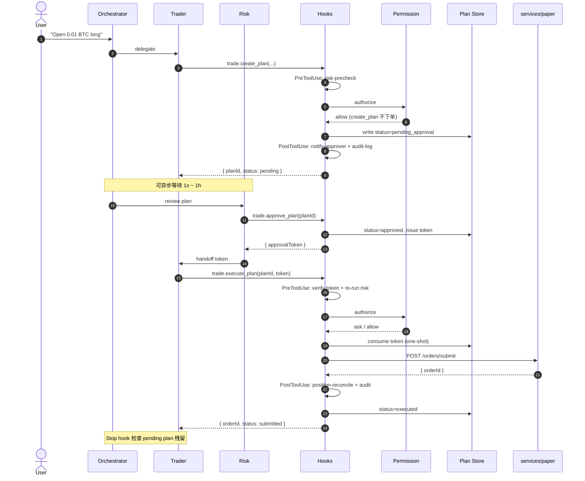

# 04 · D-9 当前状态：Plan/Exec 闭环 + 工程护栏

> 状态：**D-9 完成（2026-05-28）**，D-9.1a 收口（含全市场交易日历）。
> 下一里程碑：research-hub（issue #6）/ E2 多代演化（issue #7）。
>
> 本文回答的问题：**clone 仓库后，"现在到底做到哪里、决策链路长什么样"。**
> 详细架构与设计取舍见 [`docs/03-kernel-design.md`](./03-kernel-design.md)；
> 本文只描述**当前代码已落地的状态**。

## 一句话

**Trader agent 不能直接下单**——所有下单意图必须走 `trade.create_plan →
trade.approve_plan → trade.execute_plan` 三段式；其中 **Hooks**（5 类生命周期事件）
与 **Permission Engine**（allow / ask / deny 三态）作为 tool 中间件双层护栏，
LLM 视野里**不存在**绕过 plan 直接下单的可达路径。

---

## 决策链路（一次下单端到端）

---

## 已落地的模块

| 模块 | 位置 | 关键文件 |
|---|---|---|
| 三 agent 拆分 | `packages/orchestration/src/mastra/agents/` | `orchestrator.ts` · `trader.ts` · `risk.ts` |
| Plan/Exec 三 tool | `packages/orchestration/src/tools/` | `trade-plan.ts`（`createTradePlan` / `approveTradePlan` / `executeTradePlan`） |
| Hooks runner（5 类事件） | `packages/orchestration/src/hooks/` | `runner.ts` · `with-hooks.ts` · `matcher.ts`（`SessionStart` / `UserPromptSubmit` / `PreToolUse` / `PostToolUse` / `PostToolUseFailure` + Stop） |
| Permission Engine（三态） | `packages/orchestration/src/permissions/` | `engine.ts` · `predicate.ts` · `defaults.ts`（YAML 化在 D-8b） |
| Plan Store（in-memory） | `packages/orchestration/src/plans/` | `store.ts`（含 approval_token 派发，一次性 + expire_at） |
| paper 单笔下单 endpoint | `services/paper/src/inalpha_paper/api/` | `orders.py` → `POST /orders/submit` |
| 3 个回测策略 | `services/paper/src/inalpha_paper/strategies/` | `buy_and_hold.py` · `sma_cross.py` · `mean_reversion.py` |
| paper 内核 | `services/paper/src/inalpha_paper/kernel/` · `execution/` | `clock.py` · `msgbus.py` · `risk_engine.py` · `execution_engine.py` · `order_executor.py` · `gateway.py` |
| data 服务（Binance） | `services/data/` | CCXT Binance → Postgres + TimescaleDB |

---

## 工程硬约束（已通过 deny + tool 集双层落地）

- `live.submit_order` → permissions `deny`（LLM 视野中**不存在**直下单路径）
- `live.close_all_positions` / `live.cancel_all_orders` → `modelInvocable: false`
  （list 级隔离，LLM 看不见这些 tool）
- `approval_token` **一次性**（execute 消费后立即作废）+ 默认 `expire_at = 5 分钟`
- `trade.create_plan` 必填 `rationale`（LLM 推理落盘，可复盘、可统计）
- 详细决策原文（hooks / permissions / plan-exec）保留在仓库 owner 的私有
  `docs/miro/decisions/` 下，不在开源范围；本文给出实现摘要与代码入口已足够

---

## D-8c（2026-05-22）研究 → 策略 → 回测 闭环

把 `research.deep_dive` 产物和"跑回测"打通的 MVP：

- **research 输出结构化**：`ResearchPlan` 加 `research_id` / `factors` / `signals` /
  `strategy_hint`（家族 + 参数 + reasoning）。analyst brief 也加 `factors` 列表。
  文件 `services/research/src/inalpha_research/{schemas.py,manager.py,analysts/}`。
- **compose 引擎**：`services/paper/src/inalpha_paper/strategies/compose.py` +
  `POST /strategies/compose`。把 `strategy_hint` 路由到 `sma_cross /
  mean_reversion / buy_and_hold` 之一并 clip 参数到合法区间；`family='none'` 直接拒绝。
- **回测落库**：migration `0003_backtest_lineage.py` 给 `backtest_runs` 加
  `research_id` / `params_hash` / `strategy_code` / `strategy_hint`；每次回测完
  写一行。新增 `storage/backtest_runs.py` + `GET /backtest_runs?research_id=...`。
- **Orchestration 串起来**：新 tool `paper.compose_strategy` /
  `paper.list_backtest_runs`；`paper.run_backtest` 入参加可选 `researchId` /
  `strategyHint`；`trade.create_plan` 入参加 `researchId` / `backtestRunId`，
  自动 prefix 进 rationale（`[research:<id>] [backtest:<id>] 用户原因`）。
- **orchestrator prompt 重写**：4 步标准链路 `deep_dive → compose_strategy →
  (list_backtest_runs 或 run_backtest) → 报告 / create_plan`。

---

## D-9（2026-05-25）LLM 自创策略 E1 MVP + baseline 重定位

让 orchestrator **默认**走"自己写完整 `Strategy` 子类源码 → 沙盒 → 回测自动并跑 baseline"。
内置策略从"穷举库出口"降级为"基线 / 教学 / 适配器"三类角色：

- **沙盒三道关**（`services/paper/src/inalpha_paper/strategy_authoring/`）：
  - `ast_audit.py`：AST 白名单（import / name / dunder access），拒绝 `os/sys/subprocess`、
    `eval/exec/__import__`、`.__class__.__bases__` 等越狱路径
  - `dynamic_loader.py`：受限 namespace `exec`，注入内核符号（`Strategy / Bar / Order / ...`），
    裁剪 `__builtins__`，LLM 写策略**零 import**
  - `contract_check.py`：协议校验（必继承 `Strategy`、覆写 `on_bar`、`__init__` 签名）
- **多目标 fitness**（`strategy_authoring/fitness.py`）：`sharpe + 0.3*calmar -
  0.10*turnover_penalty - 1.0*(drawdown>30%)`；回测响应同时返 `fitness` 字段；
  排序候选不允许裸 Sharpe
- **候选表**：migration `0005_strategy_candidates.py` + `storage/strategy_candidates.py` +
  `POST/GET /strategy_candidates`；`BacktestRequest` 加 `candidate_id`（与 `strategy_id`
  二选一）；`runner.run_backtest` candidate 分支自动从 DB 读 code → 二次审计 → 子进程加载
- **Orchestration**：新 tool `paper.author_strategy` / `list_candidates` / `get_candidate`；
  `paper.run_backtest` inputSchema 加 `candidateId`（superRefine 互斥）；
  `strategy-code-audit` PreToolUse hook 拦超长 + prompt injection；
  orchestrator prompt **默认走 author**，compose 降级为"用户明确点名内置时的快速通道"；
  author tool description 内嵌 few-shot 模板降低协议错误率
- **内置策略重定位**（`services/paper/.../strategies/__init__.py`）：`buy_and_hold` 作首要
  基线、`sma_cross` / `mean_reversion` 作教学样本 + compose 快速通道、`signal_replay` 作
  adapter；不再积累新内置策略
- **baseline 自动并跑**：`runner.run_backtest` candidate 分支用 `asyncio.gather` 同时跑
  candidate + `buy_and_hold` 同 bars/cash/fee；`BacktestResponse` 加 `baseline` 字段；
  alpha 判定 = `candidate.fitness` 显著高于 `baseline.fitness`
- **审批门**：`POST /strategy_candidates/{id}/promote` 端点 + orchestration 端
  `paper.promote_candidate` tool。MVP 阶段 permission 默认 `allow`，agent 自助闭环
  （前端 askUserChoice 还没接通，`ask` 会让 agent 撞墙）；审批责任改由两道防御替代：
  (1) orchestrator prompt 强制 agent 调前自检 `fitness > baseline` + 等用户明确指令；
  (2) 后端硬校验 `fitness IS NOT NULL` + 当前 `status='candidate'`，并把
  `reason / promoted_by / promoted_at` 写到候选 `audit.promotion`。promote 仅做状态
  切换——live trading runner 按行情 tick 调 `on_bar` 仍在 E2 / D-7 范围。
  ADR-0018 askUserChoice 接通后回归 `ask`
- **RiskEngine 真接入 paper HTTP 层**（ADR-0006 / issue #3）：lifespan 加载
  `configs/risk_rules.toml` → 构造 async `RiskGuard`（独立于 backtest 的 sync
  `RiskEngine`）→ `POST /orders/submit` 与 `POST /plans/{id}/execute` 撮合前过
  `risk_guard.enforce`，命中返 409 `RISK_REJECTED` + 写入 `risk_locks` 表（独立
  connection 显式 commit，不被调用方 endpoint 异常 rollback）。trade_repo / market_calendar
  目前是 Noop / crypto-only 实现，cooldown / stoploss_guard 真激活留 follow-up
  issue；前端 askUserChoice 接通前 ask 路径仍是 workaround

- **D-9.1a · closed_trades 写入链路接入**（2026-05-28）：
  `positions` 表加 `ts_opened` / `open_order_id` 列（migration 0008）；
  `positions.apply_fill()` 增强为返回 `ClosedTradeInfo | None`，在 HTTP
  订单流同事务内写入 `closed_trades` 表。至此 trade-based RiskRule 5 件套
  （Cooldown / LowProfit / MaxDrawdown / StoplossGuard / MarketHoursRule）
  在 HTTP 路径全可触发——前提是 `closed_trades` 表有平仓数据（HTTP 订单流
  本身产生）。MarketHoursRule 通过 `RoutingCalendar` 接 `exchange_calendars`，
  按 `(venue, symbol)` 解析真实交易所，对全 D-9 市场（crypto 24/7 / 美股 / A股 /
  港股 / 日英德 / 韩澳印 / 全球指数）生效——含节假日 / 午休 / 半日市 / DST，锁
  粒度按交易所 code（issue #8 收口）。D-9 闭环完成。

不在范围（下一阶段）：MAP-Elites / Island Model / 多代演化 / unified-diff 变异（E2/E3）；
`services/evolver/` 独立服务（等多代演化需求出现再拆）；promoted 候选的 live tick
runner（按行情自动下单、写 `paper_positions` / `paper_trades`）。

---

## 未完成 / 下一步

> 重心：模拟盘（paper）先于实盘（live）。

- **research-hub** 嵌套 supervisor（4 analyst + bull/bear/risk debate，issue #6）尚未落地
- **E2 多代演化**（issue #7 · ADR-0020）：MAP-Elites / Island Model（E1 MVP 已上）
- **delegation hop**（issue #5 · ADR-0012 补丁）：sub-strategy 派生计划的转授权链
- **paper live runner**（issue #1）：promoted 候选按行情自动跑（远期，paper 优先）

> 已收口：RiskEngine 接入（#3）、权限 YAML 化（#4）、askUserChoice（#2）、
> trade_repo 默认化 + 全市场交易日历（#8）。

多市场日历 follow-up（非阻塞）：盘前 / 盘后时段、指数映射表补全、深交所 XSHE /
印度 XNSE 精确化（当前分别复用 XSHG / XBOM）。

---

## 相关文档

- 总体架构与设计取舍 → [`docs/03-kernel-design.md`](./03-kernel-design.md)
- 架构总图（mermaid） → [`README.md`](../README.md#architecture)
- 项目背景 / 边界 → [`docs/00-context.md`](./00-context.md)
- AI 协作硬约束 → [`AGENTS.md`](../AGENTS.md) · [`CLAUDE.md`](../CLAUDE.md)
