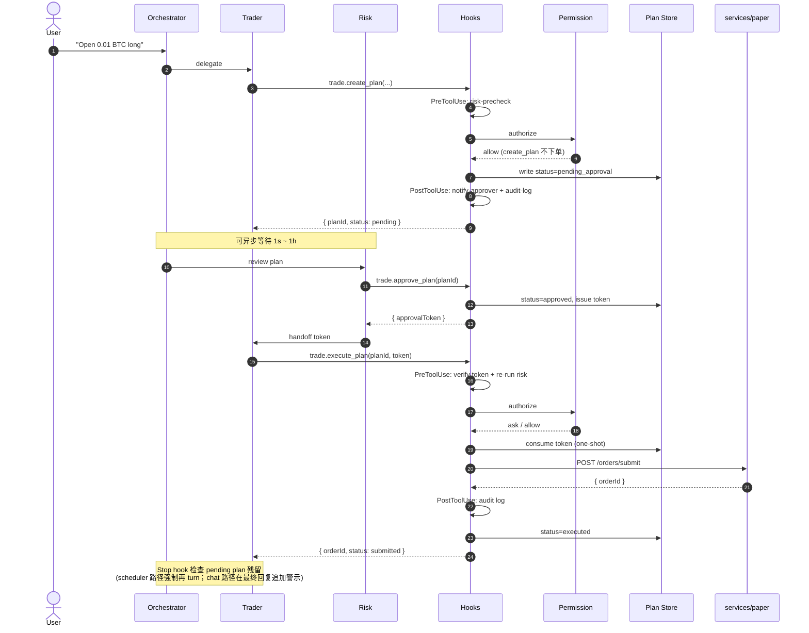

# 04 · 当前状态：Plan/Exec 闭环 + 工程护栏 + 多市场模拟盘

> 状态：**D-11 多市场模拟盘完成（2026-06-02）**——跨币种 cash model + paper
> live runner（promoted 候选按行情自动跑 + 决策复盘日志），在 D-10（web 搜索 +
> 财报基本面 + 多市场数据）/ D-9（Plan/Exec 闭环 + LLM 自创策略 + 风控引擎）/
> D-9.1a 收口基础上落地。
> 下一里程碑：E2 多代演化（issue #7）；research-hub（issue #6）已于 2026-06-12 收口（见下）。
>
> 本文回答的问题：**clone 仓库后，"现在到底做到哪里、决策链路长什么样"。**
> 详细架构与设计取舍见 [`docs/03-kernel-design.md`](./03-kernel-design.md)；
> 本文只描述**当前代码已落地的状态**。

## 一句话

**Trader agent 不能直接下单**——所有下单意图必须走 `trade.create_plan →
trade.approve_plan → trade.execute_plan` 三段式；其中 **Hooks**（5 类生命周期事件）
与 **Permission Engine**（allow / ask / deny 三态）作为 tool 中间件双层护栏，
LLM 视野里**不存在**绕过 plan 直接下单的可达路径。

---

## 决策链路（一次下单端到端）

---

## 已落地的模块

| 模块 | 位置 | 关键文件 |
|---|---|---|
| 三 agent 拆分 | `packages/orchestration/src/mastra/agents/` | `orchestrator.ts` · `trader.ts` · `risk.ts` |
| Plan/Exec 三 tool | `packages/orchestration/src/tools/` | `trade-plan.ts`（`createTradePlan` / `approveTradePlan` / `executeTradePlan`） |
| Hooks runner（5 类事件） | `packages/orchestration/src/hooks/` | `runner.ts` · `with-hooks.ts` · `matcher.ts`（`SessionStart` / `UserPromptSubmit` / `PreToolUse` / `PostToolUse` / `PostToolUseFailure` + Stop） |
| Permission Engine（三态） | `packages/orchestration/src/permissions/` | `engine.ts` · `predicate.ts` · `defaults.ts`（YAML 化在 D-8b） |
| Plan Store（in-memory） | `packages/orchestration/src/plans/` | `store.ts`（含 approval_token 派发，一次性 + expire_at） |
| paper 单笔下单 endpoint | `services/paper/src/inalpha_paper/api/` | `orders.py` → `POST /orders/submit` |
| 3 个回测策略 | `services/paper/src/inalpha_paper/strategies/` | `buy_and_hold.py` · `sma_cross.py` · `mean_reversion.py` |
| paper 内核 | `services/paper/src/inalpha_paper/kernel/` · `execution/` | `clock.py` · `msgbus.py` · `risk_engine.py` · `execution_engine.py` · `order_executor.py` · `gateway.py` |
| data 服务（Binance） | `services/data/` | CCXT Binance → Postgres + TimescaleDB |

---

## 工程硬约束（已通过 deny + tool 集双层落地）

- `live.submit_order` → permissions `deny`（LLM 视野中**不存在**直下单路径）
- `live.close_all_positions` / `live.cancel_all_orders` → `modelInvocable: false`
  （list 级隔离，LLM 看不见这些 tool）
- `approval_token` **一次性**（execute 消费后立即作废）+ 默认 `expire_at = 5 分钟`
- `trade.create_plan` 必填 `rationale`（LLM 推理落盘，可复盘、可统计）
- 详细决策原文（hooks / permissions / plan-exec）保留在仓库 owner 的私有
  `docs/miro/decisions/` 下，不在开源范围；本文给出实现摘要与代码入口已足够

---

## D-8c（2026-05-22）研究 → 策略 → 回测 闭环

把 `research.deep_dive` 产物和"跑回测"打通的 MVP：

- **research 输出结构化**：`ResearchPlan` 加 `research_id` / `factors` / `signals` /
  `strategy_hint`（家族 + 参数 + reasoning）。analyst brief 也加 `factors` 列表。
  文件 `services/research/src/inalpha_research/{schemas.py,manager.py,analysts/}`。
- **compose 引擎**：`services/paper/src/inalpha_paper/strategies/compose.py` +
  `POST /strategies/compose`。把 `strategy_hint` 路由到 `sma_cross /
  mean_reversion / buy_and_hold` 之一并 clip 参数到合法区间；`family='none'` 直接拒绝。
- **回测落库**：migration `0003_backtest_lineage.py` 给 `backtest_runs` 加
  `research_id` / `params_hash` / `strategy_code` / `strategy_hint`；每次回测完
  写一行。新增 `storage/backtest_runs.py` + `GET /backtest_runs?research_id=...`。
- **Orchestration 串起来**：新 tool `paper.compose_strategy` /
  `paper.list_backtest_runs`；`paper.run_backtest` 入参加可选 `researchId` /
  `strategyHint`；`trade.create_plan` 入参加 `researchId` / `backtestRunId`，
  自动 prefix 进 rationale（`[research:<id>] [backtest:<id>] 用户原因`）。
- **orchestrator prompt 重写**：4 步标准链路 `deep_dive → compose_strategy →
  (list_backtest_runs 或 run_backtest) → 报告 / create_plan`。

---

## D-9（2026-05-25）LLM 自创策略 E1 MVP + baseline 重定位

让 orchestrator **默认**走"自己写完整 `Strategy` 子类源码 → 沙盒 → 回测自动并跑 baseline"。
内置策略从"穷举库出口"降级为"基线 / 教学 / 适配器"三类角色：

- **沙盒三道关**（`services/paper/src/inalpha_paper/strategy_authoring/`）：
  - `ast_audit.py`：AST 白名单（import / name / dunder access），拒绝 `os/sys/subprocess`、
    `eval/exec/__import__`、`.__class__.__bases__` 等越狱路径
  - `dynamic_loader.py`：受限 namespace `exec`，注入内核符号（`Strategy / Bar / Order / ...`），
    裁剪 `__builtins__`，LLM 写策略**零 import**
  - `contract_check.py`：协议校验（必继承 `Strategy`、覆写 `on_bar`、`__init__` 签名）
- **多目标 fitness**（`strategy_authoring/fitness.py`）：`sharpe + 0.3*calmar -
  0.10*turnover_penalty - 1.0*(drawdown>30%)`；回测响应同时返 `fitness` 字段；
  排序候选不允许裸 Sharpe
- **候选表**：migration `0005_strategy_candidates.py` + `storage/strategy_candidates.py` +
  `POST/GET /strategy_candidates`；`BacktestRequest` 加 `candidate_id`（与 `strategy_id`
  二选一）；`runner.run_backtest` candidate 分支自动从 DB 读 code → 二次审计 → 子进程加载
- **Orchestration**：新 tool `paper.author_strategy` / `list_candidates` / `get_candidate`；
  `paper.run_backtest` inputSchema 加 `candidateId`（superRefine 互斥）；
  `strategy-code-audit` PreToolUse hook 拦超长 + prompt injection；
  orchestrator prompt **默认走 author**，compose 降级为"用户明确点名内置时的快速通道"；
  author tool description 内嵌 few-shot 模板降低协议错误率
- **内置策略重定位**（`services/paper/.../strategies/__init__.py`）：`buy_and_hold` 作首要
  基线、`sma_cross` / `mean_reversion` 作教学样本 + compose 快速通道、`signal_replay` 作
  adapter；不再积累新内置策略
- **baseline 自动并跑**：`runner.run_backtest` candidate 分支用 `asyncio.gather` 同时跑
  candidate + `buy_and_hold` 同 bars/cash/fee；`BacktestResponse` 加 `baseline` 字段；
  alpha 判定 = `candidate.fitness` 显著高于 `baseline.fitness`
- **审批门**：`POST /strategy_candidates/{id}/promote` 端点 + orchestration 端
  `paper.promote_candidate` tool。MVP 阶段 permission 默认 `allow`，agent 自助闭环
  （前端 askUserChoice 还没接通，`ask` 会让 agent 撞墙）；审批责任改由两道防御替代：
  (1) orchestrator prompt 强制 agent 调前自检 `fitness > baseline` + 等用户明确指令；
  (2) 后端硬校验 `fitness IS NOT NULL` + 当前 `status='candidate'`，并把
  `reason / promoted_by / promoted_at` 写到候选 `audit.promotion`。promote 仅做状态
  切换；按行情 tick 调 `on_bar` 的 live runner 在 **D-11 已接入**（见下方 D-11 小节）。
  ADR-0018 askUserChoice 接通后回归 `ask`
- **RiskEngine 真接入 paper HTTP 层**（ADR-0006 / issue #3）：lifespan 加载
  `configs/risk_rules.toml` → 构造 async `RiskGuard`（独立于 backtest 的 sync
  `RiskEngine`）→ `POST /orders/submit` 与 `POST /plans/{id}/execute` 撮合前过
  `risk_guard.enforce`，命中返 409 `RISK_REJECTED` + 写入 `risk_locks` 表（独立
  connection 显式 commit，不被调用方 endpoint 异常 rollback）。trade_repo / market_calendar
  目前是 Noop / crypto-only 实现，cooldown / stoploss_guard 真激活留 follow-up
  issue；前端 askUserChoice 接通前 ask 路径仍是 workaround

- **D-9.1a · closed_trades 写入链路接入**（2026-05-28）：
  `positions` 表加 `ts_opened` / `open_order_id` 列（migration 0008）；
  `positions.apply_fill()` 增强为返回 `ClosedTradeInfo | None`，在 HTTP
  订单流同事务内写入 `closed_trades` 表。至此 trade-based RiskRule 5 件套
  （Cooldown / LowProfit / MaxDrawdown / StoplossGuard / MarketHoursRule）
  在 HTTP 路径全可触发——前提是 `closed_trades` 表有平仓数据（HTTP 订单流
  本身产生）。MarketHoursRule 通过 `RoutingCalendar` 接 `exchange_calendars`，
  按 `(venue, symbol)` 解析真实交易所，对全 D-9 市场（crypto 24/7 / 美股 / A股 /
  港股 / 日英德 / 韩澳印 / 全球指数）生效——含节假日 / 午休 / 半日市 / DST，锁
  粒度按交易所 code（issue #8 收口）。D-9 闭环完成。

不在范围（下一阶段）：MAP-Elites / Island Model / 多代演化 / unified-diff 变异（E2/E3）；
`services/evolver/` 独立服务（等多代演化需求出现再拆）。
（注：promoted 候选的 live runner 原列在此处，已在 D-11 落地，见下方 D-11 小节。）

---

## D-10（2026-06-01）web 搜索 + 财报基本面 + 多市场数据源扩展

D-9 把决策护栏（Plan/Exec + 风控 + 沙盒）做扎实后，D-10 在**数据侧**补齐多市场
研究所需的两类信息源——让 analyst 不再只盯 K 线，能拉财报基本面 + 实时网络情报，
且全球品种（A股 / 港股 / 美股 / 日欧等单股 / 全球指数）都覆盖：

- **web 搜索（零 key）**：`services/data` 新增 `GET /web/search` + `/web/news`
  （`connectors/web_search.py` 用 DDGS 聚合多引擎，按语言自动选后端；ddgs 未装或
  网络失败时返空列表降级，不阻断链路）。orchestration 侧 `tools/web.ts` 暴露
  `web.search` / `web.search_news` 两 tool。
- **财报基本面（多市场）**：`services/data` 新增 `GET /fundamentals`
  （`api/fundamentals.py` 按 venue 路由：A股 `sh./sz.` + 港股 `hk.` 走
  `connectors/akshare.py`，美股 / 日欧等全球走 `connectors/yfinance_conn.py`）；
  字段映射总市值 / 市盈率 / ROE / 营收增速，缺失置 None，拿不到返
  `available=False` 而非 5xx。orchestration 侧 `data.get_fundamentals` tool。
- **research analyst 接入**：`FundamentalAnalyst` 调 `/fundamentals`，财报不可用时
  自动 web 搜索兜底；`SentimentAnalyst` 非 crypto 走 yfinance news + web 搜索，
  crypto 的 FNG 不可用时 web 搜索兜底（`services/research/.../analysts/`）。
- **orchestrator 多市场编排**：`agents/orchestrator.ts` 接入新 tool，并按市场分化
  `lookbackDays`（crypto 1h/4h ≈30d；A股/港股/日股 akshare 1d ≈180d；美股/全球指数
  yfinance 1d ≈90d），避免"30 天 K 线＜20 根交易日"无统计意义；research client
  超时放宽到 300s 给 A股慢路径留余量。
- **金融时效**：web/news 与基本面均无 API key 依赖；analyst 数据源不可用时降级到
  LLM-only 并标低 confidence，不静默用过时数据。

---

## D-10 · MCP 生态兼容 + 相对估值 analyst（借鉴 anthropics/financial-services）

调研 Anthropic 官方 [`anthropics/financial-services`](https://github.com/anthropics/financial-services)
后落地的两个增量（两者定位互补：Inalpha 做量化交易闭环 / 自动回测下单，该仓库做
卖方文档工作流 / 不下单；MCP 决策详见内部 ADR-0009「MCP 作为可插拔 tool 协议」2026-06-01 补充）：

- **MCP client 路径产品化（ADR-0009 从 spike → 落地）**：新增
  `packages/orchestration/src/mcp/`（`config.ts` + `manager.ts` + `schema.ts`），
  采用与 financial-services `.mcp.json` **同构**的配置 schema。MCP tool 命名
  `mcp__<server>__<verb>`，经**现有** `wireToolList` 套同一套 hooks + permissions；
  orchestrator 的 `tools` 改 dynamic 异步函数，把内置 tool + MCP tool 合并。
  - **免费优先（硬约束）**：默认 `config/mcp.config.json` 只启用零密钥公开端点
    （CoinGecko）；FactSet / Morningstar / S&P 等**付费连接器以 `disabled:true` 作模板**，
    持订阅者改 flag + 配 `requiredEnv` 即用。缺 key / 连接失败 → 跳过 + 不阻塞启动。
  - 权限：`mcp__coingecko__*`（只读公开源）显式 allow；其余 `mcp__*` 由
    `defaultMode: ask` fail-closed 兜底。验证：`pnpm smoke:mcp`。
- **相对估值 analyst（research 第 6 个 analyst）**：新增
  `services/research/.../analysts/valuation.py`，分析框架借鉴 financial-services
  的 `comps-analysis` skill（Apache-2.0）——可比公司 / 相对估值。复用免费
  `/fundamentals` 快照（PE/PB/ROE/margins）+ web 搜索喂入，沿用 D-9 freshness
  纪律：**只做相对估值、禁止完整 DCF**（无现金流数据会逼 LLM 编数），缺数据降
  confidence（cap 0.55）。已并入 `ALL_ANALYSTS` 自动参与并行 + bull/bear 辩论。

---

## D-11（2026-06-02）多市场模拟盘：跨币种 cash + live runner

把"promote 一个策略 → 放到模拟盘"从"只是状态切换"做成"真按行情自动跑"，并让
跨市场组合估值正确。两半场：

**A · 跨币种 cash model**（PR #32，已并 main）：
- `accounts.cash` 单标量 → `cash_balances` JSONB 按币种桶 + `base_currency`（migration 0009）；
  `positions.currency` 列；`execution/currency_resolver.py`（venue/symbol → 计价货币，
  复用 `exchange_resolver`）。
- `services/data` 新增 `GET /fx`（identity / USD 稳定币本地 1.0，真实汇率走 yfinance
  forex，拿不到抛 502 不乱猜）；`/accounts/me` 多币种桶 + 持仓按 FX 折算到 base_currency，
  透出 `fx_warnings`（FX 不可用 / 偏旧的币种不静默）。架构取舍：跨币种是**账户聚合层**
  问题（单次回测 / 单 run 是单币种），engine Portfolio 保持单币种。

**B · paper live runner**（PR #34）：
- 新 migration 0010 `strategy_runs`（`UNIQUE(candidate_id) WHERE status='running'`）；
  `LiveRunnerManager`（`live_runner.py`）每个 run 一个后台 asyncio task，按 timeframe
  拉 fresh bar → 喂 `LiveEngineSession`（`engine/live_session.py`，复用回测内核 +
  `CaptureGateway` 拦截下单不撮合 + `confirm_fill` 回灌保持持仓视图一致）→ 下单意图
  走**护栏内 plan/exec**（`risk_guard.enforce` + plan create/approve/consume + fills，
  `approved_by='system:live_runner'` 机器审批）。
- **启动冷启动预热**：拉 N 根历史 bar 喂策略建指标（不真下单），SMA 等策略 start 后即可出信号。
- **决策复盘日志**（migration 0011 `strategy_run_decisions`）：每次 on_bar 产生下单意图
  记一行（bar 上下文 / 订单意图 / outcome filled|rejected|risk_rejected / plan_id /
  order_id），交叉引用 trade_plans(rationale) + closed_trades(盈亏)。
- API：`POST /strategy_runs`（promoted 校验）/ `/stop` / `GET` / `GET .../decisions`；
  orchestration：`paper.start_strategy` / `stop_strategy` / `list_strategy_runs` /
  `list_strategy_run_decisions`。lifespan 启动 reconcile 残留 running → errored。
- **信任边界**：机器审批靠"人先 promote + 人显式 start"两道人工闸门（ADR-0020 精神）。
- **CR 加固（PR #34 收口）**：① 只在**已收盘 bar** 上决策（`_closed_bars` 丢弃未收盘那根，
  避免半根 K 线幻影信号）；② 自动化路径**风控 fail-closed**（factory=None 默认拒跑置 errored，
  `INALPHA_LIVE_RUNNER_REQUIRE_RISK_GUARD=false` 可显式放行）；③ 后台 task 经
  `BackgroundTasks` 在事务提交后才起（防孤儿 run）；④ 决策时间线排序加 tiebreaker。
- follow-up（非阻塞，已开 issue #36/#37/#38）：跨用户 candidate 归属校验 / per-account
  run 上限 / 多实例 reconcile / 沙盒子进程隔离 / service token audience。

---

## D-11.1（2026-06-03）live runner 信任边界 + 健壮性收口（#36 / #37）

live runner 是无人值守自动下单路径（CLAUDE.md 硬约束"信任边界"），在堆新特性前先
收口 PR #34 review 留下的 P1 安全洞与健壮性缺口：

- **跨用户 candidate 归属校验**（#36.1）：`strategy_candidates` 加 `owner_account_id`
  （migration 0013），创建时由 `account_id_from_user` 写入（与 run 的 `account_id` 同源，
  非 UUID sub 也可比；不能直接拿 `author_id` 比，它对非 UUID sub 为 NULL）。
  `POST /strategy_runs` 起跑前校验 owner == 调用者账户，否则 403 `CANDIDATE_NOT_OWNED`；
  pre-migration 老数据 owner=NULL → 有界放行 + warning。
- **per-account run 上限**（#36.2）：`INALPHA_LIVE_MAX_RUNNING_RUNS_PER_ACCOUNT`
  （默认 10）+ `count_running_by_account`，超限 429 `TOO_MANY_RUNNING_RUNS`，防单用户
  起任意多长驻 task 打爆事件循环。
- **错误可重试分类**（#37.3）：`_is_retryable` 把 4xx `InalphaError`（确定性：校验 /
  约束 / symbol 非法）判为不可重试，`_run_loop` 立即 errored 跳过退避；网络 / 超时 /
  未知错误仍走 streak 退避。风控拒单（409）已在 route 层消化为 risk_rejected 决策行、
  不冒泡杀 run。
- **健壮性测试**（#37.4）：补 `_run_loop` 错误循环（可重试攒 streak / 不可重试立即 errored /
  CancelledError 干净退出 / build_session 失败）、LIMIT 未成交 reject、reconcile、
  归属 403 / 上限 429 / 老数据放行。
- 已确认 PR #34 已落地项（不重做）：风控 fail-closed（#36.3）、已收盘 bar 守门（#37.1）。
  未做：session 持仓重建（#37.2，绑定未来 resume run 特性，#37 保留开着）；#38 Phase F。

---

## D-11.2（2026-06-05）live runner 运维收口 + PnL 净口径

live runner 跑起来后的运维 / 正确性收尾，把"无人值守长驻"剩余的几处隐患补齐：

- **PnL 净口径**（#45）：`cumulative_pnl` 原是**毛盈亏**（已实现 + 未实现），手续费虽在
  `fills` 阶段从 cash 扣，但没补回展示盈亏 → 高频策略 cumulative_pnl 虚高、看起来比真实
  净值更赚。`_read_run_pnl_quote` 改为减去 run 期间手续费（`orders` 表 `SUM(fee) WHERE
  status='FILLED'`，与已实现 / 未实现同计价货币一起折算）；dashboard 累计盈亏 label 标注
  「净 / (net)」+ 决策时间线新增单笔 fee 列。
- **运行时长 TTL auto-stop**（#44）：`INALPHA_LIVE_RUNNER_MAX_RUNTIME_S`（默认 0 = 不限），
  run 自 `started_at` 起超时 → `_ttl_exceeded` 置 `stopped` + error_log，与回撤熔断同口径
  （正常终态非 bug），防策略卡死 / 无限空跑的长尾僵尸 run。用现成 `started_at` 列，无迁移。
- **build 阶段退避 + 错误分类**（#41）：build 失败原本裸 `except → errored`，分不清"data
  服务暂时不可用"与"策略代码确定性错"。现按 `_classify_build_error` 分类：data 不可达 /
  data 5xx（`DataServiceError` 502）→ `infra_unavailable` 退避重试；`InalphaError` 4xx /
  策略代码 `RuntimeError`（AST / 契约 / candidate）→ `strategy_error` 立即 errored。
  `error_log` 元素扩展为 `{ts, error, code}` 落分类（JSONB，无迁移）。

---

## Agent Skills（2026-06-11）投研方法论按需加载 + serenity 首个外来 skill

开源社区 AgentSkills 格式（`SKILL.md` + frontmatter + `references/`）的产品内加载机制，
让 orchestrator 能吸收外部投研方法论辅助用户研究（ADR-0046）：

- **progressive disclosure**：启动扫描 `packages/orchestration/skills/` 各 skill 的
  frontmatter，`<skills>` 清单段（每 skill 一行 name — description + 使用纪律）注入
  dynamic instructions；正文与 references 经新 tool `skill.read` 按需进 context
  （64KB 截断）。无 skill 时清单段为空串，机制零成本。
- **fail-open**：单 skill frontmatter 坏 → warn + skip；目录缺失 → 空清单。skill 是
  增强不是依赖，永不拖挂 orchestrator（同 MCP 加载语义）。
- **信任边界**：只读 `.md/.json/.txt` 白名单 + 路径越界拒绝；外来 skill 的 `scripts/`
  不 vendor 不执行（评分逻辑转 markdown rubric 内联）；`examples/` 不 vendor（含具体
  标的，违反"示例不锁死预期"纪律）。
- **首个外来 skill**：[muxuuu/serenity-skill](https://github.com/muxuuu/serenity-skill)
  （MIT）——"热点 → 拆产业链 → 找供应链瓶颈 → 筛优先研究方向"的结构化投研方法论。
  全文改写接入：description 意图化（去写死触发短语）、市场无关化、所有"查数据"步骤
  映射到 `web.* / data.*(fresh) / factor.* / research.*` 并强制"禁训练记忆代答 +
  输出标注数据截止"（金融时效性纪律）、交易动作接 `trade.create_plan` 审批链。
- 守门：vitest 体检（frontmatter 校验 / 禁引私有路径 / 截断上限）+
  `check-consistency.sh` C7（skills/ 目录结构 + 禁引私有路径）。

## D-12（2026-06-11）因子库闭环：血缘 + 衰减巡检 + monthly 宏观 + 因子发现 L1

把"衰减值如何确定后期策略方向"这条断链接通，并启动因子发现 L1（四个工作流）：

- **因子血缘 + 衰减巡检告警**（migration 0019）：`author_strategy` 加结构化
  `factorContext` 入参（研究链路驱动时必传，数值禁编造）→ 落
  `strategy_candidates.factor_snapshot`；start_strategy 起跑 best-effort 拍
  `factor_baseline`（入场基准）；paper 新增 `FactorPatrol` 独立巡检 task（不嵌
  交易 loop，按标的分组去重调 factor `/score`），血缘因子进入 decaying →
  `run_log` warn（code=`factor_decay`，带入场 vs 当前 rank_ic + 累计盈亏）——
  同 run×因子只告警一次，恢复重置。**只告警不动仓**（不自动停/调/剔，机器审批
  边界不变）。衰减三态判定（stable/fading/decaying）下沉 factor 服务为单一权威，
  前端徽章改读服务端 `decay_state`。
- **monthly FRED 宏观扩容**（ADR-0044 Phase 2 执行）：CPI / 核心 CPI / 失业率 /
  非农 / M2 共 8 因子（62→70）。per-series 静态发布滞后表（CPI 45d / 就业 40d /
  M2 60d——统一 shift 对 M2 是 lookahead bug）；staleness 按频率分档（monthly
  45d，发布严重延迟如实 NaN）；修 warmup 硬编码 120 天缺口（monthly YoY 需
  ~520d）；取数按原生频率走 `1mo`。
- **FRED 宏观 Phase 3 扩容**（2026-06-18）：补**正交新信息维度**——信用利差
  （HY/IG OAS）、曲线短端（10Y-3M）、实体经济（PPI / 工业产出 / 零售 / 新屋开工
  YoY）、消费者信心,共 9 因子（70→79）。每序列只取 1-2 个一阶因子,延续"控候选数 /
  防多重检验"纪律（**因子非越多越好,优先正交信息**）；新序列均录入 per-series 滞后表
  （daily T+1 / monthly 30~50d）。同源同族多窗口（如 qlib 扩窗口）刻意不做。
- **null IC 选择效应基准**：score/snapshot 加 `ic_null_benchmark`（Bailey–LdP
  E[max|null] 近似）——N 个候选、当前样本量下纯噪声能跑出的期望最大 |IC|；
  top1 不显著高于它 = 选择效应预警。只透出供判断，不剔除。
- **因子发现 L1**（migration 0020）：受限 qlib 风格表达式 DSL（白名单递归解释器，
  零 eval/exec；lookahead 三层防线——TS hook 外围 / 服务端解析期 lag·window
  字面量强制 / 前瞻收益只在服务端算）+ `POST /custom/score` 一站式评估（有效性
  + p 值 + 与库查重）+ `factor_candidates` 候选池（hypothesis≥20 经济学故事门、
  expression_hash 幂等、batch_id/n_tested 多重检验审计锚点）+ `factor_discovery`
  workflow（并发评估 → 批内 BH 校正 → 冗余/衰减/低置信门 → 自动 propose）。
  **register 门**：review 端点不挂任何 LLM tool，转正唯一入口是 dashboard
  /factors 候选区块人工按钮；registered 表达式经 custom adapter 自动进
  catalog/timing/score（注册即生产，无单独生产表）。
  新 tools：`factor.evaluate_candidate` / `factor.propose` /
  `factor.list_candidates` / `factor.run_discovery`。

## research-hub（2026-06-12）辩论三方制 + 争议触发 + 决策链路落盘（issue #6 收口）

issue #6 启动前复核发现其大部分提议已被 D-9/D-10 顺手实现（6 analyst 并行 /
LLM manager 综合 / bull-bear 多轮辩论 / 限时限轮）；本次落收敛后的真实增量：

- **三方制**：辩论加入 `RiskResearcher` 风险官（`researchers/risk.py`）——不站
  多空，每轮在 Bull/Bear 之后压测双方最薄弱假设 + 失效条件 + 仓位纪律；
  `RESEARCH_DEBATE_RISK_ENABLED`（默认开）可退回两方制。
- **争议触发**：`RESEARCH_DEBATE_TRIGGER` 默认 `contested`——briefs 同时存在
  有信心（confidence ≥ 0.35）的多空对立才辩，全员同向跳过省 token
  （`debate.assess_disagreement`，确定性规则不走 LLM）；`always` 保留旧行为。
- **软早停**：从第 2 轮起 Bull/Bear 论证与各自上轮词汇 Jaccard 重合度都过阈
  （`RESEARCH_DEBATE_CONVERGENCE_THRESHOLD` 默认 0.6）= 没有新论点，提前结束；
  与硬超时并存。
- **决策链路落盘**（ResearchPlan 三个新字段，复盘"为什么是这个 rating"）：
  `debate_trigger`（为什么辩/为什么跳过）、`debate_stop_reason`（completed /
  converged / timeout）、`synthesis_reasoning`（manager 权衡自述，LLM 输出新增
  `reasoning` 键）。`run_debate` 返回值升级 `DebateOutcome`（turns + stop_reason）。

不在范围（issue #6 余项后续单独评估）：supervisor 显式编排（当前隐式并行 +
manager 综合已覆盖）、debate 轮内并行化、reasoning 进活动流前端高亮。

---

## 防过拟合工程化 + 财报 PIT（2026-06-18）

借鉴个人量化博主"用方法论（harness）约束 LLM + 回测检验 + 防过拟合 / 防未来函数"的思路，
落四项（各自独立 PR、均 rebase 合入 main）：

- **Chandelier ATR 移动止损**（ADR-0052 增补 A · #97）：框架级 Position Guard 新增第四闸——
  基于 ATR 的吊灯移动止损（`mark ≤ 开仓最高价 − mult×ATR`），止损位随波动自适应；复用
  `trailing_stop_loss` tag 零迁移；激活门用 close-based（与百分比 trailing 同口径，避免上影线
  误激活）；默认关，回测与 live 共用同组件。
- **克制型单因子低频骨架**（ADR-0051 增补 A · #98）：原型库第 5 骨架 `single_factor_assistive`
  ——单主因子（动量）阈值 + 少量辅助过滤（量能 / 波动率上限，可裁）+ 信号 flip 才出手（天然
  低频）；不自写止损交框架 guard；经 `paper.list_archetypes` / `GET /archetypes` 暴露。
- **WalkForward / CPCV 时序交叉验证**（ADR-0028 · #99）：`engine/cv.py` 三 splitter
  （WalkForward / PurgedKFold / CombinatorialPurgedCV）+ `optimal_folds_number`，API 对齐
  skfolio（不引入该包）、末段 test 含最新 bar、purge+embargo；`run_cv_backtest` 出多路径 OOS
  Sharpe 分布 + DSR；`POST /backtest/cv`（cpcv 数据不足自动回落 walk_forward，整体甩
  ProcessPool 不阻塞事件循环）；`paper.cv_backtest` tool。**单策略报 DSR、不报 PBO**（CSCV-PBO
  需多配置作输入，留 grid 层）。
- **财报 / bar Point-in-Time（阶段 A）**（ADR-0053 · #100）：akshare 财报按"报告期末 + 120 天
  发布滞后 ≤ as_of"过滤未披露报告期（防未来函数）；`GET /fundamentals?as_of=`；paper
  `DataClient.get_bars_pit` 把 bar 截断到 as_of。yfinance v1 不做 PIT 但响应显式标注；与 FRED
  宏观 PIT（ADR-0044）口径对齐。

体系定位：**防过拟合** = 单窗口 holdout（D-12）+ Sharpe CI / sensitivity（ADR-0027）+ 多路径
时序 CV / DSR（本次）；**防未来函数** = 回测 next-bar 撮合 + 因子 DSL 三层 lookahead 防线
（ADR-0019）+ FRED PIT（ADR-0044）+ 财报 / bar PIT（本次）。

---

## 未完成 / 下一步

> 重心：模拟盘（paper）先于实盘（live）。

- **E2 多代演化**（issue #7 · ADR-0020）：MAP-Elites / Island Model（E1 MVP 已上）
- **delegation hop**（issue #5 · ADR-0012 补丁）：sub-strategy 派生计划的转授权链

> 已收口：paper live runner（#1，D-11）、PnL 净口径 / 运行时长 TTL / build 退避（#45 /
> #44 / #41，D-11.2）、RiskEngine 接入（#3）、权限 YAML 化（#4）、askUserChoice（#2）、
> trade_repo 默认化 + 全市场交易日历（#8）。

live runner follow-up（非阻塞，待开）：轮询不感知交易时段（#48，休市空轮询浪费）、
LIMIT 单不跨 bar 挂单（#47，当前即时 IOC 语义）；session 持仓 resume（#37.2）、
#38 Phase F（沙盒子进程隔离 / service token audience）。

多市场日历 follow-up（非阻塞）：盘前 / 盘后时段、指数映射表补全、深交所 XSHE /
印度 XNSE 精确化（当前分别复用 XSHG / XBOM）。

因子库 follow-up（非阻塞，D-12 显式不做）：衰减告警→自动反思回测（仍人工复盘）、
自动衰减剔除（仅 ic_null_benchmark 透出）、活动流 factor_decay event kind 前端高亮、
横截面因子 / Polars 迁移（ADR-0031 欠账不变）、因子发现 L2 多 agent 小组。

防过拟合 / PIT follow-up（非阻塞，2026-06-18 显式不做）：**PIT 阶段 B/C**（bars 表加 PIT
元数据列 + 复权、指数成分股快照，ADR-0053）；**横截面 / 跨品种验证**（多标的 panel 地基 +
`run_panel_backtest` OOS 分布 + 解锁 `needs_universe` 横截面因子，ADR-0054 已写 ADR、代码未起）；
CPCV 的 PBO（grid 多配置层）+ forward-looking 玩具策略 graduation 验证（ADR-0028）。

---

## 相关文档

- 总体架构与设计取舍 → [`docs/03-kernel-design.md`](./03-kernel-design.md)
- 架构总图（mermaid） → [`README.md`](../README.md#architecture)
- 项目背景 / 边界 → [`docs/00-context.md`](./00-context.md)
- AI 协作硬约束 → [`AGENTS.md`](../AGENTS.md) · [`CLAUDE.md`](../CLAUDE.md)
