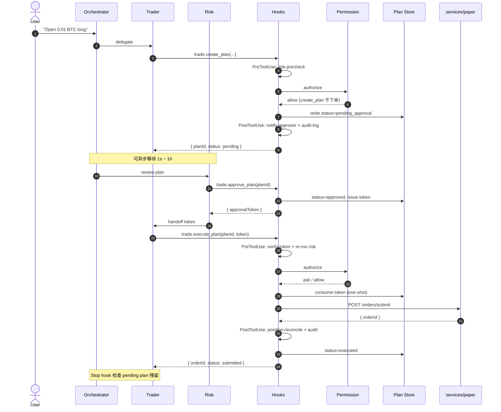

# 04 · D-8a 当前状态：Plan/Exec 闭环 + 工程护栏

> 状态：**D-8a 完成（2026-05-21）**。下一里程碑 D-8b（trade_plans / approval_tokens
> Postgres 表持久化）/ D-9（RiskEngine 规则化 + paper-service 真接入）。
>
> 本文回答的问题：**clone 仓库后，"现在到底做到哪里、决策链路长什么样"。**
> 详细架构与设计取舍见 [`docs/03-kernel-design.md`](./03-kernel-design.md)；
> 本文只描述**当前代码已落地的状态**。

## 一句话

**Trader agent 不能直接下单**——所有下单意图必须走 `trade.create_plan →
trade.approve_plan → trade.execute_plan` 三段式；其中 **Hooks**（5 类生命周期事件）
与 **Permission Engine**（allow / ask / deny 三态）作为 tool 中间件双层护栏，
LLM 视野里**不存在**绕过 plan 直接下单的可达路径。

---

## 决策链路（一次下单端到端）

---

## 已落地的模块

| 模块 | 位置 | 关键文件 |
|---|---|---|
| 三 agent 拆分 | `packages/orchestration/src/mastra/agents/` | `orchestrator.ts` · `trader.ts` · `risk.ts` |
| Plan/Exec 三 tool | `packages/orchestration/src/tools/` | `trade-plan.ts`（`createTradePlan` / `approveTradePlan` / `executeTradePlan`） |
| Hooks runner（5 类事件） | `packages/orchestration/src/hooks/` | `runner.ts` · `with-hooks.ts` · `matcher.ts`（`SessionStart` / `UserPromptSubmit` / `PreToolUse` / `PostToolUse` / `PostToolUseFailure` + Stop） |
| Permission Engine（三态） | `packages/orchestration/src/permissions/` | `engine.ts` · `predicate.ts` · `defaults.ts`（YAML 化在 D-8b） |
| Plan Store（in-memory） | `packages/orchestration/src/plans/` | `store.ts`（含 approval_token 派发，一次性 + expire_at） |
| paper 单笔下单 endpoint | `services/paper/src/inalpha_paper/api/` | `orders.py` → `POST /orders/submit` |
| 3 个回测策略 | `services/paper/src/inalpha_paper/strategies/` | `buy_and_hold.py` · `sma_cross.py` · `mean_reversion.py` |
| paper 内核 | `services/paper/src/inalpha_paper/kernel/` · `execution/` | `clock.py` · `msgbus.py` · `risk_engine.py` · `execution_engine.py` · `order_executor.py` · `gateway.py` |
| data 服务（Binance） | `services/data/` | CCXT Binance → Postgres + TimescaleDB |

---

## 工程硬约束（已通过 deny + tool 集双层落地）

- `live.submit_order` → permissions `deny`（LLM 视野中**不存在**直下单路径）
- `live.close_all_positions` / `live.cancel_all_orders` → `modelInvocable: false`
  （list 级隔离，LLM 看不见这些 tool）
- `approval_token` **一次性**（execute 消费后立即作废）+ 默认 `expire_at = 5 分钟`
- `trade.create_plan` 必填 `rationale`（LLM 推理落盘，可复盘、可统计）
- 详细决策原文（hooks / permissions / plan-exec）保留在仓库 owner 的私有
  `docs/miro/decisions/` 下，不在开源范围；本文给出实现摘要与代码入口已足够

---

## 未完成 / 下一步

- **D-8b**：`trade_plans` / `approval_tokens` Postgres 表 + Alembic migration
  （目前 in-memory，进程重启状态丢失）
- **D-8b**：`permissions.yaml` 配置文件化（目前在 `defaults.ts` 硬编码）
- **D-9**：RiskEngine 规则化（max notional / 价格偏离 / 日损上限）+ paper-service 真接入
- **delegation hop**（ADR-0012 补丁）：sub-strategy 派生计划的转授权链
- **research-hub** 嵌套 supervisor（4 analyst + bull/bear/risk debate）尚未落地，
  当前 orchestrator 只接 trader / risk

---

## 相关文档

- 总体架构与设计取舍 → [`docs/03-kernel-design.md`](./03-kernel-design.md)
- 架构总图（mermaid） → [`README.md`](../README.md#architecture)
- 项目背景 / 边界 → [`docs/00-context.md`](./00-context.md)
- AI 协作硬约束 → [`AGENTS.md`](../AGENTS.md) · [`CLAUDE.md`](../CLAUDE.md)
