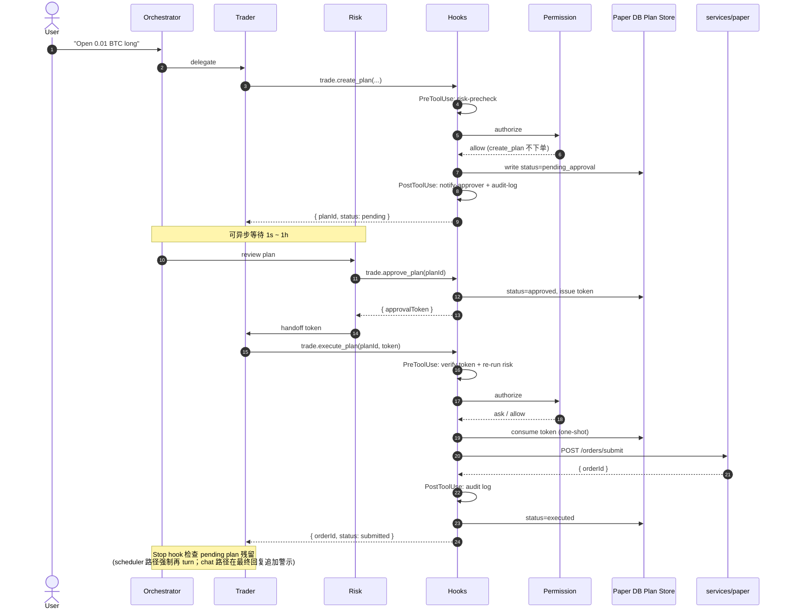

> 历史存档：各段仅代表当时状态，不作为当前待办。最新结论见 [当前状态](../04-current-state.md)。

# 04 · 当前状态：D-12 + E2 事件驱动自动演化

> 状态：**D-12 因子库闭环 + E2 事件驱动 Evolver 已落地（代码核对至 2026-09-30）**——因子血缘 + 衰减巡检 + monthly
> 宏观 + 因子发现 L1，在 D-11（多市场模拟盘）/ D-10（web 搜索 + 财报基本面 +
> 多市场数据）/ D-9（Plan/Exec 闭环 + LLM 自创策略 + 风控引擎）/ D-9.1a 基础上落地。
> research-hub（issue #6）已于 2026-06-12 收口；E1 生产代码由 PR #159 合入 main；
> E2 在 `EVENT_EVOLUTION_ENABLED` 后提供事件账本、确定性 DSL、五代共演化和实验性采用，
> 原 E1 run API 与逐次审批语义保持不变。
>
> 本文回答的问题：**clone 仓库后，"现在到底做到哪里、决策链路长什么样"。**
> 详细架构与设计取舍见 [`docs/03-kernel-design.md`](.././03-kernel-design.md)；
> 本文只描述**当前代码已落地的状态**。

## 一句话

**Trader agent 不能直接下单**——所有下单意图必须走 `trade.create_plan →
trade.approve_plan → trade.execute_plan` 三段式；其中 **Hooks**（5 类生命周期事件）
与 **Permission Engine**（allow / ask / deny 三态）作为 tool 中间件双层护栏，
LLM 视野里**不存在**绕过 plan 直接下单的可达路径。

---

## 决策链路（一次下单端到端）

---

## 已落地的模块

| 模块 | 位置 | 关键文件 |
|---|---|---|
| 三 agent 拆分 | `packages/orchestration/src/mastra/agents/` | `orchestrator.ts` · `trader.ts` · `risk.ts` |
| Plan/Exec 三 tool | `packages/orchestration/src/tools/` | `trade-plan.ts`（`createTradePlan` / `approveTradePlan` / `executeTradePlan`） |
| Hooks runner（5 类事件） | `packages/orchestration/src/hooks/` | `runner.ts` · `with-hooks.ts` · `matcher.ts`（`SessionStart` / `UserPromptSubmit` / `PreToolUse` / `PostToolUse` / `PostToolUseFailure` + Stop） |
| Permission Engine（三态） | `packages/orchestration/src/permissions/` | `engine.ts` · `predicate.ts` · `defaults.ts`（YAML 化在 D-8b） |
| Plan/approval 持久化 | `services/paper/src/inalpha_paper/api/` · `storage/` | `trade_plans.py` 与 owner-scoped DB 查询；approval_token 一次性 + expire_at |
| paper 单笔下单 endpoint | `services/paper/src/inalpha_paper/api/` | `orders.py` → `POST /orders/submit` |
| 策略与评估内核 | `services/paper/src/inalpha_paper/strategies/` · `strategy_evaluation.py` | 内置 baseline/教学/adapter + 候选审计、回测与市场网格评估 |
| paper 内核 | `services/paper/src/inalpha_paper/kernel/` · `execution/` | `clock.py` · `msgbus.py` · `risk_engine.py` · `execution_engine.py` · `order_executor.py` · `gateway.py` |
| data 多市场服务 | `services/data/` | CCXT / akshare / yfinance / FRED / web → Postgres + TimescaleDB |
| research + factor | `services/research/` · `services/factor/` | 三方研究辩论；因子血缘、IC、衰减与发现工作流 |
| E1/E2 Evolver | `services/evolver/` | E1 frozen bars + unified diff；E2 事件 DSL + 五代 campaign + Forward/Holdout 门禁 |
| 认证控制台 | `apps/dashboard/` | 登录/session、注册 waitlist、admin 审核、agent 对话、逐用户 LLM 配置、演化/回测/runner/因子/风控看板 |

### 注册与试用准入（2026-08-28）

- 登录页提供中英文“申请试用”入口；公开注册只创建 `users.access_status='pending'`，
  不接收密码、不签 session，也不会立即获得控制台访问权。
- 管理员批准后账号进入 `invited`，API 只返回一次明文激活令牌并在数据库保存 SHA-256
  哈希。管理员必须通过邮件把 fragment 激活链接发到申请邮箱；链接 48 小时过期，可重发。
  申请人设置 Argon2 密码后才原子转换为 `active`，令牌随即失效。
- 批准、拒绝、激活链接轮换和最终激活会追加写入 `user_access_events`；事件记录操作者、
  前后状态、令牌哈希指纹和 trace id，不保存明文令牌或密码。
- `admin@inalpha.dev` 需通过 `create-user --roles admin` 显式授予角色；审核 API 每次从
  数据库实时读取角色，不信任前端菜单或旧 session。迁移不会按邮箱静默提权。
- 注册对重复邮箱统一返回 202，不覆盖原申请也不泄露邮箱是否存在；服务内有 per-email +
  global 双层限流。登录/激活的 Argon2 工作分别使用独立、非排队并发门控，计算期间
  不占数据库连接。
- 公网部署必须在反向代理 / CDN 对 `/api/auth/register` 启用持久化 per-IP 限流或人机
  验证；应用进程内限流仅作为第二道防线。

---

## 工程硬约束（已通过 deny + tool 集双层落地）

- `live.submit_order` → permissions `deny`（LLM 视野中**不存在**直下单路径）
- `live.close_all_positions` / `live.cancel_all_orders` → `modelInvocable: false`
  （list 级隔离，LLM 看不见这些 tool）
- `approval_token` **一次性**（execute 消费后立即作废）+ 默认 `expire_at = 5 分钟`
- `trade.create_plan` 必填 `rationale`（LLM 推理落盘，可复盘、可统计）
- 详细决策原文（hooks / permissions / plan-exec）保留在仓库 owner 的私有
  `docs/miro/decisions/` 下，不在开源范围；本文给出实现摘要与代码入口已足够

---

## D-8c（2026-05-22）研究 → 策略 → 回测 闭环

把 `research.deep_dive` 产物和"跑回测"打通的 MVP：

- **research 输出结构化**：`ResearchPlan` 加 `research_id` / `factors` / `signals` /
  `strategy_hint`（家族 + 参数 + reasoning）。analyst brief 也加 `factors` 列表。
  文件 `services/research/src/inalpha_research/{schemas.py,manager.py,analysts/}`。
- **compose 引擎**：`services/paper/src/inalpha_paper/strategies/compose.py` +
  `POST /strategies/compose`。把 `strategy_hint` 路由到 `sma_cross /
  mean_reversion / buy_and_hold` 之一并 clip 参数到合法区间；`family='none'` 直接拒绝。
- **回测落库**：migration `0003_backtest_lineage.py` 给 `backtest_runs` 加
  `research_id` / `params_hash` / `strategy_code` / `strategy_hint`；每次回测完
  写一行。新增 `storage/backtest_runs.py` + `GET /backtest_runs?research_id=...`。
- **Orchestration 串起来**：新 tool `paper.compose_strategy` /
  `paper.list_backtest_runs`；`paper.run_backtest` 入参加可选 `researchId` /
  `strategyHint`；`trade.create_plan` 入参加 `researchId` / `backtestRunId`，
  自动 prefix 进 rationale（`[research:<id>] [backtest:<id>] 用户原因`）。
- **orchestrator prompt 重写**：4 步标准链路 `deep_dive → compose_strategy →
  (list_backtest_runs 或 run_backtest) → 报告 / create_plan`。

---

## D-9（2026-05-25）LLM 自创策略 E1 MVP + baseline 重定位

让 orchestrator **默认**走"自己写完整 `Strategy` 子类源码 → 沙盒 → 回测自动并跑 baseline"。
内置策略从"穷举库出口"降级为"基线 / 教学 / 适配器"三类角色：

- **沙盒三道关**（`services/paper/src/inalpha_paper/strategy_authoring/`）：
  - `ast_audit.py`：AST 白名单（import / name / dunder access），拒绝 `os/sys/subprocess`、
    `eval/exec/__import__`、`.__class__.__bases__` 等越狱路径
  - `dynamic_loader.py`：受限 namespace `exec`，注入内核符号（`Strategy / Bar / Order / ...`），
    裁剪 `__builtins__`，LLM 写策略**零 import**
  - `contract_check.py`：协议校验（必继承 `Strategy`、覆写 `on_bar`、`__init__` 签名）
- **多目标 fitness**（`strategy_authoring/fitness.py`）：`sharpe + 0.3*calmar -
  0.10*turnover_penalty - 1.0*(drawdown>30%)`；回测响应同时返 `fitness` 字段；
  排序候选不允许裸 Sharpe
- **候选表**：migration `0005_strategy_candidates.py` + `storage/strategy_candidates.py` +
  `POST/GET /strategy_candidates`；`BacktestRequest` 加 `candidate_id`（与 `strategy_id`
  二选一）；`runner.run_backtest` candidate 分支自动从 DB 读 code → 二次审计 → 子进程加载
- **Orchestration**：新 tool `paper.author_strategy` / `list_candidates` / `get_candidate`；
  `paper.run_backtest` inputSchema 加 `candidateId`（superRefine 互斥）；
  `strategy-code-audit` PreToolUse hook 拦超长 + prompt injection；
  orchestrator prompt **默认走 author**，compose 降级为"用户明确点名内置时的快速通道"；
  author tool description 内嵌 few-shot 模板降低协议错误率
- **内置策略重定位**（`services/paper/.../strategies/__init__.py`）：`buy_and_hold` 作首要
  基线、`sma_cross` / `mean_reversion` 作教学样本 + compose 快速通道、`signal_replay` 作
  adapter；不再积累新内置策略
- **baseline 自动并跑**：`runner.run_backtest` candidate 分支用 `asyncio.gather` 同时跑
  candidate + `buy_and_hold` 同 bars/cash/fee；`BacktestResponse` 加 `baseline` 字段；
  alpha 判定 = `candidate.fitness` 显著高于 `baseline.fitness`
- **审批门（D-9 当时 → 当前）**：`POST /strategy_candidates/{id}/promote` 端点 +
  orchestration 端 `paper.promote_candidate` tool。D-9 MVP 曾因审批交互未接通临时使用
  permission `allow`；D-9.1b 起已经恢复 `ask`，首次调用登记 owner-scoped 待审批项，用户
  明确同意后以相同操作身份重调才会执行。后端仍硬校验 `fitness IS NOT NULL` + 当前
  `status='candidate'`，并把 `reason / promoted_by / promoted_at` 写到候选
  `audit.promotion`。promote 仅做状态切换；按行情 tick 调 `on_bar` 的 live runner 在
  **D-11 已接入**（见下方 D-11 小节）。
- **RiskEngine 真接入 paper HTTP 层**（ADR-0006 / issue #3）：lifespan 加载
  `configs/risk_rules.toml` → 构造 async `RiskGuard`（独立于 backtest 的 sync
  `RiskEngine`）→ `POST /orders/submit` 与 `POST /plans/{id}/execute` 撮合前过
  `risk_guard.enforce`，命中返 409 `RISK_REJECTED` + 写入 `risk_locks` 表（独立
  connection 显式 commit，不被调用方 endpoint 异常 rollback）。trade_repo / market_calendar
  目前是 Noop / crypto-only 实现，cooldown / stoploss_guard 真激活留 follow-up
  issue；前端 askUserChoice 接通前 ask 路径仍是 workaround

- **D-9.1a · closed_trades 写入链路接入**（2026-05-28）：
  `positions` 表加 `ts_opened` / `open_order_id` 列（migration 0008）；
  `positions.apply_fill()` 增强为返回 `ClosedTradeInfo | None`，在 HTTP
  订单流同事务内写入 `closed_trades` 表。至此 trade-based RiskRule 5 件套
  （Cooldown / LowProfit / MaxDrawdown / StoplossGuard / MarketHoursRule）
  在 HTTP 路径全可触发——前提是 `closed_trades` 表有平仓数据（HTTP 订单流
  本身产生）。MarketHoursRule 通过 `RoutingCalendar` 接 `exchange_calendars`，
  按 `(venue, symbol)` 解析真实交易所，对全 D-9 市场（crypto 24/7 / 美股 / A股 /
  港股 / 日英德 / 韩澳印 / 全球指数）生效——含节假日 / 午休 / 半日市 / DST，锁
  粒度按交易所 code（issue #8 收口）。D-9 闭环完成。

不在范围（后续评估）：MAP-Elites / Island Model；五代选择与代际继承已由 E2 落地。
E1 已拆出 `services/evolver/` 独立服务，完成 unified-diff 单代变异、真实 frozen bars、
seed / buy-and-hold / 全候选同数据哈希评估、owner 隔离、数据库幂等与异步 run/slot 状态机；
演化需用户显式授权，不会在候选采纳后自动产生额外 LLM 费用。
（注：promoted 候选的 live runner 原列在此处，已在 D-11 落地，见下方 D-11 小节。）

### E1 生产闭环（2026-08-25 · PR #159）

- **独立服务与部署**：`services/evolver:8005` 已接入 dev/selfhost/prod Compose、镜像构建、
  health check 和 CI；Paper/Evolver pytest 与 migration 测试进入主 CI。
- **真实、可复现评估**：run 先按 `requested_as_of` 拉取并冻结已收盘 bars，保存 manifest 与
  dataset hash；seed、buy-and-hold baseline、候选共享同一数据和年化口径，数据错误 fail closed。
- **异步持久化**：run/slot/candidate 全部落 PostgreSQL，支持 owner-scoped 列表/详情、幂等
  创建、全局并发与账户 active 限制、abort、超时和终态收口。
- **候选边界**：LLM 只返回 unified diff；应用后继续经过 AST audit、受限 loader、Strategy
  contract 与独立回测子进程。该子进程有超时/内存限制，但不是 hardened container/VM。
- **显式审批**：`evolver.run_evolution` 是 costful ask；审批按认证 owner 隔离，聊天文字、
  model output 或另一 turn 不能代替可信审批。Evolver 不自动 promote、start 或 order。
- **Dashboard**：已有演化列表、run 详情、候选详情、取消、能力开关、多租户错误隔离，以及
  活动页内的显式批准/拒绝入口；审批内容展示冻结模型与本次预算费用上限估算。

### 当前分支收口：冻结 LLM 审批快照（migration 0041）

- 编排层在展示审批前冻结 `config_id/provider/model/base_url/pricing/version/最大单候选估算`，
  生成稳定 `config_digest` 和 operation id；E1 经可信 UI 审批，E2 由 owner 明确指令直接授权。
- orchestration 随后签发最长 30 小时、绑定 owner/operation/purpose/request digest 的 Ed25519 grant；
  Evolver 创建 run/campaign 时校验 grant 与 snapshot digest，再持久化非密钥 `llm_snapshot`；数据库
  check constraint 要求新写入具备完整快照，升级前仍在 queued/running 的历史任务会显式
  abort，避免在缺少冻结授权的情况下继续执行。
- 批准后由 orchestration 用独立 Ed25519 私钥签发短时 credential grant，绑定 owner、operation、
  config 与 digest；Evolver 只转交、不能签发。Dashboard 用公钥验签并以 `jti` 在 PostgreSQL
  记录并校验同 scope 的兑换；首次响应丢失时仅允许 2 分钟内补偿重试一次，再按 owner +
  config_id 即时解密 API key；队列中的 grant
  在成功兑换后立即清除，
  明文 key 不写入 snapshot、run/candidate、异常或日志。
- credential grant 有效期 30 小时，queued 最长保留 24 小时；超时任务以
  `EVOLUTION_QUEUE_TIMEOUT` 显式 abort，不会等到执行时才因凭据过期失败。
- 演化只接受每家已有冻结价格条目的精确模型；未知模型 fail closed。DeepSeek 官方
  `https://api.deepseek.com` 与 `/v1` alias 统一规范化，不会误判为自定义代理。
- 输入 prompt 以 UTF-8 字节数保守约束在冻结 input token 上限内，输出 token 同样硬限制；
  因此 Dashboard 展示的 `budget × 最大单候选估算` 不只是提示，也是本次执行的费用硬边界。
- LLM 成功、diff 被拒和其它已发生调用的路径都记录 input/output/cache-hit tokens 与实际或
  按冻结单价计算的 `llm_cost_usd`；`DASHBOARD_SERVICE_URL` 与
  `EVOLVER_LLM_TIMEOUT_S`、凭据签名公私钥已进入环境模板和生产 Compose；Dashboard 暂时
  不可用或返回 5xx 时 run 回到队列重试，不会在依赖启动窗口直接进入失败终态。

### E2 事件驱动自动演化（feature flag）

- Data 新增 append-only 双时态事件账本、事实版本与 cutoff snapshot；CoinMarketCal
  Professional 可导入历史首次添加时间，精选 crypto 新闻仅从首次抓取开始 forward 归档。
- Paper 明确 `bar_open_at` / `bar_known_at`，在同一决策点按稳定顺序先发布规范事件、再发布
  已关闭 bar；事件订单最早下一根开盘成交，并使用上一根成交量容量、此前 ATR 与严重度的
  `event-fill-v1` adverse slippage。空事件输入保持 E1 路径不变。
- Evolver 新增 `HypothesisSpec` DSL、direct/confirmed/hybrid 消融、匹配无事件窗口、block
  bootstrap + BH-FDR、2 elite + 4 mutation + 1 crossover + 1 restart 的五代状态机。每代固定
  两个 owner-scoped proposer 调用；只接收 DSL，凭据仍通过短时 owner grant 即时解析。
- Champion 锁定后进入独立 Forward 状态，30 天/3 个独立事件/90 天上限；Forward 通过才可
  一次性消费 holdout。赢家只能以 `runner_eligible=false` 的实验性 adoption 进入策略实验室，
  不会自动 promote、启动 Runner 或下单。
- Dashboard 已增加 Campaign 工作台、代际/血缘/消融/Forward/Holdout 视图、首页摘要、实验性
  策略标签、过滤后的 Agent Activity 和事件数据健康页。通过 `EVENT_EVOLUTION_ENABLED` 分阶段开放。
- 策略、模拟盘与 E1 结果详情可一键或用一句“开始进化”创建 owner-scoped `EvolutionLoop`；重复
  触发复用同一活动 loop。当前默认模型为 DeepSeek `deepseek-flash`（V4.1 Flash）。
- **持久化闭环收口（2026-09-21）**：Loop 冻结 target、数据 snapshot 与模型配置，先完成 E1
  baseline，再原子交接唯一 E2 campaign；simulation feedback 保留候选贡献归属。步骤结果、
  状态版本与 UI 事件落库，服务端 dispatcher 使用租约、心跳与 fencing 阻止过期 worker 写入。
  重启后可重新领取可执行任务，复用已有 checkpoint 与交接结果。
- **授权与预算**：签名启动请求验证后，同事务保存 owner-bound loop 授权（90 天有效期）与
  冻结模型、费用上限；后续调用按用途签发短时凭据，费用先预留再结算。恢复不得刷新授权、
  绕过预算或重复消费 holdout；最终采用仍由用户手动执行。
- **验证层级**：代码已落地；仓库已有 loop baseline 恢复、dispatcher/租约隔离、预算投影、
  五代搜索、Forward 交接、holdout 与重放归属的自动化测试。真实环境的完整运行、重启恢复、
  成本与事件覆盖仍需记录验证证据，不能由测试文件存在推断生产验证通过。
- **控制台入口（2026-09-30）**：总览；研究（策略实验室、因子库、策略演化）；运行（模拟盘、
  风控、Agent 活动）；狐神签作为项目特色保留侧栏独立入口。事件数据诊断与管理员试用审核
  进入底部配置菜单。总览不再
  展示整块汇率/缺价/过期行情提示；估值逻辑、`fx_warnings` 与持仓原有状态标记保持不变。

### 真实事件输入验证（2026-09-30）

本次仅验证输入与持久化机制，**尚未完成真实付费模型的 E2 搜索或生产验收**。

- **代码修复**：Research 抽取器 v2 识别币种全称，保留结构化币种字段，避免普通英文
  `link` / `dot` 被当成资产；不改变事件类型、证据哈希算法或可见时间边界。
- **真实接口验证**：通过正常 Research → Data 接口抽取 100 个尚未处理的真实新闻版本，
  来源限定 CoinDesk / Kraken Blog、`selected-news-forward@1`、`first-seen-only-v1`，
  新增 100 条事实、失败 0；重复请求新增 0。31 个版本提及 BTC，但只有 1 条属于自动 E2
  的 listing / delisting / exploit / chain_halt 类型；提及 BTC 不等于具备 BTC 因果信号。
- **隔离重放**：按来源与原文标识去重后，在新建、迁移后的独立数据库中重放 94 条原文；
  关闭自动归档与抽取调度，只通过正常 Data / Research API 写入；94 条事实中 26 条提及 BTC。
  核对原文内容哈希和实际
  接收时间，重复抽取不新增事实，重复冻结复用快照，读取不可变快照一致。验证结束后删除
  本次创建的数据库，未把开发库 fixture 纳入真实事件证据。
- **真实行情验证**：正常 `POST /backfill/bars` 首次补回 60 根 BTC 永续 4h K 线，随后通过
  Evolver `FrozenBarsLoader` 冻结 1,633 根已收盘 K 线，范围 2026-01-01 至 2026-09-30
  00:00 UTC；新鲜度滞后 0、告警为空。当前未收盘 K 线未纳入冻结数据。
- **当前阻塞**：上述 BTC 快照仅 1 条事件，可见时间为 2026-09-28 17:22:50 UTC。
  对当前全年窗口按代码的 60% 发现 / 20% 选择 / 20% 封存划分，发现与选择事件均为 0，
  唯一事件落入封存区间。不能把它交给 proposer、调整可见时间或打开 holdout 来补搜索证据。
  即使缩短窗口，当前单条事件也不能证明已满足至少 8 对匹配事件的证据门槛。
- **自动化验证**：Research 离线测试 163 通过、4 个真实模型/网络测试未运行；独立临时 DB
  重跑包含五代搜索的 durable-loop 检查，30 通过、0 跳过（124.48 秒）。后者使用 fake LLM，
  验证恢复、重复触发、租约隔离与阶段交接机制，不代表真实模型运行或真实 Forward 已通过。
  可复跑的临时 DB 检查脚本见 [PR #181](https://github.com/mirror29/inalpha/pull/181)。

审计哈希（事件快照所在临时数据库已清理，仅作为本次验证记录）：

- 已收盘 bars SHA-256：`2c06af70d3e8fecd5eaed151a23d64380c2e3a49d4291f3ff09b1af92db59eb9`。
- 真实事件快照 SHA-256：`258a95536f105dbb9b75bae734b2939761c7c3cc1efa8918f0bad201911add0c`。

### 真实 E2 执行验收（2026-09-30）

**结论：真实执行、重启恢复和证据不足拒绝路径通过；完整正向 E2 验收尚未通过。**
运行证据见 [结构化验收记录](.././validation/e2-real-acceptance-2026-09-30.json)。

- **环境与授权**：独立本地 PostgreSQL 和 Data / Research / Paper / Dashboard / Evolver
  进程，使用 `console:dev` 的已有加密模型配置。启动走真实 orchestration wrapped tool 的
  hooks / permissions，再由 orchestration 签发 Ed25519 grant，Dashboard 按 owner 验签兑换；
  Evolver 进程未注入签名私钥。验收使用本地单租户开发身份，不代表生产登录或部署已验收。
- **输入**：重放全部 345 条去重后的真实 CoinDesk / Kraken Blog 原文并抽取 345 条事实，
  保留原内容哈希与实际可见时间；未混入 fixture。BTC 自动事件类型快照包含 3 条事实。
  从正常 Paper SMA 回测启动，冻结 631 根真实 BTC 永续 1h 已收盘 K 线，窗口为 9 月 4 日至
  9 月 30 日；60/20/20 切分的发现 / 选择 / 封存事件数分别为 **2 / 0 / 1**。
- **实际执行**：loop `56b6fa31-339e-4036-8705-39621d197090`；campaign
  `99edb6fe-4f1b-4231-842e-760706d9b194`。基线完成后自动交接唯一 campaign，五代
  共 40 个假设槽位、120 个确定性实现；120 个实现完成评估，失败 0。总耗时 333.15 秒，
  包括真实服务重启后的自然租约等待。重复启动复用原 loop，数据库只存在 1 个 loop / campaign。
- **模型与费用**：真实 DeepSeek `deepseek-flash`，基线 1 次、campaign 10 次调用，11 笔
  费用预留均已结算。授权上限 $0.50，账本支出 **$0.0907749**、未结算预留 0。该数字根据
  provider usage tokens 与冻结单价计算，未单独核对供应商账单；baseline API 汇总保留四位小数。
- **恢复**：第 4 代 proposal 已保存、无调用中的费用预留时重启 Evolver；恢复后完成第 5 代。
  loop、campaign 和数据快照 ID 保持一致；第 1–4 代 proposal 哈希与费用不变，未重复模型调用
  或阶段交接。这验证了已提交 checkpoint 的真实恢复，未覆盖网络调用中途崩溃的恢复费用语义。
- **门禁**：最终 `INSUFFICIENT_FDR_EVIDENCE`，选择窗口内事件与匹配对照最大值均为 0，
  120 个实现均未通过组合 FDR/匹配证据门禁。冠军为空、Forward 未创建、holdout attempt 为 0。
  尝试人工采用返回 `400 CAMPAIGN_NOT_ADOPTABLE`；未认证读取为 401、其他 owner 为 404；
  终态后旧阶段凭据续签返回 403。后者验证终态授权拒绝，不单独证明运行中的旧 worker 写入隔离。
- **模型输出质量待收口**：10 个 proposer 批次中 **6 个批次回退到确定性 scaffold**，只有
  4 个批次采用模型输出。因此不能把 40 个槽位描述为全部由 Agent 成功提出；当前实现只记录
  回退次数，具体 JSON/DSL 拒绝原因未持久化，根因仍待核对。这是下一轮真实验收的明确缺口。

成功冠军 → Forward 的实际交接、真实 30 天与独立事件积累、一次性 sealed holdout 消费，以及
最终人工采用仍待验证；不得通过改时钟、回填事件、降低门槛或人工改数据库状态来制造通过。
本次隔离数据库保留作本地审计，临时服务在验收后停止。

### E2 proposer 收口与持续验收（2026-09-30）

本轮真实复现将回退定位到 JSON 数组解析失败和 `confirmation` DSL 校验失败。
现已把固定错误类别、槽位、白名单字段与校验类型原子保存到不可变 proposal checkpoint；
不保存模型原文、异常消息、凭据或响应体。迁移 **0059** 增加 diagnostics，旧记录仍为空数组，
不能反推旧失败原因。模型收到同源嵌套 JSON Schema、事件类型枚举和数值约束；平台仍负责
证据、身份、血缘，调用次数、预算与租约边界不变。

- 诊断运行 `5aa8ed84-7e81-4d1b-a087-3526f5f55a03`：五代完成，6/10 批次回退；
  4 次 JSON 解析拒绝、2 次 confirmation 校验拒绝，账本已结算 **$0.0948498**。
- 嵌套 schema 修复运行 `1d1500f4-3261-415c-98f4-1f62c275161f`：五代完成，
  **8/10 批次采用模型输出，0 次 JSON/DSL 拒绝**；另 2 次请求阶段失败，
  具体原因未被当时的通用分类记录，不能称为 10 次成功生成。已结算 **$0.0577704**，
  另保留 **$0.0340608** 的最大预算用于 usage 未知请求，不能把未知费用按零处理。
  最后的事件枚举补全通过自动化测试，未为此再次购买模型调用。
- 费用均按 provider usage 与冻结估计单价核算，未核实供应商账单。
  两轮仍因选择窗口事件为 0 返回 `INSUFFICIENT_FDR_EVIDENCE`，未进入冠军/Forward/holdout/采用。
- 自动化：Evolver 离线全套 **190 passed / 49 skipped**；本轮相关真实数据库检查
  **40 passed**；只读输入检查的 24 小时独立事件回归 **2 passed**。
  skipped 数据库集成不冒充真实覆盖，一致性 **19 通过 / 0 失败 / 12 既有警告**。

结构化记录见 [`validation/e2-proposer-acceptance-2026-09-30.json`](../validation/e2-proposer-acceptance-2026-09-30.json)。
`scripts/check-e2-readiness.py --env-file <本地环境文件>` 只读核对真实新闻来源、闭合行情、
自然 60/20/20 窗口和同类型 24 小时独立事件数；默认九月起 BTC 永续 4h，可用 `--timeframe 1h`。
“可以尝试搜索”只是必要输入条件，不能代替匹配对照、FDR、收益或 Forward 通过。
根服务归档已开启，自动抽取尚未开启；后续独立验收需通过正常 API 重放并抽取新增原文，
不得直接插入事实或伪造历史可见时间。
Forward 至少真实 30 天和 3 个独立事件，最终人工采用仍需用户选择，完整正向验收未完成。

### 真实事件输入刷新与抽取恢复（2026-09-30）

本轮通过正常 Data API 同步新增归档，并在独立 Research 服务启用
`EVENT_EXTRACTION_ENABLED=true` 的现有持久化 worker；未修改根环境配置或其他任务的服务。
隔离验收库目前保存 **348 篇独立原文、349 个原文版本和 349 个事实版本**，
相对上一轮新增 3 篇独立原文和 1 次既有内容修订；349 个抽取任务全部完成。
不是直接插入事实，也未购买模型调用。

- **时间与版本边界**：来源身份、内容 hash、首次观察时间与来源发布时间保持不变。
  对新原文保留来源接收时间；一次内容修订经正常 Data 版本规则将本地 fetched/accepted
  时间保守后移到重新观察时刻，不能称为该修订的精确历史复制。没有回溯时间或改写旧快照。
- **幂等与恢复**：对同一来源集合重复同步创建 0 个版本；来源元数据 hash 相同。
  重启本轮独立 Research 服务后，349 个已完成任务和原文/事实计数保持不变。
  同一 cutoff 重复创建事件快照复用同一 snapshot 与 events hash。
- **真实输入与匹配结果**：正式 FrozenBarsLoader 冻结 BTC 永续 **632 根 1h / 158 根 4h**
  闭合行情，正常 Binance API 补齐；两者发现/选择/封存事件仍为 **2 / 0 / 1**。
  选择窗口八个初始 scaffold 的正式事件评估器结果均为 event_count=0、matched_control_count=0，
  并非已有 8 个合格配对。没有检查封存收益，没有新建搜索、冠军、Forward 或采用。
- **新增费用为 0**：核对前后持久化模型费用 reservation 数量一致，新增调用 0；
  先前 usage 未知的保留额度没有释放或算作免费请求。
- **验证**：重放与就绪检查回归 **15 passed**；一致性 **19 通过、0 失败、12 既有警告**。
  上述真实服务输入验证与自动化测试分别记录，完整正向 E2 仍未通过。

记录见 [`validation/e2-input-refresh-2026-09-30.json`](../validation/e2-input-refresh-2026-09-30.json)。
可重复同步命令见 Research README 的 [隔离 E2 输入刷新](../../services/research/README.md#隔离-e2-输入刷新)。
新增 `scripts/replay-e2-archive.py` 仅重放白名单归档；数据库读取限定只读，目标必须是已经
初始化的独立 E2 审计库，且先用已有原文哨兵核对目标 Data API 的实际路由。
正常 Research worker 负责事实写入，命令本身不调用模型。

---

## D-10（2026-06-01）web 搜索 + 财报基本面 + 多市场数据源扩展

D-9 把决策护栏（Plan/Exec + 风控 + 沙盒）做扎实后，D-10 在**数据侧**补齐多市场
研究所需的两类信息源——让 analyst 不再只盯 K 线，能拉财报基本面 + 实时网络情报，
且全球品种（A股 / 港股 / 美股 / 日欧等单股 / 全球指数）都覆盖：

- **web 搜索（零 key）**：`services/data` 新增 `GET /web/search` + `/web/news`
  （`connectors/web_search.py` 用 DDGS 聚合多引擎，按语言自动选后端；ddgs 未装或
  网络失败时返空列表降级，不阻断链路）。orchestration 侧 `tools/web.ts` 暴露
  `web.search` / `web.search_news` 两 tool。
- **财报基本面（多市场）**：`services/data` 新增 `GET /fundamentals`
  （`api/fundamentals.py` 按 venue 路由：A股 `sh./sz.` + 港股 `hk.` 走
  `connectors/akshare.py`，美股 / 日欧等全球走 `connectors/yfinance_conn.py`）；
  字段映射总市值 / 市盈率 / ROE / 营收增速，缺失置 None，拿不到返
  `available=False` 而非 5xx。orchestration 侧 `data.get_fundamentals` tool。
- **research analyst 接入**：`FundamentalAnalyst` 调 `/fundamentals`，财报不可用时
  自动 web 搜索兜底；`SentimentAnalyst` 非 crypto 走 yfinance news + web 搜索，
  crypto 的 FNG 不可用时 web 搜索兜底（`services/research/.../analysts/`）。
- **orchestrator 多市场编排**：`agents/orchestrator.ts` 接入新 tool，并按市场分化
  `lookbackDays`（crypto 1h/4h ≈30d；A股/港股/日股 akshare 1d ≈180d；美股/全球指数
  yfinance 1d ≈90d），避免"30 天 K 线＜20 根交易日"无统计意义；research client
  超时放宽到 300s 给 A股慢路径留余量。
- **统一多市场新闻**：`GET /news` 与 `data.get_news` 统一 `market_news` / `media` /
  `disclosure` 契约，首批接入东财、SEC、HKEX 与 Crypto 专业 feed；股票市场级快讯
  用代表指数/ETF 的 Yahoo 新闻代理并在条目中保留代理 ticker，不冒充完整新闻线。
  `as_of` / `since` 只在当前 provider 快照上做截止过滤，不是历史新闻库；历史窗口用
  `coverage_complete=false` 与逐 provider `coverage=snapshot_only` 显式标注覆盖不足，
  不能把空结果解读为“当时没有新闻”。响应另保留逐 provider 状态、`is_partial` 与
  来源等级；无 provider 覆盖的 market/symbol/kinds/language 组合返
  `422 NEWS_SCOPE_NOT_SUPPORTED`。旧 `venue + symbol` 请求继续兼容。
  `SentimentAnalyst` 与 `MacroAnalyst` 已消费结构化新闻，外部内容以不可执行证据块
  送入 LLM，来源不可用时再显式降级 web 搜索。
- **金融时效**：web/news 与基本面均无 API key 依赖；analyst 数据源不可用时降级到
  LLM-only 并标低 confidence，不静默用过时数据。

---

## D-10 · MCP 生态兼容 + 相对估值 analyst（借鉴 anthropics/financial-services）

调研 Anthropic 官方 [`anthropics/financial-services`](https://github.com/anthropics/financial-services)
后落地的两个增量（两者定位互补：Inalpha 做量化交易闭环 / 自动回测下单，该仓库做
卖方文档工作流 / 不下单；MCP 决策详见内部 ADR-0009「MCP 作为可插拔 tool 协议」2026-06-01 补充）：

- **MCP client 路径产品化（ADR-0009 从 spike → 落地）**：新增
  `packages/orchestration/src/mcp/`（`config.ts` + `manager.ts` + `schema.ts`），
  采用与 financial-services `.mcp.json` **同构**的配置 schema。MCP tool 命名
  `mcp__<server>__<verb>`，经**现有** `wireToolList` 套同一套 hooks + permissions；
  orchestrator 的 `tools` 改 dynamic 异步函数，把内置 tool + MCP tool 合并。
  - **免费优先（硬约束）**：默认 `config/mcp.config.json` 只启用零密钥公开端点
    （CoinGecko）；FactSet / Morningstar / S&P 等**付费连接器以 `disabled:true` 作模板**，
    持订阅者改 flag + 配 `requiredEnv` 即用。缺 key / 连接失败 → 跳过 + 不阻塞启动。
  - 权限：`mcp__coingecko__*`（只读公开源）显式 allow；其余 `mcp__*` 由
    `defaultMode: ask` fail-closed 兜底。验证：`pnpm smoke:mcp`。
- **相对估值 analyst（research 第 6 个 analyst）**：新增
  `services/research/.../analysts/valuation.py`，分析框架借鉴 financial-services
  的 `comps-analysis` skill（Apache-2.0）——可比公司 / 相对估值。复用免费
  `/fundamentals` 快照（PE/PB/ROE/margins）+ web 搜索喂入，沿用 D-9 freshness
  纪律：**只做相对估值、禁止完整 DCF**（无现金流数据会逼 LLM 编数），缺数据降
  confidence（cap 0.55）。已并入 `ALL_ANALYSTS` 自动参与并行 + bull/bear 辩论。

---

## D-11（2026-06-02）多市场模拟盘：跨币种 cash + live runner

把"promote 一个策略 → 放到模拟盘"从"只是状态切换"做成"真按行情自动跑"，并让
跨市场组合估值正确。两半场：

**A · 跨币种 cash model**（PR #32，已并 main）：
- `accounts.cash` 单标量 → `cash_balances` JSONB 按币种桶 + `base_currency`（migration 0009）；
  `positions.currency` 列；`execution/currency_resolver.py`（venue/symbol → 计价货币，
  复用 `exchange_resolver`）。
- `services/data` 新增 `GET /fx`（identity / USD 稳定币本地 1.0，真实汇率走 yfinance
  forex，拿不到抛 502 不乱猜）；`/accounts/me` 多币种桶 + 持仓按 FX 折算到 base_currency，
  透出 `fx_warnings`（FX 不可用 / 偏旧的币种不静默）。架构取舍：跨币种是**账户聚合层**
  问题（单次回测 / 单 run 是单币种），engine Portfolio 保持单币种。

**B · paper live runner**（PR #34）：
- 新 migration 0010 `strategy_runs`（`UNIQUE(candidate_id) WHERE status='running'`）；
  `LiveRunnerManager`（`live_runner.py`）每个 run 一个后台 asyncio task，按 timeframe
  拉 fresh bar → 喂 `LiveEngineSession`（`engine/live_session.py`，复用回测内核 +
  `CaptureGateway` 拦截下单不撮合 + `confirm_fill` 回灌保持持仓视图一致）→ 下单意图
  走**护栏内 plan/exec**（`risk_guard.enforce` + plan create/approve/consume + fills，
  `approved_by='system:live_runner'` 机器审批）。
- **启动冷启动预热**：拉 N 根历史 bar 喂策略建指标（不真下单），SMA 等策略 start 后即可出信号。
- **决策复盘日志**（migration 0011 `strategy_run_decisions`）：每次 on_bar 产生下单意图
  记一行（bar 上下文 / 订单意图 / outcome filled|rejected|risk_rejected / plan_id /
  order_id），交叉引用 trade_plans(rationale) + closed_trades(盈亏)。
- API：`POST /strategy_runs`（promoted 校验）/ `/stop` / `GET` / `GET .../decisions`；
  orchestration：`paper.start_strategy` / `stop_strategy` / `list_strategy_runs` /
  `list_strategy_run_decisions`。lifespan 启动 reconcile 残留 running → errored。
- **信任边界**：机器审批靠"人先 promote + 人显式 start"两道人工闸门（ADR-0020 精神）。
- **CR 加固（PR #34 收口）**：① 只在**已收盘 bar** 上决策（`_closed_bars` 丢弃未收盘那根，
  避免半根 K 线幻影信号）；② 自动化路径**风控 fail-closed**（factory=None 默认拒跑置 errored，
  `INALPHA_LIVE_RUNNER_REQUIRE_RISK_GUARD=false` 可显式放行）；③ 后台 task 经
  `BackgroundTasks` 在事务提交后才起（防孤儿 run）；④ 决策时间线排序加 tiebreaker。
- follow-up（非阻塞，已开 issue #36/#37/#38）：跨用户 candidate 归属校验 / per-account
  run 上限 / 多实例 reconcile / 沙盒子进程隔离 / service token audience。

---

## D-11.1（2026-06-03）live runner 信任边界 + 健壮性收口（#36 / #37）

live runner 是无人值守自动下单路径（CLAUDE.md 硬约束"信任边界"），在堆新特性前先
收口 PR #34 review 留下的 P1 安全洞与健壮性缺口：

- **跨用户 candidate 归属校验**（#36.1）：`strategy_candidates` 加 `owner_account_id`
  （migration 0013），创建时由 `account_id_from_user` 写入（与 run 的 `account_id` 同源，
  非 UUID sub 也可比；不能直接拿 `author_id` 比，它对非 UUID sub 为 NULL）。
  `POST /strategy_runs` 起跑前校验 owner == 调用者账户，否则 403 `CANDIDATE_NOT_OWNED`；
  pre-migration 老数据 owner=NULL → 有界放行 + warning。
- **per-account run 上限**（#36.2）：`INALPHA_LIVE_MAX_RUNNING_RUNS_PER_ACCOUNT`
  （默认 10）+ `count_running_by_account`，超限 429 `TOO_MANY_RUNNING_RUNS`，防单用户
  起任意多长驻 task 打爆事件循环。
- **错误可重试分类**（#37.3）：`_is_retryable` 把 4xx `InalphaError`（确定性：校验 /
  约束 / symbol 非法）判为不可重试，`_run_loop` 立即 errored 跳过退避；网络 / 超时 /
  未知错误仍走 streak 退避。风控拒单（409）已在 route 层消化为 risk_rejected 决策行、
  不冒泡杀 run。
- **健壮性测试**（#37.4）：补 `_run_loop` 错误循环（可重试攒 streak / 不可重试立即 errored /
  CancelledError 干净退出 / build_session 失败）、LIMIT 未成交 reject、reconcile、
  归属 403 / 上限 429 / 老数据放行。
- 已确认 PR #34 已落地项（不重做）：风控 fail-closed（#36.3）、已收盘 bar 守门（#37.1）。
  未做：session 持仓重建（#37.2，绑定未来 resume run 特性，#37 保留开着）；#38 Phase F。

---

## D-11.2（2026-06-05）live runner 运维收口 + PnL 净口径

live runner 跑起来后的运维 / 正确性收尾，把"无人值守长驻"剩余的几处隐患补齐：

- **PnL 净口径**（#45）：`cumulative_pnl` 原是**毛盈亏**（已实现 + 未实现），手续费虽在
  `fills` 阶段从 cash 扣，但没补回展示盈亏 → 高频策略 cumulative_pnl 虚高、看起来比真实
  净值更赚。`_read_run_pnl_quote` 改为减去 run 期间手续费（`orders` 表 `SUM(fee) WHERE
  status='FILLED'`，与已实现 / 未实现同计价货币一起折算）；dashboard 累计盈亏 label 标注
  「净 / (net)」+ 决策时间线新增单笔 fee 列。
- **运行时长 TTL auto-stop**（#44）：`INALPHA_LIVE_RUNNER_MAX_RUNTIME_S`（默认 0 = 不限），
  run 自 `started_at` 起超时 → `_ttl_exceeded` 置 `stopped` + error_log，与回撤熔断同口径
  （正常终态非 bug），防策略卡死 / 无限空跑的长尾僵尸 run。用现成 `started_at` 列，无迁移。
- **build 阶段退避 + 错误分类**（#41）：build 失败原本裸 `except → errored`，分不清"data
  服务暂时不可用"与"策略代码确定性错"。现按 `_classify_build_error` 分类：data 不可达 /
  data 5xx（`DataServiceError` 502）→ `infra_unavailable` 退避重试；`InalphaError` 4xx /
  策略代码 `RuntimeError`（AST / 契约 / candidate）→ `strategy_error` 立即 errored。
  `error_log` 元素扩展为 `{ts, error, code}` 落分类（JSONB，无迁移）。

---

## Agent Skills（2026-06-11）投研方法论按需加载 + serenity 首个外来 skill

开源社区 AgentSkills 格式（`SKILL.md` + frontmatter + `references/`）的产品内加载机制，
让 orchestrator 能吸收外部投研方法论辅助用户研究（ADR-0046）：

- **progressive disclosure**：启动扫描 `packages/orchestration/skills/` 各 skill 的
  frontmatter，`<skills>` 清单段（每 skill 一行 name — description + 使用纪律）注入
  dynamic instructions；正文与 references 经新 tool `skill.read` 按需进 context
  （64KB 截断）。无 skill 时清单段为空串，机制零成本。
- **fail-open**：单 skill frontmatter 坏 → warn + skip；目录缺失 → 空清单。skill 是
  增强不是依赖，永不拖挂 orchestrator（同 MCP 加载语义）。
- **信任边界**：只读 `.md/.json/.txt` 白名单 + 路径越界拒绝；外来 skill 的 `scripts/`
  不 vendor 不执行（评分逻辑转 markdown rubric 内联）；`examples/` 不 vendor（含具体
  标的，违反"示例不锁死预期"纪律）。
- **首个外来 skill**：[muxuuu/serenity-skill](https://github.com/muxuuu/serenity-skill)
  （MIT）——"热点 → 拆产业链 → 找供应链瓶颈 → 筛优先研究方向"的结构化投研方法论。
  全文改写接入：description 意图化（去写死触发短语）、市场无关化、所有"查数据"步骤
  映射到 `web.* / data.*(fresh) / factor.* / research.*` 并强制"禁训练记忆代答 +
  输出标注数据截止"（金融时效性纪律）、交易动作接 `trade.create_plan` 审批链。
- 守门：vitest 体检（frontmatter 校验 / 禁引私有路径 / 截断上限）+
  `check-consistency.sh` C7（skills/ 目录结构 + 禁引私有路径）。

## D-12（2026-06-11）因子库闭环：血缘 + 衰减巡检 + monthly 宏观 + 因子发现 L1

把"衰减值如何确定后期策略方向"这条断链接通，并启动因子发现 L1（四个工作流）：

- **因子血缘 + 衰减巡检告警**（migration 0019）：`author_strategy` 加结构化
  `factorContext` 入参（研究链路驱动时必传，数值禁编造）→ 落
  `strategy_candidates.factor_snapshot`；start_strategy 起跑 best-effort 拍
  `factor_baseline`（入场基准）；paper 新增 `FactorPatrol` 独立巡检 task（不嵌
  交易 loop，按标的分组去重调 factor `/score`），血缘因子进入 decaying →
  `run_log` warn（code=`factor_decay`，带入场 vs 当前 rank_ic + 累计盈亏）——
  同 run×因子只告警一次，恢复重置。**只告警不动仓**（不自动停/调/剔，机器审批
  边界不变）。衰减三态判定（stable/fading/decaying）下沉 factor 服务为单一权威，
  前端徽章改读服务端 `decay_state`。
- **monthly FRED 宏观扩容**（ADR-0044 Phase 2 执行）：CPI / 核心 CPI / 失业率 /
  非农 / M2 共 8 因子（62→70）。per-series 静态发布滞后表（CPI 45d / 就业 40d /
  M2 60d——统一 shift 对 M2 是 lookahead bug）；staleness 按频率分档（monthly
  45d，发布严重延迟如实 NaN）；修 warmup 硬编码 120 天缺口（monthly YoY 需
  ~520d）；取数按原生频率走 `1mo`。
- **FRED 宏观 Phase 3 扩容**（2026-06-18）：补**正交新信息维度**——信用利差
  （HY/IG OAS）、曲线短端（10Y-3M）、实体经济（PPI / 工业产出 / 零售 / 新屋开工
  YoY）、消费者信心,共 9 因子（70→79）。每序列只取 1-2 个一阶因子,延续"控候选数 /
  防多重检验"纪律（**因子非越多越好,优先正交信息**）；新序列均录入 per-series 滞后表
  （daily T+1 / monthly 30~50d）。同源同族多窗口（如 qlib 扩窗口）刻意不做。
- **横截面因子引擎首个纵切**（2026-06-18）：把因子从"单标的择时信号"用作
  "横截面选股信号"——`POST /panel/score` 收一篮子标的,算每因子**横截面 rank-IC**
  （每期对全池按因子排序 vs 跨标的前瞻收益,量化界因子有效性标准口径,正交于单标的
  时序 IC）+ 最近一期横截面排名（直接选标的,如取 PB 最低者轮动 = 聚宽式策略）。
  纪律:macro 不参与（全市场单值无横截面区分度）；对齐缺口留 NaN 不 ffill；某期有效
  标的 < min_symbols 不排名（残缺池排名是伪信号）。**降级标注**:universe 非 PIT
  （is_pit=false,历史成分快照未建,存活者偏差未挡,显式不静默）。顺带纠正
  `alpha101.a6 = -corr(open,volume,10)` 误标 needs_universe（纯时序,已下放实装）。
- **内禀横截面 alpha a1/a3 原生实装**（2026-06-25）：`alpha101.a1
  = rank(Ts_ArgMax(SignedPower((ret<0?std:close),2),5))-0.5`、`a3 = -corr(rank(open),
  rank(volume),10)` —— 含 `rank()` 的真·横截面因子，在 Panel 上原生算（共享
  `cross_sectional_rank` 算子），`panel_score` 自动纳入 ①路径。a3 零方差窗的 ±inf 归 NaN。
- **横截面选股 tool 接入 agent**（2026-06-25）：`factor.panel_score` orchestration
  tool（FactorClient.panelScore → `POST /panel/score`）——对话里"给一组标的按因子选哪只 / 轮动"
  即走它；orchestrator prompt 加路由说明（单标的择时仍走 factor.timing,non-PIT 降级须转述）。
  **延后**（归后续 PR）:0054 完整 `run_panel_backtest`、PIT 成分（0053 C）、paper 多标的轮动 runner。
- **null IC 选择效应基准**：score/snapshot 加 `ic_null_benchmark`（Bailey–LdP
  E[max|null] 近似）——N 个候选、当前样本量下纯噪声能跑出的期望最大 |IC|；
  top1 不显著高于它 = 选择效应预警。只透出供判断，不剔除。
- **因子发现 L1**（migration 0020）：受限 qlib 风格表达式 DSL（白名单递归解释器，
  零 eval/exec；lookahead 三层防线——TS hook 外围 / 服务端解析期 lag·window
  字面量强制 / 前瞻收益只在服务端算）+ `POST /custom/score` 一站式评估（有效性
  + p 值 + 与库查重）+ `factor_candidates` 候选池（hypothesis≥20 经济学故事门、
  expression_hash 幂等、batch_id/n_tested 多重检验审计锚点）+ `factor_discovery`
  workflow（并发评估 → 批内 BH 校正 → 冗余/衰减/低置信门 → 自动 propose）。
  **register 门**：review 端点不挂任何 LLM tool，转正唯一入口是 dashboard
  /factors 候选区块人工按钮；registered 表达式经 custom adapter 自动进
  catalog/timing/score（注册即生产，无单独生产表）。
  新 tools：`factor.evaluate_candidate` / `factor.propose` /
  `factor.list_candidates` / `factor.run_discovery`。

## research-hub（2026-06-12）辩论三方制 + 争议触发 + 决策链路落盘（issue #6 收口）

issue #6 启动前复核发现其大部分提议已被 D-9/D-10 顺手实现（6 analyst 并行 /
LLM manager 综合 / bull-bear 多轮辩论 / 限时限轮）；本次落收敛后的真实增量：

- **三方制**：辩论加入 `RiskResearcher` 风险官（`researchers/risk.py`）——不站
  多空，每轮在 Bull/Bear 之后压测双方最薄弱假设 + 失效条件 + 仓位纪律；
  `RESEARCH_DEBATE_RISK_ENABLED`（默认开）可退回两方制。
- **争议触发**：`RESEARCH_DEBATE_TRIGGER` 默认 `contested`——briefs 同时存在
  有信心（confidence ≥ 0.35）的多空对立才辩，全员同向跳过省 token
  （`debate.assess_disagreement`，确定性规则不走 LLM）；`always` 保留旧行为。
- **软早停**：从第 2 轮起 Bull/Bear 论证与各自上轮词汇 Jaccard 重合度都过阈
  （`RESEARCH_DEBATE_CONVERGENCE_THRESHOLD` 默认 0.6）= 没有新论点，提前结束；
  与硬超时并存。
- **决策链路落盘**（ResearchPlan 三个新字段，复盘"为什么是这个 rating"）：
  `debate_trigger`（为什么辩/为什么跳过）、`debate_stop_reason`（completed /
  converged / timeout）、`synthesis_reasoning`（manager 权衡自述，LLM 输出新增
  `reasoning` 键）。`run_debate` 返回值升级 `DebateOutcome`（turns + stop_reason）。

不在范围（issue #6 余项后续单独评估）：supervisor 显式编排（当前隐式并行 +
manager 综合已覆盖）、debate 轮内并行化、reasoning 进活动流前端高亮。

---

## 防过拟合工程化 + 财报 PIT（2026-06-18）

借鉴个人量化博主"用方法论（harness）约束 LLM + 回测检验 + 防过拟合 / 防未来函数"的思路，
落四项（各自独立 PR、均 rebase 合入 main）：

- **Chandelier ATR 移动止损**（ADR-0052 增补 A · #97）：框架级 Position Guard 新增第四闸——
  基于 ATR 的吊灯移动止损（`mark ≤ 开仓最高价 − mult×ATR`），止损位随波动自适应；复用
  `trailing_stop_loss` tag 零迁移；激活门用 close-based（与百分比 trailing 同口径，避免上影线
  误激活）；默认关，回测与 live 共用同组件。
- **克制型单因子低频骨架**（ADR-0051 增补 A · #98）：原型库第 5 骨架 `single_factor_assistive`
  ——单主因子（动量）阈值 + 少量辅助过滤（量能 / 波动率上限，可裁）+ 信号 flip 才出手（天然
  低频）；不自写止损交框架 guard；经 `paper.list_archetypes` / `GET /archetypes` 暴露。
- **WalkForward / CPCV 时序交叉验证**（ADR-0028 · #99）：`engine/cv.py` 三 splitter
  （WalkForward / PurgedKFold / CombinatorialPurgedCV）+ `optimal_folds_number`，API 对齐
  skfolio（不引入该包）、末段 test 含最新 bar、purge+embargo；`run_cv_backtest` 出多路径 OOS
  Sharpe 分布 + DSR；`POST /backtest/cv`（cpcv 数据不足自动回落 walk_forward，整体甩
  ProcessPool 不阻塞事件循环）；`paper.cv_backtest` tool。**单策略报 DSR、不报 PBO**（CSCV-PBO
  需多配置作输入，留 grid 层）。
- **财报 / bar Point-in-Time（阶段 A）**（ADR-0053 · #100）：Baostock 财报按实际公告日
  `pubDate ≤ as_of` 过滤未披露报告期（防未来函数）；`GET /fundamentals?as_of=`；paper
  `DataClient.get_bars_pit` 把 bar 截断到 as_of。yfinance v1 不做 PIT 但响应显式标注；与 FRED
  宏观 PIT（ADR-0044）口径对齐。

体系定位：**防过拟合** = 单窗口 holdout（D-12）+ Sharpe CI / sensitivity（ADR-0027）+ 多路径
时序 CV / DSR（本次）；**防未来函数** = 回测 next-bar 撮合 + 因子 DSL 三层 lookahead 防线
（ADR-0019）+ FRED PIT（ADR-0044）+ 财报 / bar PIT（本次）。

---

## 永续做空 / 杠杆（perp）模式（2026-06-26）

crypto-first 的永续合约（USDT-M perp）做空 + 杠杆模式（PR #113），**按 run 选开**——
spot 仍严格 long-only（裸空 / 超卖翻空被守门拒），做空 / 杠杆只在 perp 标的开放。
**回测 / HTTP 下单 / live runner 三端同账务**，"回测==实盘"在 perp 这条线成立。

- **标的与开关**：perp 仅 crypto USDT-M 永续（ccxt 记法 `BTC/USDT:USDT`，非现货 `BTC/USDT`）；
  下单 / 回测传 `trading_mode="perp"` + `leverage`（1..20）。非 crypto / 现货 symbol 开 perp → 拒。
- **逐仓保证金账务**：初始保证金 `IM = notional/leverage`、分档维持保证金、强平价（mark 穿越即
  强平）、强平罚金（名义额 1%）、逐仓破产 clamp（单仓亏损封顶在初始保证金）。`GET /positions`
  露 `leverage / margin_used / liquidation_price`，dashboard 持仓表展示杠杆徽标 + 强平价列。
- **价格与资金费分离**：K 线（price action）用现货同对作价格 proxy（perp 标记价≈现货，走势一致）；
  mark price / funding rate 另走真实 `GET /perp/funding`。资金费每结算点（默认 8h）按
  `qty_signed × mark × rate` 计提进 cash（正费率多头付空头）——**回测用常数费率（v1）、live 拉真实**。
- **风控**：Position Guard 双向化（多空都能硬止损 + 强平兜底）；风控豁免收紧为**仅 reduce-only**
  平仓单（按 DB 持仓方向判定，防伪造 guard 单借豁免开大仓）。
- **agent 全链路**：`paper.run_backtest` / `cv_backtest` / `check_sensitivity` / `start_strategy`
  均可传 perp 参数；**做空策略必须用 perp 回测**（spot 下做空 = 0 成交，看着像坏策略）；原型库
  加做空骨架 `perp_short_reversion`（仅 perp）。
- **回测性能**：backfill 改增量续拉（从已缓存 `max(ts)` 起只补缺口、仍补到当前保新鲜），
  缓存命中即秒级，修掉长窗口回测 30s 超时。

**v1 已知局限（诚实标注）**：

- **保证金只校单笔、无跨仓聚合**：多个 perp 持仓累计可能超钱包（单仓无影响）→ issue #114
- **回测用常数 funding、非逐根真实历史**：回测 funding ≠ 实盘 funding，长持仓 + 高费率时显著 → issue #115
- 空头只有硬止损 + 强平（无移动止损 / 吊灯 / 止盈，多头才有）；穿仓不模拟保险基金（只 clamp）；
  维持保证金分档暂全 crypto 共用一张表。

---

## 2026-10-08 · 持续采集覆盖改进（已部署，正向 E2 待验收）

- **服务器实测**：正常单批采集和抽取已执行，145 篇独立原文、178 个版本与 178 个已完成
  抽取任务，无未入队原文；本轮无新增输入。原选择窗口仍只有 1 个合格独立宏观事件，
  未满足最低匹配要求。创建更多相同任务不能补足输入，新来源也不能回填过去的可见时间。
- **代码改进**：归档按来源保留独立的 50 条批次，补充各来源成功、失败和写入完成的结构化
  日志；跨来源同链接保留官方赢家和替代来源，不施加全局上限。来源写入失败单独回滚并
  继续处理后续来源；失败日志保留不含异常原文的代码位置。新增 Bitcoin Core 官方公告和 Cointelegraph
  免费 RSS，仅用于归档，公共新闻 API 的来源集合和全局上限不变。
  服务器默认 TLS 的只读探测分别返回 5 和 30 条有日期条目。
- **验收边界**：新增来源只改善后续持续覆盖；保持原验收脚本的来源范围、自然 60/20/20
  划分、24 小时独立性、匹配对照与 FDR 要求。原文或版本数量不等于可评估独立事件数。
  未启动付费搜索，新增模型调用与费用均为 0，成功冠军和 Forward 仍待真实验收。
- **自动化验证**：新建隔离库升级至 0059 后，新闻、归档、事件版本和鉴权测试共 46 项通过；
  Ruff 通过。一致性检查 19 项通过、0 失败、12 条既有警告。Mypy 的 3 项旧 provider
  声明错误已在主分支重现；不能称为全量类型检查通过。
- **部署范围**：合并后只更新 Data 服务，先确认没有在途请求，再验证来源日志、实际首次
  可见时间及 outbox 抽取；不重启其他业务服务。测试与只读探测回执见
  [采集覆盖改进](../validation/e2-source-coverage-2026-10-08.json)。后续优先级仍统一在下方清单。

### 2026-10-08 · 合并与服务器验收补充

- PR #187、#188 已在用户明确授权下合并；服务器仓库与 Data 镜像为 `33e430f6`。
  Data 健康，数据库仍为 0059；逐个比对确认其他九个容器标识不变。部署前 Data 已建立连接为 0，
  配置已备份。设置了 120 秒关闭等待时间，但未取得正常退出证据，不能称为优雅关闭验收通过。
- 正常归档轮询将 Bitcoin Core 的 5 篇与 Cointelegraph 的 30 篇真实原文入库，正常 Research
  worker 全部完成抽取。首批新增来源实际 `accepted_at` 从 2026-10-08 08:46 UTC 开始，
  不以旧发布日期回填历史可见时间。当前共 182 篇独立原文、215 个版本与 215 个完成任务。
- **待修复的运行问题**：两个 Data worker 会同时轮询，同一启动批次 Kraken 一次成功、一次限流。
  数据幂等已避免重复原文与队列任务；仍需协调跨 worker 轮询，不能靠减少用户请求处理 worker
  或降低 TLS/PIT 要求解决。来源状态日志已使该问题可见。协调修复使用独立连接的 PostgreSQL
  session advisory lock，后台采集者在轮询间隔也持锁，避免同时或错开启动的重复轮询。
  每轮核对连接、设置整轮期限，取消/故障关闭连接后其他 worker 可接手；不占写入池、不新增
  迁移。隔离库共 50 项测试通过，含并发跳过、间隔持锁、释放后接手、取消及超时释放；
  模块 Mypy 与 Ruff 通过。
  PR #189 已合并并部署 Data `c0c7eecd`。09:19 UTC 首轮两个 worker 启动，一名持锁采集、
  一名明确跳过；四个来源各抓取一次，状态均为 ok。后续定时轮次与真实故障接手仍待观察，
  不将首轮成功描述为来源永不限流。09:20 UTC 累计 183 篇独立原文、217 个版本与完成任务。
  同次替换实测旧容器停止等待 120 秒后收到 SIGKILL，退出码 137；优雅关闭未通过，
  后续单独诊断，不为排查重复重启生产服务。新容器健康，其他九个容器标识不变。
  回执见 [采集器生产协调](../validation/e2-collector-production-2026-10-08.json)。
- 原预检口径未变，两周期自然选择窗口仍各有 1 个合格独立宏观事件。没有启动 E2 搜索、
  冠军、Forward 或 holdout，本轮新增 E2 模型调用和费用为 0。新增来源数量不代表原窗口通过。
  真实回执见 [Data 部署与采集](../validation/e2-data-deployment-2026-10-08.json)。

### 2026-10-08 · 采集与容器关闭修复部署（09:45 UTC）

- PR #189、#190、#191 均已合并。Data 已更新至 `ee655f39`，容器健康、数据库仍为 0059，
  其他九个容器标识不变；配置已备份。当前 PID 1 为 Uvicorn，保留两名 HTTP worker。
- 镜像启动命令改为 `exec .venv/bin/uvicorn`。本地隔离两 worker 的关闭回调检查通过；
  服务器使用同一新镜像启动完整 Data 应用的临时容器，关闭采集、不发布端口、不接收用户请求，
  DB 健康，停止后约 1.57 秒退出、退出码 0，临时容器已清理。这验证完整应用的隔离停机，
  不声称已验证在途用户请求或生产容器下一次正常维护时的停机；不为验证重复停止生产服务。
- 新镜像首轮仍一名采集、一名跳过，四个来源各一次且均为 ok；累计 184 篇独立原文、
  219 个版本与事实，219 个抽取任务全部完成。选择窗口仍各 1 个合格独立宏观事件，
  低于最低 8 对匹配要求，未启动新的 E2 搜索、冠军、Forward 或 holdout，新增 E2 费用为 0。
  1h 缓存新鲜度预检仍未通过；覆盖满足后经正常 Data/BFF 入口刷新，并按运行时闭合行情要求核验。
- 后续继续观察定时轮询和来源故障接手、累积真实可评估事件；保留首见时间与原窗口口径。
  回执见 [Python 容器关闭与最新部署](../validation/python-container-shutdown-2026-10-08.json)。

### 2026-10-08 · 历史会话不回复修复（10:30 UTC）

- **真实故障证据**：Dashboard 聊天请求的 291 条 AG-UI 校验错误均指向
  `messages[*].toolCalls[*].type` 缺少 `function`。历史回填保留了工具 ID、参数与结果，
  但漏掉协议判别字段，使继续旧会话的请求在进入模型前被拒绝。
- **代码已落地并部署**：PR #193 补齐历史工具调用字段，兼容两种存储形态并保留 owner 校验；
  同时订阅 HTTP/传输失败回调，显示可操作提示，保留具体错误优先级与原有流中断处理。
  Dashboard 镜像为 `60a2691f`，容器健康，其他九个容器标识不变，Data 仍为 `ee655f39`。
  替换前 HTTP / Mastra 连接均为 0，配置已备份。
- **自动化与部署验证**：两种真实协议 schema 回归在修复前失败、修复后通过；Dashboard
  116 项测试及类型检查通过。实际安装的 HttpAgent 连续执行流式错误与 HTTP 400，验证
  回调生效、下一轮状态重置与 `isRunning=false`。最新完整 CI 通过；一致性 19 通过、
  0 失败、12 条既有警告。部署产物确认新字段和失败回调存在，公开登录页 smoke 为 200。
- **边界**：浏览器登录态的会话列表可读，后续操作被用户交互中断；没有提交新的付费聊天
  请求，不能称为真实模型回复验收。旧页面应刷新并重新打开原会话，替换内存中的旧格式历史。
  E2 独立事件覆盖、冠军、Forward / holdout 的验收边界不变。
  回执见 [历史会话续聊修复](../validation/chat-history-continuation-2026-10-08.json)。

### 2026-10-09 · 原历史会话真实回复验收

- **真实复现**：上一轮协议修复部署后，正常登录的新会话能回复，原历史会话仍出现
  `Failed to fetch / CHAT_REQUEST_FAILED`，Dashboard 记录 `aborted / ECONNRESET`。
  只读核对原会话为 151 条持久化记录，展开为 852 条协议消息、291 个工具调用，
  内容约 8.54 MB，其中旧工具结果约 7.46 MB；完整历史此前随每次 run/connect 重新上传。
- **代码已落地并部署**：PR #195 合并为 `18bbd189`。只压缩 orchestrator 请求体到当前用户轮及
  后续 assistant/tool 消息，交错审批结果保留对应调用所在轮；页面完整历史、工具 ID/结果、
  认证、owner/thread 和取消语义保持。Mastra 从已有 owner 隔离的持久化 memory 读取最近 50 条记录。
  未知协议或不完整工具对保留原请求，不制造缺失调用。仅替换 Dashboard，其他 9 个容器不变。
- **已有自动化验证**：125 项 Dashboard 测试、类型检查、生产构建和 CI 通过；覆盖安装版本的
  run/connect 信封、大历史压缩、页面历史不变、交错审批及异常输入。一致性 19 通过 / 0 失败 /
  12 条既有警告。本地 8.54 MB 合成样本处理约 10–12 ms，不能外推为生产页面性能验收。
- **真实用户链路已验证**：在同一已登录原会话移除页面上下文后发一次无工具的最小测试，收到
  “收到”，运行状态结束且没有新增请求失败；刷新后测试消息与回复仍恢复，完整旧历史保留。
  这证明该历史会话的续聊恢复，不证明演化搜索、审批执行、冠军、Forward 或 holdout 通过。
- **费用与后续边界**：本次共提交 3 个正常 owner 聊天诊断请求（部署前 2、部署后 1）；未启动
  新 E2 搜索。诊断请求确切 usage/费用尚未对账，不能记为零；自动跟进须保留未知费用额度，
  对账前不得再次消耗搜索预算。E2 的输入覆盖、正常授权、预算及真实时间证据仍按下方清单推进。
  脱敏回执见 [原历史会话真实回复验收](../validation/chat-current-turn-transport-2026-10-09.json)。

### 2026-10-09 · 控制台下拉框、试用入口与过期审批

- PR #197 已合并：供应商选择改为 Radix Select；双语 README 与官网增加
  `https://dashboard.inalpha.dev` 和试用申请入口，说明审核通过后邮件激活。
  官网中英文链接均已打开真实申请表单，桌面及 390×844 移动端显示通过，未提交申请。
- 实测发现 Select 与 Dialog 的焦点组件版本不一致，PR #198 精确固定兼容版本并增加模块共享
  回归检查；生产复验确认方向键移动、回车选择及焦点返回正常，移动端展开与点击选择正常。
  未保存测试模型配置。
- PR #199 修复过期审批仍显示批准按钮的问题。只读审计确认最近一条演化审批于
  02:20 UTC 创建、02:25 UTC 过期。历史卡片展开后核对 owner-scoped 完整 pending 列表，
  失效时隐藏按钮，查询失败提供独立重试，使用服务器剩余时长避免客户端时钟偏差。
  原会话已显示「审批记录」和过期/已处理提示，未重放旧审批、未发起新的付费模型调用。
- **已部署并验证**：Dashboard 固定镜像 `17ae0233`，容器 `4a610993a023` healthy；其他 9 个容器
  ID 不变。133 项 Dashboard 测试、类型检查、构建、完整 CI 通过；一致性 19 通过 / 0 失败 /
  12 条既有警告。上述验收不代表新的有效审批执行、冠军、Forward 或 holdout 通过。
- 本轮尚未创建新的模拟盘或策略演化任务。此前聊天诊断费用仍待对账，本轮新增模型预算待明确；
  不将未知费用记零。脱敏回执：[控制台选择器与试用入口](../validation/console-select-trial-2026-10-09.json)。

## 2026-10-09 · 三组模拟盘与 E1 真实演化实测

- 经正常登录账户和工具创建 BTC、ETH、SOL 三个现货 1h 模拟盘，各分配 500 USD 基准资金额度，隔离钱包初始各 500 USDT。数据库确认三者 `running`、记账 `verified`；截至 06:27 UTC 尚未记录首根已处理 bar，不能据此宣称决策或成交链路通过。
- 同三标的各完成一次真实 E1 单代、4 候选演化，均通过 8,760 根小时行情检查，各有 1 个候选完成审计、契约和评估。BTC 其余 3 个 `diff_failed`；ETH 另有 1 个 `diff_failed`、2 个 `no_change`；SOL 另有 2 个 `diff_failed`、1 个 `ast_rejected`。完成不代表收益达标，未自动采用任何演化产物。
- 三任务账面模型费用分别 $0.0232 / $0.0297 / $0.0271，合计 **$0.0800**；这是 E1 运行记录口径，不含本次 Agent 聊天和旧诊断费用，未将未对账费用记零。用户已明确解除本轮原模型预算限制。
- 实测暴露裸 UUID 种子引用错误，改为既有 `candidate:<id>` 协议后正常创建任务。此前两个 BTC 任务因行情缺口在数据阶段失败；正常 Data API 补齐真实行情后，生产只读网格核对三标的完整窗口均为 0 缺失。宽窗口 backfill 的增量续拉不能证明中间无空洞，需按缺口核验。
- 本次是 **E1 真实执行证据**，不替代 E2 的事件覆盖、匹配对照、FDR、冠军、真实 Forward 与一次性 holdout 验收。下一步仍按下方统一清单推进；模拟盘首个 bar/决策/成交、补丁失败率及聊天费用对账仍需跟踪。
- 脱敏回执：[paper-evolution-real-2026-10-09.json](../validation/paper-evolution-real-2026-10-09.json)。

## 未完成 / 下一步

> 重心：模拟盘（paper）先于实盘（live）。

### 2026-10-09 · 演化工作流改进（本地实施中）

- `2e0b560e` 修复总览仅统计闭环、独立 E1 默认折叠的问题：独立 E1 在主视图展示，关联任务去重，部分接口失败不隐藏其他已加载结果；尚未部署。
- `3f4f4444` 修复冻结行情仅从第一根返回 bar 开始验证的漏洞：按请求窗口起点检查完整市场日历网格，拒绝缺失前缀，并返回实际缺失数量及最多 20 条样例。
- 本地 Evolver 检查：210 项通过、49 项跳过、3 条测试密钥长度警告；Ruff 通过。一致性检查 19 项通过、0 失败、12 条既有警告。跳过项未提供验收证据，以上结果不代表生产验证。
- `f5eb5a26` 增加 owner 鉴权的 `POST /api/v1/runs/preflight`：校验种子与完整行情窗口，返回 manifest、请求摘要和费用上限估算；释放数据库连接后才准备行情，不创建 run、不兑换模型密钥。E1 工具权限中间件在创建或消费费用审批前执行预检，失败不启动付费任务。
- 本轮本地检查：orchestration 类型检查及 572 项测试通过；Evolver 213 项通过、49 项跳过。`b7e55751` 已将预检源码/数据指纹绑定审批身份与跨语言签名摘要，付费 run 强制提供 preparation，创建时与执行前分别复核；保持旧 E2 内部请求幂等身份。新增漂移拒绝测试，orchestration 全量 574 项通过，Evolver 全量 218 项通过、49 项跳过；候选上下文统一解析、页面准备摘要和线上验收仍待完成。
- `88482b0a` 增加显式失败重试与迁移 0060：沿用原种子源码、窗口、参数和候选数，创建新的审批/attempt，并保留原记录与费用；同一实验限制一个活跃尝试。`73dc5daf` 在详情页提供服务端允许的重试入口和前次尝试链接。
- 隔离空库从真实 0001→0058 wallet→0059 diagnostics→0060 升级通过；16 项真实数据库测试、3 项迁移/审计降级测试通过，临时库已清理。Dashboard 141 项、orchestration 575 项测试及类型检查通过。当前仅本地实现，尚未进行服务器迁移、部署、重启隔离及真实页面重试验收。
- `191c31b1` / `8b56c94a` 保留 provider 完成原因，将输出截断、补丁格式错误、位置错误与上下文不匹配分别分类；仅明确的 header-only 响应算无改动，拒绝结果保留返回产物与已返回 usage 的费用。Evolver 233 项测试通过、51 项跳过，共享客户端 8 项通过；尚未部署，未知 usage 归因及有界模型修复仍待完成。
- `c28d5c45` / `6d811e9e` 关闭 E1 隐式 SDK 重试，并最多使用一个已批准名额进行补丁协议修复；保留原失败、修复 parent 血缘和两次费用。Evolver 241 项通过、52 项因未配置数据库跳过；隔离真实数据库 17 项及迁移 3 项通过。回执见 `docs/validation/evolution-mutation-repair-local-2026-10-09.json`。尚未部署，实际有效候选比例、未知 usage、在途调用重启恢复仍待验证。
- `250fb787` 在 E1 详情首屏增加原策略、最佳通过候选和买入持有基准对比；仅完整快照、匹配窗口/资本/年化参数及一致适应度可用于改善判断，永续与现货基准标为不同口径。单独展示窗口内训练/验证与风险，明确不等于盲测、Forward、一次性 holdout 或采用证据。Dashboard 151 项测试、类型检查及生产构建通过，一致性 19 通过、0 失败、12 既有警告；尚未部署或做真实页面验收。
- `43eb6a49` / `e9cf14be` 增加缺失用量与明确零 token 回执的区分、迁移 0061 及调用前持久化标记；恢复时不重发用量未知的 slot，保留历史账面费用并分列已知小计和未知调用数。Evolver 244 项通过、53 项因未配置数据库跳过，共享客户端 9 项通过；正确迁移链隔离数据库 18 项、迁移 4 项通过。回执见 `docs/validation/evolution-usage-local-2026-10-09.json`。尚未部署，费用/血缘页面、聊天归因及真实恢复验收待完成。
- `2893439c` 在运行详情分列已确认用量费用、保留账面金额和未知调用，区分生成/有界修复及失败费用；候选列表与详情移除缺失费用的零值默认，提供修复 parent 链接，未知 token 不显示为零。双语 SSR/汇总测试覆盖旧记录、小额费用和失败修复，Dashboard 158 项及类型检查通过，生产构建通过；尚未部署或完成真实页面验收。聊天费用仍未关联实验，不将该缺口记为零。
- `665541c8` 新增迁移 0062，将 E1 运行及候选费用从四位小数扩展为十二位小数，保留小额调用估算；存在高精度金额时拒绝有损降级。正确迁移链新建隔离数据库完成 18 项集成测试及 5 项迁移检查，临时库已清理，现有数据库未修改；未部署，历史已舍入金额不能恢复。回执见 `docs/validation/evolution-cost-precision-local-2026-10-09.json`。
- `381dea21` 增加 E1 批准后直接交接：通过受信工具注册和既有 hooks/权限/预检执行冻结输入，0063 保存非敏感命令，操作持久化失败时拒绝执行；正常 owner 可用原审批 ID 重试已消费的操作，保持原 operation ID。冻结摘要变化不会创建新的隐式审批，注册路径只允许 E1，不扩展采用或交易权限。`923c5d3e` 在聊天和活动页读取直接任务回执并链接详情，直接交接不再派发聊天续跑提示。
- 本轮 orchestration 580 项、Dashboard 161 项测试及两端类型检查通过，Dashboard 构建通过；正确迁移链新建隔离数据库 18 项集成、6 项迁移检查通过，一致性 19 通过/0 失败/12 条既有警告。仅本地实现证据，刷新后的审批状态恢复入口、决定记录到操作持久化之间的重启窗口、真实服务重启/重复请求和 owner 页面验收仍待补齐；尚未部署。回执见 `docs/validation/evolution-approval-dispatch-local-2026-10-09.json`。
- `3f977095` 将 E1 批准决定与冻结命令放入同一 PostgreSQL 事务，操作冲突回滚决定，过期或跨 owner 请求不能批准；提交失败不会切换为已批准。`ef01003c` 增加 owner-scoped 审批状态与刷新恢复入口，状态读取不执行任务，恢复交接沿用原审批及 operation ID，不续期或重建研究参数。
- 本轮编排 581 项通过、3 项真实数据库测试在普通全量中跳过，随后在新建隔离 PostgreSQL 库单独执行 3 项全部通过；覆盖提交后/执行前重建存储、回滚、过期与 owner 隔离。另 18 项 Evolver 集成及 6 项迁移检查通过，Dashboard 162 项、类型检查和构建通过，临时库已清理。尚未部署，完整服务重启/网络响应丢失、实际浏览器与真实 owner 验收仍待完成。回执见 `docs/validation/evolution-atomic-approval-local-2026-10-09.json`。
- `de65782d` 在 E1 费用预检前统一解析本人种子：裸候选 UUID 规范化为 `candidate:`，可从已完成回测或父 E1 继承省略的配置，保留验证比例；缺少已完成上下文时即使模型提供完整替代窗口也拒绝准备。明确提供的配置仍会完整冻结、校验并展示，显式重试沿用原实验配置，不重新解析为最新种子上下文。
- `4c621f72` 增加中英文审批摘要：展示原策略、市场/周期、窗口、模拟资金/费用/杠杆、窗口内验证、闭合行情、候选名额、冻结模型和费用上限估算；完整引用与指纹位于诊断折叠区，缺失费用不显示为零。编排 587 项通过、3 项数据库检查在默认全量中跳过；Dashboard 165 项、两端类型检查和构建通过，一致性 19 通过/0 失败/12 条既有警告。SSR 检查不是实际浏览器验收，尚未部署。回执见 `docs/validation/evolution-preparation-summary-local-2026-10-09.json`。
- `25bc8c44` 增加单次聊天模型调用的用量归一化基础：缺失/非法 token 保留未知，明确零与缺失分开，已知 token 和未知金额分别保留；按冻结单价估算的小额费用保留十二位精度，不推断缓存折扣或供应商账单。6 项针对性测试及编排类型检查通过。尚未接入真实调用处理器、数据库账本或审批关联，不代表聊天费用已落账；未部署。回执见 `docs/validation/chat-usage-normalization-local-2026-10-09.json`。
- `a707f378` 将模型调用级回执接入生产 Agent 定义（本地未部署）：0064 在每步模型请求前保存 owner/调用标识及未知用量，响应后只结算单步用量，关闭隐式重试；结算失败保留未知记录与正常回复。正常 JWT 的后台调用单独标记 `service`，不计作用户聊天；价格只取实际请求模型配置可验证的冻结估算，不信任客户端上下文价格，未知模型仍保留未知金额。编排全量 601 项通过、5 项数据库检查默认跳过，类型检查通过；隔离库另有 18 项 Evolver、5 项编排存储、7 项迁移检查通过。只清理本次临时库，未修改现有数据库或生产服务。实验关联、费用查询界面和真实生产对账仍待完成。回执见 `docs/validation/chat-usage-ledger-local-2026-10-09.json`。
- `86d6b0f1` / `12fdeeea` 增加 E1 准备轮次归因与展示：服务端进程内记录调用 provenance，冻结审批保留原 invocation；重复审批不替换归属，批准命令重建后仍保留关联。详情查询只按同 owner、operation 和精确 invocation 汇总聊天调用，后台服务记录不混入；历史审批过期不删除费用证据，也不因此恢复执行权限。相同轮次产生多个审批时标记共享费用，不累计为多个独立任务成本；缺失关联/金额保留未知。编排全量复核 603 项通过、5 项数据库检查默认跳过；隔离库另有 21 项 Evolver、5 项编排存储、7 项迁移检查通过；Dashboard 167 项、类型检查与构建通过，最终文案针对性 5 项通过；Evolver 244 项通过、56 项无测试数据库时跳过，3 条既有短测试 JWT 警告。一致性 19 通过/0 失败/12 条既有警告。首次并行重任务导致两项现有耗时检查失败，停止并行后全量复核通过，未放宽测试门槛。尚未部署；E2 自动任务的聊天关联、完整血缘页面及真实验收仍待完成。回执见 `docs/validation/evolution-chat-attribution-local-2026-10-09.json`。
- `e800c073` / `fcdf6f0f` 增加 E2 启动轮次关联与跨阶段展示，迁移 0065 保存 owner/operation/invocation。可信聊天回执存在后、执行工具前才保存关联；写入失败阻止启动。普通重复操作保留原来源，活动 Loop 复用查询原 operation；自动 baseline 与搜索阶段共享准备费用，而已有独立 E1 作为后续输入时不冒领该笔费用。Loop、搜索和 E1 共用双语费用组件，不把共享准备金额按阶段累加。编排 605 项通过、6 项数据库检查默认跳过；隔离库另有 23 项 Evolver、6 项编排存储和 8 项迁移检查通过；Dashboard 167 项、两端类型检查和 Dashboard 构建通过；Evolver 默认 244 项通过、58 项数据库检查跳过，3 条既有短测试 JWT 警告；一致性 19 通过/0 失败/12 条既有警告。临时数据库已清理，现有数据库和生产服务未修改；尚未部署或完成真实页面验收。回执见 `docs/validation/evolution-e2-chat-lineage-local-2026-10-09.json`。
- `5ff4280c` / `83aecdda` 增加 owner-scoped 完整实验血缘：原策略、原实验、attempt、闭环、搜索、冠军、Forward、一次性 holdout 与人工采用记录可追溯；跨 owner 或不匹配的关联不展示，不为事件任务编造 E1 来源。假设父代限定同 campaign 的先前代际，比较表可定位对应假设，缺失记录明确提示；结论先于血缘和费用呈现。Dashboard 173 项、类型检查与构建通过；Evolver 默认 244 项通过、61 项数据库测试跳过、3 条既有测试 JWT 警告；隔离库另有 26 项 Evolver、6 项编排存储和 8 项迁移检查通过，临时库已清理，既有数据库未修改。一致性 19 通过/0 失败/12 条既有警告。合成数据库与 SSR 检查不等于真实市场或浏览器验收；尚未部署。回执见 `docs/validation/evolution-experiment-lineage-local-2026-10-09.json`。
- 专项审查后本地修复 `a9300813` / `5c0aef10`：0060 兼容迁移后旧写入者，将根实验身份设为本行 run ID；E1 批准事务将准备费用关联独立保存于 0065，过期相同输入重新审批不删除旧费用审计，可信调用回执缺失会回滚。`c3ee2dce` / `d7c348bc` / `ae29c1ad` 修复首页小额费用归零、血缘状态翻译和部分失败的大块提示挤走已加载结果。Dashboard 174 项、编排 605 项、两端类型检查及构建通过；隔离库 27 项 Evolver / 7 项编排存储 / 8 项迁移通过。Evolver 默认 244 项通过、62 项数据库测试跳过、3 条既有测试 JWT 警告；一致性 19/0/12。隔离浏览器样例验证父代切换、中文移动端 E1 保留及英文阶段区分，不代表完整应用或正常生产授权链路验收。回执见 `docs/validation/evolution-review-fixes-local-2026-10-09.json`；未部署。
- **审批命令恢复本地修复**：`76aee847` 使用 AES-256-GCM 无损保存冻结执行命令，认证绑定 owner / operation / session / tool / input digest；普通审批历史仍脱敏，合法 `token` / `wallet` 参数恢复后保持原值。编排 613 项通过、7 项数据库默认跳过；针对性 14 项、隔离库 27 / 7 / 8 项、类型检查、编排构建及离线 Agent PR 评估 4/4 通过。密钥从稳定的 `JWT_SECRET` 独立派生；轮换后旧密文不可恢复，需等待最长 24 小时批准窗口结束，已提交运行不受影响。详见 [本地加密恢复回执](../validation/evolution-approval-encryption-local-2026-10-09.json)。专项复审未发现新增可证实问题；审批组件挂载/失败重试/卸载交互覆盖、CI/CR、协调部署与正常 owner 完整恢复仍待验收。真实 E2 冠军、Forward 与 holdout 未完成。
- **PR #202 完整集成验证补充**：`46577b87` 修复 API 契约测试的队列污染：仅在提交契约 fixture 中隔离 dispatcher，恢复环境并清理自身生成身份的记录，不改变生产调度。新建隔离库完整 Evolver 套件 306 项通过、3 条既有 JWT 警告；编排存储 7 项、迁移 8 项通过，临时库已清理。新 HEAD 的 CI/CR 仍待完成；自动 CR 两次未返回有效审查内容，不能计作审查通过。生产只读核对为 schema 0059、3 个 completed E1、2 个 failed、0 Loop / campaign；正常 owner 页面确认三组结果藏在历史折叠区，首屏计数为 0，尚未部署修复。
- **PR #202 已合并部署（2026-10-09）**：固定业务 SHA `93ec6b28`，完整 CI 与镜像构建通过；最终专项复核无新增阻断，自动 CR 无有效正文不记作通过。生产 schema `0059 → 0065`，只替换 orchestration / Evolver / Dashboard，三者 healthy；Data、Paper、Factor、Research、Redis、Postgres、Tunnel 七个容器 ID 不变。备份配置与完整数据库均保持 600。部署中修复了公开迁移文件因严格 umask 不可读，以及 compose run 读取 SSH 脚本输入的问题，失败步骤没有替换业务容器。原 owner 正常会话首屏显示 5 个任务，BTC/ETH/SOL 三组已完成 E1 无需展开即可看到；BTC 详情实测展示同窗口对比、过拟合/无验证成交限制、来源/attempt 血缘及分列费用。旧记录缺准备关联明确保留未知。本次新增模型调用 0；新代码正常批准/执行、响应丢失与完整恢复、真实变异质量及 E2 Forward/holdout 仍待验收。回执：[演化工作流部署与真实页面验收](../validation/evolution-workflow-deployment-2026-10-09.json)。

### 当前优先级（代码核对至 2026-09-30；服务器进度至 2026-10-10）

1. **P0 · 补齐可用于搜索的真实事件，再运行 E2**：跨 worker 协调已部署并验证首轮，
   10 月 10 日自动快照遗漏支持的确认型证据已由 PR #211 修复并仅部署编排服务；
   生产编译产物已确认修复内容，正常 owner 覆盖不足拦截已实测；不能将 target 解析成功、快照非空或部署健康视为事件就绪。
   新的输入预检与 worker 独立检查已由 PR #214 合并并部署，正常 owner 不足覆盖拦截已实测，完整正向链路仍未完成。旧 SOL 选择段（7 月 29 日至 9 月 3 日）为 0，
   等待十月新事实不能补足旧冻结窗口；应积累真实证据后为新的明确实验重新准备，不改写原验收口径。
   继续观察后续轮次与来源失败；容器信号修复已部署、完整应用隔离停机通过，
   生产下一次正常维护时再核对在途请求与停机，保持多 worker 的请求处理能力；继续积累有出处、按首次可见时间保存的事件，
   核对发现/选择窗口中的覆盖与匹配对照，区分新闻版本、独立原文与独立事件。全年窗口的先前样本发现/选择事件为 0；本次完整归档九月窗口为 2 / 0 / 1，
   本轮新增原文抽取、重复同步和 worker 重启已验证；部署后的服务器现已开启采集与抽取，
   首批 25 篇原文完成；10 月 8 日部署验收时已增至 143 篇 / 176 个版本，176 个抽取任务全部完成，
   两个来源探测均正常；PR #186 已合并并完成 Dashboard 部署与公开页面 smoke。
   修正预检类型遗漏后，两种周期选择窗口各有 1 个独立宏观事件，仍不足最低匹配要求；06:06 UTC 跟进已至 144 篇 / 177 个版本与 completed 任务，1h 行情缓存已于后续正常登录 BFF 检查刷新，
   继续积累并通过正常 worker 抽取真实输入，不得用封存事件或改写时间补足。覆盖足够后从已有策略
   重跑小流量 loop，记录 target、loop/campaign id、
   bars/event snapshot hash、各阶段耗时、候选拒绝原因与实际费用；检查五代搜索、冠军锁定和
   Paper Forward sandbox 交接。Forward 按真实时间与独立事件积累证据，未达门槛前不消费 holdout。
2. **P0 · 模型输出与剩余恢复验收**：结构化拒绝诊断与同源 DSL 输出契约已落地，真实修复运行
   8/10 批次采用模型输出、另 2 次请求失败且 usage 未知；继续核对请求错误分类、保留预算和接受率。已验证第 4 代 checkpoint 恢复与重复启动；
   10 月 10 日正常 owner 的新 E1 预检、正确切分摘要、单次批准后直接提交、完成评估和刷新读取已验证，
   本次候选与原策略适应度相同，未证明改善。响应丢失、批准命令跨完整服务重启恢复、显式重试与运行中旧 worker 隔离仍待真实验收；
   继续在 baseline、调用中途和阶段交接时重启服务，确认重复点击复用
   同一活动 loop、恢复复用 snapshot/checkpoint、失效租约不能写入、费用不重复结算、交接不
   重复创建。Forward 通过后验证 holdout 仅消费一次，并保留数据库状态与日志证据。
3. **P1 · 数据与评估校准**：按来源汇总失败、事件覆盖和可用样本，结合 direct/confirmed/hybrid
   消融、FDR、费用与 Forward 表现决定数据补齐或评估调整。空结果与覆盖不足分别记录。
4. **后置扩展**：MAP-Elites、Island Model 与因子多 agent 扩展先等待真实运行数据证明需要。

10 月 10 日 01:51 UTC 只读复核保留原 `from_ts=2026-09-04`、自然 60/20/20 和统计门槛：
1h / 4h 选择窗口仍各有 1 个合格独立宏观事件，低于至少 8 对匹配事件要求；缓存末根分别停在
10 月 8 日 06:00 / 00:00 UTC，均过期。正常运行仍须补齐并核验准确末根闭合 bar；缓存诊断
不改变查询口径，也不是新增付费搜索。生产 Loop、campaign、Forward 与 holdout 仍为空。

上述完整正向 E2 验证仍待完成；输入验证、fake LLM 检查和真实五代拒绝路径证据均见上文，
真实五代执行与证据不足拒绝路径已验证，成功冠军、Forward 与最终人工采用仍未验收。
以下为同日早期的数据库与离线验证记录；后续真实执行证据见上文，完整正向验收范围不变。

### P0 验证记录（2026-09-30 · 本地开发环境）

- **数据库集成检查**：在独立空库迁移至 `0057`，重复请求复用、并发领取、worker 突然退出、
  旧租约写入隔离、baseline checkpoint 恢复、原子 campaign 交接和费用预留/结算检查通过。
  可复跑入口为 `services/evolver/scripts/validate_durable_loop.py`；它不会往开发库写测试数据。
  含五代的脚本验收为 **30 项通过、0 跳过，120.65 秒**，测试库随后自动删除。
- **五代离线引擎检查**：真实编译器、回测子进程和数据库配合离线模型与合成数据，验证五代
  40 个假设、120 个实现、提案恢复，以及证据不足时不锁定冠军、不进入 Forward、不消费 holdout。
  初跑两项触发 240 秒整体超时；以现有配置允许的评估并发 4、数值库每进程单线程复跑，两项
  通过（71.8 秒）。未修改断言、超时或资源限制；macOS 的 `RLIMIT_DATA` 警告不代表资源限制
  已在生产环境验证。
- **真实数据前置检查未通过**：本机有 333 条 CoinDesk 与 35 条 Kraken 原始归档，但已抽取的
  58 条事实全部来自测试或演示。已有五代记录采用 38 条测试/演示事实，以
  `INSUFFICIENT_FDR_EVIDENCE` 结束，因此不能充当真实市场闭环证据。不能把原始归档数当作
  可评估的事件事实数，也不能通过修改冠军/Forward 门槛让该记录“通过”。
- **运行前置条件**：本地 E2 开关关闭，编排服务未启动。下一次付费实验前，先在干净的研究
  数据库建立有来源、首次可见时间与版本的真实事件事实，核对 target 的事件 snapshot 与 bars hash，
  再从 owner 的已配置模型与正常授权入口启动。保留已有历史 snapshot，不删除或改写历史事实。

这些早期离线结果没有验证付费模型端到端、真实服务重启时的在途调用、冠军 Forward 交接或一次性
holdout 的真实运行。数据库测试与离线替身通过，也不等于这些 P0 项目完成。

### 2026-09-30 · 演化控制台与真实事件前置验证

此节保留控制台分支的前置验证记录；后续隔离输入刷新与真实五代证据见上文，
当前优先事项以本节之前的 P0 清单为准。

- **代码已落地**：控制台以策略改进任务为主入口，展示当前结论、五阶段进度、研究假设与下一步。
  关联的 E1/Campaign 不重复列为独立任务；历史独立实验保留。内部 ID、哈希与执行元数据
  收入默认折叠的审计详情。目标描述从 Paper 读取后核对与演化任务的账户归属，不匹配或缺失时保留任务但隐藏描述。
- **已有自动化测试**：Dashboard 类型检查与 109 项现有/新增测试通过；覆盖目标读取失败回退、
  非法目标 ID、阶段状态、关联记录去重及逐轮评估分页。Research CLI 与 worker 的
  4 项测试和 Ruff 检查通过。这些检查不等同于真实 E2 运行验证。
- **真实数据验证**：开发库中选定 20 条真实新闻归档，经 Research 确定性抽取与 Data 正常鉴权
  写入 20 条事实，失败 0；分类为监管 1、攻击 2、其他 17，关联资产为空。没有调用 LLM，
  不产生模型费用。保留归档的事实可见时间，未修改旧快照或测试数据。
- **仍待验证**：单资产可用事件覆盖不足，开发库还包含测试事实，不能把混合快照当作真实研究证据。
  先核验资产识别、事件相关性及可见时间，准备来源可追溯且隔离测试数据的研究输入，再执行
  上方 P0 清单中的真实五代搜索、重启与交接验证。Forward 仍需真实时间积累证据；尚未完成。
- **可复跑入口**：`services/research/scripts/extract_archived_events.py` 默认预览，只有 `--write`
  才写入；显式归档 ID、最多 100 条、来源与版本校验、幂等写入及资产覆盖汇总。

### 合并与服务器验收准备（2026-09-30）

已同步 main 的控制台改版与模拟盘账本隔离，保留两套归档抽取入口说明。main 的
`0058` 为模拟盘钱包迁移，proposal diagnostics 顺延为 `0059` 并依赖 `0058`。
此前本地真实验收使用未合并分支的旧 `0058` diagnostics 迁移；该审计库保留为历史证据，
不能直接套用新迁移链或强行 stamp。后续本地验证使用按新迁移链初始化的隔离库。

已在全新隔离 PostgreSQL 库验证完整迁移到 `0059`，随后删除该临时测试库；
Evolver 与输入验证相关自动化检查 232 项通过、49 项跳过，一致性检查 19 项通过、
0 失败、12 条既有警告。`0058` / `0059` 数据库迁移回归测试另有 2 项通过。
此结果仅证明本地集成；部署后的服务与输入检查见下一节，完整正向 E2 尚未通过。

服务器验收先确认部署版本与镜像，再备份数据库并按正常迁移链升级，检查服务健康、
模型授权、事件采集与抽取、闭合行情及选择窗口。只有真实输入满足评估条件才启动新的
E2 搜索；部署成功不代表正向链路通过，Forward 仍需至少真实 30 天和 3 个独立事件。

### 服务器服务与输入验收（2026-09-30）

- **部署已核对**：仓库及七个业务镜像均为 `1d8494dd`，服务健康，数据库迁移为 `0059`，
  proposal diagnostics 字段存在。部署后首次检查原文、事实和 E2 记录为空，三个事件开关关闭。
- **运行配置已补齐**：备份配置后启用 `EVENT_ARCHIVE_ENABLED`、`EVENT_EXTRACTION_ENABLED`
  与 `EVENT_EVOLUTION_ENABLED`，仅重建 Data / Research / Evolver，未重建模拟盘运行器。
- **真实输入已开始积累**：25 篇 CoinDesk 独立原文经正常采集生成 25 条事实，25 个抽取任务完成；
  10 条事实关联 BTC。首次接收时间为当日真实观察时间，没有回填发布时间或复制本地历史事实。
  来源探测 CoinDesk 正常，Kraken Blog 为 `upstream_error`，具体上游原因尚未诊断。
- **行情与鉴权检查通过**：正常鉴权 Data backfill API 补齐 1h / 4h BTC 永续行情，分别有
  634 / 158 根闭合、连续且新鲜的 bars。JWT 与 grant 公钥配置一致，私钥仅存在于编排服务；
  无凭据访问 Evolver 和 Dashboard 的 loop API 均为 401，中英文控制台均跳转登录。
  浏览器登录页验证密码小眼睛切换 `password → text → password`，无控制台错误；未提交登录。
- **完整正向链路仍未通过**：两种周期选择窗口均为 0 个合格独立事件，本轮新增模型调用与费用为 0。
  配置检查没有验证 owner 模型密钥兑换；服务器五代搜索、冠军交接、Forward 和 holdout 尚未执行。
  下一步仍按上方 P0 清单积累真实输入，修复来源故障，覆盖足够后再从登录用户的正常授权入口启动。

机器可读回执见 [服务器就绪检查](../validation/e2-server-readiness-2026-09-30.json)。

### 服务器真实输入跟进（2026-10-08 · 03:16 UTC）

- 真实归档增至 **141 篇独立原文 / 174 个版本**：CoinDesk 123 篇 / 156 个版本，
  Kraken Blog 18 篇 / 18 个版本；174 个正常抽取任务全部完成，64 个事实版本关联 BTC。
  独立原文数、事实版本数与可评估独立事件数分别统计，不能互相替代。
- 正常鉴权 API 探测两个来源均为 `ok`；此前 Kraken 上游失败已恢复，未关闭 TLS 验证。
- 正常 Data backfill API 新增 1h / 4h 行情 161 / 41 根；刷新后有 819 / 204 根闭合 bars，
  两种周期均连续且新鲜。保持原 `from_ts=2026-09-04` 与自然 60/20/20 分割，未修改统计范围。
- 当时预检只统计四类直接触发事件，结果为 **0**；该口径遗漏确认型事件，修正结果见下一节。
  服务器 loop、campaign、Forward 与 holdout
  记录均为空。本轮没有启动模型调用、增加模型费用或重启服务，完整正向 E2 尚未通过。
- 部署观察：Dashboard / 仓库为 `622d1b38`，其他业务镜像仍为 `1d8494dd`；容器健康，
  数据库仍为 `0059`。此次只核对部署状态，不将配置存在或容器健康当作模型兑换与闭环通过。

回执见 [服务器真实输入跟进](../validation/e2-server-readiness-2026-10-08.json)。
下一步仍集中在上方 P0 清单：持续积累实际首次可见的真实事件，核对匹配对照与覆盖；
满足必要输入条件且用户正常授权可用后再启动搜索，不回填时间或用封存事件补足样本。

### 事件覆盖诊断与预检修正（2026-10-08 · 03:32 UTC）

- **代码问题已确认并修正**：原预检 SQL 仅允许 listing / delisting / exploit / chain_halt，
  这只是 DSL 的直接触发白名单。已有模型还支持监管、宏观、升级等 confirmed / hybrid 假设，
  因此不能把四类事件为 0 描述为全部事件为 0。预检现统计同一 HypothesisSpec 类型集合，
  并单独保留 `direct_independent_events_by_type`；类型集合与正式模型契约由回归测试核对。
  CR 后补充区分：`other` 继续出现在诊断计数中，但不进入 `qualifying_independent_events_by_type`，
  无论质量分数多高都不能凑够预检门槛；至少 8 个具名类型独立事件也仅是必要条件。
  输入工具测试使用 Evolver 的已同步环境：在 `services/evolver` 执行
  `uv run pytest -q ../../scripts/tests/test_e2_readiness.py ../../scripts/tests/test_e2_archive_replay.py`，
  与 CI 命令一致，不跳过正式模型契约测试。此次输入工具回归 28 项通过。
- **真实复核仍不就绪**：同一数据、同一窗口和相同 severity≥0.5 / confidence≥0.6 门槛下，
  1h 选择窗口有 13 条 BTC 最新事实，其中 11 条为 `other`，两条宏观事实按 24h 合并为 1 个独立事件；
  4h 窗口有 12 条 BTC 最新事实，其中 11 条为 `other`，另有 1 个独立宏观事件。
  两种周期均低于 8 对匹配事件的最低要求；独立事件计数也不证明匹配对照已成功。
- **抽取与资产检查**：当前最新可见事实共 143 条（按原文身份与 fact_key 取最新版），
  43 条关联 BTC，其中 38 条为 `other`，只有 5 条达到默认质量门槛。143 条事实不等于
  141 篇独立原文：不同 fact_key 可以来自同一原文。全部使用 extractor v2；本轮检查未发现
  包含 Bitcoin 全称却无 BTC 关联的事实。此检查不等于完整语义抽取准确率验证。
- **实际边界**：未改正式编译器、评估器、事实、首次可见时间、统计窗口或 FDR / 费用 / Forward 门槛；
  未启动模型、消耗 holdout 或重启服务。回归与相关检查 235 项通过、49 项跳过、3 条既有测试密钥警告。

机器可读回执见 [覆盖诊断](../validation/e2-event-coverage-diagnosis-2026-10-08.json)。
该回执采集于 `qualifying_independent_events_by_type` 字段加入之前，保留当时的原始工具输出；
新字段是后续 CR 修正，不应据此把历史回执解读为最新版输出。上述 1 个独立宏观事件和不就绪结论不变。
下一步继续上方 P0 清单：积累真正属于目标资产且可验证的事件，按同一统计口径核对覆盖与匹配对照。
不要把一般行情新闻强行分类为高置信事件；样本充足且正常用户授权可用后再启动五代搜索。

### 合并部署与服务器 smoke（2026-10-08 · 回执汇总 04:57 UTC）

- **部署完成**：PR #186 合并后，服务器仓库与 Dashboard 镜像均为 `f2c4a5d7`；仅拉取该 SHA
  镜像并执行 `compose up --no-deps dashboard`。六个后端运行时代码与 `1d8494dd` 一致，
  六个后端及 PostgreSQL / Redis / cloudflared 容器 ID 均未变化；数据库仍为 `0059`，业务容器健康。
  此次不构成全栈重启恢复验收。fast-forward 曾因两处目录及一份测试文件属 root 而中断；
  核对并恢复此次部分写入、备份字体后，仅修复这三处归属并完成更新，既有未跟踪文件保留，服务未受影响。
- **真实输入仍不就绪**：143 篇独立原文 / 176 个版本，176 个正常抽取任务全部完成；
  CoinDesk 与 Kraken Blog 探测均为 `ok`。1h / 4h 分别有 820 / 205 根闭合、连续且新鲜的 bars。
  保持 `from_ts=2026-09-04` 与自然 60/20/20 分割，两种周期选择窗口各仅有 1 个合格独立宏观事件，
  仍低于至少 8 对匹配事件的必要门槛；`other` 仅作诊断，匹配对照与 FDR 未验证。
- **公开页面检查通过**：中英文登录页密码显示 / 隐藏分别切换为 `text` / `password`；
  390×844 手机视口无横向溢出，观察到的控制台错误为 0，中文试用页面正常渲染。
  未提交登录或试用申请。Fraunces 服务器资源返回 200，哈希与源文件一致，CSS 无 Google 字体引用，
  公网浏览器品牌字体计算值为 `fraunces`；资源 HTTP 与哈希检查使用内部 Dashboard 端点。
- **鉴权边界与验收限制**：所探测的匿名业务 API 均为 401；Mastra `/api` 的 404 是既有
  进程存活探测口径，真实 `/permissions/pending` 匿名请求为 401，不代表 owner 业务调用成功。
  本轮模型调用与新增费用均为 0；owner 登录业务、JWT / grant 实际兑换、冠军、Forward 与 holdout
  均未验证。当前推进范围已到部署与 smoke，完整正向 E2 仍等待合格事件覆盖，后续统一按上方 P0 清单推进。

补充核对（06:06 UTC）：Dashboard 创建于 04:49:08、启动于 04:49:11，部署前 / 后检查分别为
04:45 / 04:50；04:57 是回执汇总时间。新预检记录首末 bar、末根收盘时间、距收盘秒数及阈值：
1h 末根 03:00、收盘 04:00，距检查约 7564 秒，超过 7200 秒阈值；4h 末根 00:00、收盘 04:00，
约 7564 秒小于 28800 秒阈值。初次检查的时间字段缺失保留为历史证据限制，不用后续观测补写。
采集继续增长至 144 篇独立原文 / 177 个版本与 completed 任务；选择覆盖仍各 1 个。
下一次搜索前需正常鉴权 Data API 刷新行情并重新预检；本轮没有构造用户 JWT 或启动付费搜索。

后续正常用户检查：Chrome 中既有会话可加载新的策略实验室与演化页面，E2 capability 请求成功。
通过已登录 Dashboard `/api/bars` 的正常 BFF 身份链路刷新 BTC 永续 1h 行情后，闭合 bars 增至 822，
末根 05:00、收盘 06:00，新鲜且连续；4h 仍为 205 根。自然窗口随正常新增 bars 推进，选择事件仍各 1 个。
此项证明正常登录会话与 Data BFF 调用可用，不证明 orchestration grant 或模型兑换成功；未启动搜索，费用为 0。
预检两周期阈值仅为既有缓存必要条件，运行时 `FrozenBarsLoader` 仍必须回填，`prepare_frozen_bars`
要求准确的预期末根闭合 bar，不能以预检宽限替代运行时验收。回执顶层时间现指最新观测，初次汇总和各次跟进时间独立保留。

机器可读回执见 [合并部署与服务器 smoke](../validation/e2-server-deploy-2026-10-08.json)。

用户要求主动补齐输入后，已在服务器执行现有采集器单批与 Research 抽取单批：采集前后均为
145 篇独立原文 / 178 个版本，抽取任务全部 completed，单批 worker 领取 0 个待处理任务；
两个来源探测均正常，raw 缺失 outbox 数量为 0。当前首见归档从 9 月 30 日开始，而原选择窗口
仅到 10 月 1 日；窗口内两条 BTC 宏观事实因 24h 独立性合为一个事件。历史导入源未配置，
当前 RSS 为 snapshot-only，因此多开搜索或抽取任务不能补出旧窗口证据。需补齐真实来源与时间覆盖，
保持正常采集和 PIT 语义，不改窗口或降低门槛；本轮模型调用与费用为 0。
相同 1h 自然选择窗口的跨资产只读诊断也仅见 BTC 的一个独立宏观事件；当前换资产新开搜索同样不能补足输入。
脱敏任务回执见 [服务器输入补齐任务](../validation/e2-server-input-tasks-2026-10-08.json)。

### 其他后续事项

- **delegation hop**（issue #5 · ADR-0012 补丁）：sub-strategy 派生计划的转授权链

> 已收口：paper live runner（#1，D-11）、PnL 净口径 / 运行时长 TTL / build 退避（#45 /
> #44 / #41，D-11.2）、RiskEngine 接入（#3）、权限 YAML 化（#4）、askUserChoice（#2）、
> trade_repo 默认化 + 全市场交易日历（#8）。

live runner follow-up（非阻塞，待开）：轮询不感知交易时段（#48，休市空轮询浪费）、
LIMIT 单不跨 bar 挂单（#47，当前即时 IOC 语义）；session 持仓 resume（#37.2）、
#38 Phase F（沙盒子进程强化隔离；Evolver owner-key 凭证已按用途、owner 与 `config_id` 收窄）。

多市场日历 follow-up（非阻塞）：盘前 / 盘后时段、指数映射表补全、深交所 XSHE /
印度 XNSE 精确化（当前分别复用 XSHG / XBOM）。

因子库 follow-up（非阻塞，D-12 显式不做）：衰减告警→自动反思回测（仍人工复盘）、
自动衰减剔除（仅 ic_null_benchmark 透出）、活动流 factor_decay event kind 前端高亮、
横截面因子 / Polars 迁移（ADR-0031 欠账不变）、因子发现 L2 多 agent 小组（**L2/L3 路线
经 2026-07 业界调研后已重新规划，见 ADR-0055**：原"多 agent 小组"推迟至演化闭环之后，
优先级调整为 P0 策略回测闭环 → P1 多样性控制 → P2 算子/数据扩展 → P3 因子演化闭环）。

防过拟合 / PIT follow-up（非阻塞，2026-06-18 显式不做）：**PIT 阶段 B/C**（bars 表加 PIT
元数据列 + 复权、指数成分股快照，ADR-0053）；**横截面 / 跨品种验证**（多标的 panel 地基 +
`run_panel_backtest` OOS 分布 + 解锁 `needs_universe` 横截面因子，ADR-0054 已写 ADR、代码未起）；
CPCV 的 PBO（grid 多配置层）+ forward-looking 玩具策略 graduation 验证（ADR-0028）。

perp follow-up（非阻塞）：跨仓保证金聚合（当前只校单笔 IM，#114）、回测接逐根真实历史
funding（当前常数，#115）、空头移动止损 / 止盈 + 穿仓保险基金（多头已有、空头仅硬止损 + 强平）。

---

## 相关文档

- 总体架构与设计取舍 → [`docs/03-kernel-design.md`](.././03-kernel-design.md)
- 架构总图（mermaid） → [`README.md`](../../README.md#architecture)
- 项目背景 / 边界 → [`docs/00-context.md`](.././00-context.md)
- AI 协作硬约束 → [`AGENTS.md`](../../AGENTS.md) · [`CLAUDE.md`](../../CLAUDE.md)

### 2026-10-09 冻结审批摘要实测补充

正常 owner 基于本人 BTC 候选 #3 完成单候选 E1 预检，8760 根行情及原配置冻结后出现审批卡；尚未批准或启动生成。实测发现摘要把 `validation_split=0.3` 误写为后 30% 验证，实际评估器是前 30% 训练、后 70% 窗口内验证。双语显示与零值禁用说明已本地修正，未修改评估逻辑、冻结输入或历史结果；176 项 Dashboard 测试、类型检查、构建和一致性 19 项通过 / 0 失败 / 12 条既有警告通过，待 CI、合并与仅 Dashboard 部署。此次正常聊天已调用模型，费用尚未对账，不能记零；生成费用估算上限 $0.0170304 不含聊天费用。下一步仍按中央 P0 清单完成真实批准提交、执行、恢复、重试及隔离验证，再推进具备合格输入的 E2。

脱敏回执：[审批摘要实测](../validation/evolution-approval-summary-check-2026-10-09.json)。

### 2026-10-09 审批摘要部署补充（22:20 UTC）

PR #204 已合并，Dashboard 固定部署 `ad33e3eb`，仅替换 Dashboard，其余九个容器 ID 不变，schema 仍为 0065，服务 healthy。177 项 Dashboard 测试、18 项 Paper 切分与回测 API 检查、类型检查、构建与一致性 19/0/12 通过；Docker Hub 授权 504/超时导致 CI 容器初始化失败，重跑失败任务后完整 CI 通过。审查中无法从 diff 核对的切分方向已直接核对真实源码并在 PR 正文引用，未改 API 范围或评估算法。首轮部署因 HTTP 在途连接被护栏阻止，待空闲后完成，未中断在途请求。配置备份权限 600。

旧审批已过期且未执行；部署后的正常页面读取超时，新的摘要显示及重新预检→批准→执行仍待真实确认。本次跟进没有模型调用；前次准备会话的精确旧 operation 未查到关联费用回执，不能据此将聊天费用记零。中央 P0 清单的恢复、重试、隔离及真实 E2 验收边界不变。回执：[摘要部署](../validation/evolution-summary-deployment-2026-10-09.json)。

### 2026-10-10 · 正常审批执行与候选血缘读取验收

- **正常授权链路已验证**：本人 BTC 原候选重新预检，冻结窗口为 2025-10-09 06:00 至
  2026-10-09 06:12:17.635 UTC，8760 根已收盘 bars 至 10 月 9 日 05:00。审批卡真实显示前 30% 训练、
  后 70% 窗口内验证、单候选预算及生成上限 $0.0170304；新审批批准一次后直接提交，无需聊天续跑。
  旧过期审批未重放。run `e9ccc95c-60c9-4525-8699-5acefc55885b` 于 01:26:33.680242 UTC 完成，1 个候选成功。
- **评估不证明改善**：原策略与最佳通过候选 fitness 均为 -1.8067746507501257，净收益 -6.236777239980511%。
  训练 2628 根 / 4 笔成交，窗口内验证 6132 根 / 0 笔成交，风险为高过拟合，并有样本不足及 Sharpe 未定义提示。
  这不是盲测、Forward、一次性 holdout 或采用证据；未自动 promote、启动候选或下单。
- **费用已关联但未核对供应商账单**：生成 1 次，已知费用 $0.0053022，输入 / 输出 token 为 2142 / 3883，
  未知调用 0；修复调用 0。准备聊天关联 4 次调用，已知费用 $0.0949611、未知金额 0，标记与 1 个审批共享，
  不按阶段重复累加。生成上限不含聊天费用；本次真实执行不能记作零调用。仅部署与页面复查没有新增模型调用。
- **真实详情故障已修复部署**：新详情初次返回 500，原因是候选血缘查询引用候选表不存在的 owner 列。
  PR #207 改为通过所属 run 联表校验 owner，未放宽隔离。修复前隔离 0065 库 3 项失败 / 1 项通过；
  修复后相关 37 项及 Python 3.12 完整 Evolver 310 项通过，Ruff、格式与一致性 19/0/12 通过。
  单文件 Mypy 的 7 项既有 tuple/dict 错误在 main 同样存在，不记为类型检查通过。独立 schema、权限及路由审查无阻断；
  自动 CR 未返回有效正文，不当作审查通过。分支及 main 完整 CI、七个镜像构建通过。
- **部署与正常页面复验**：固定合并 SHA `4ad1ac55`，仅替换 Evolver，新容器 `716fd30ee0f5` healthy，
  其他九个容器 ID 不变，schema 仍为 0065。配置备份权限 600，保留精确旧镜像供回滚。
  首次部署被 1 个在途 HTTP 连接阻止，未变更；待活动任务与连接均为 0 后部署。
  页面按钮重试曾保留旧 500，完整刷新后正常 owner 成功读取已完成评估、原候选来源链接、attempt 1/1、
  候选及分列费用，审批摘要与已提交链接保持。刷新证明持久化结果可读取，未证明响应丢失、完整重启恢复、显式重试或 fencing。

脱敏回执：[正常审批执行与血缘读取](../validation/evolution-approval-execution-lineage-2026-10-10.json)。
此前回执保留各自观测时刻的待验状态，最新优先级与验收边界以上方中央清单为准。

### 2026-10-10 · 自动事件快照过滤与目标就绪语义（本地修复，未部署）

- **生产只读诊断**：schema 0065；SOL 快照 cutoff 为 2026-10-09 06:25:54.528 UTC，
  创建于 10 月 10 日 01:05:54.453408 UTC，过滤 `chain_halt / delisting / exploit / listing`，fact_count=0。
  同资产 cutoff 前实际可见事实为 4 条 `other` 与 1 条 `upgrade`，因此四类型为空不等于全部支持证据为空。
  原 cutoff 下按 resolver 180 天窗口只读缓存诊断为 4319 根连续闭合 1h bar，
  自然选择段 7 月 29 日 07:00 至 9 月 3 日 06:00 UTC 的可见 SOL 事实为 0；这只是必要输入诊断，
  不是运行时冻结数据或匹配/FDR 验证。修正过滤不会补出该历史选择段的事件。
  正常抽取累计 304 项 completed；来源版本为 Bitcoin Core 5、CoinDesk 212、Cointelegraph 66、Kraken 21，
  版本数不等于独立事件数。生产 Loop 与 campaign 仍为 0。
- **本地代码修正**：`32111f75` 将自动快照证据过滤扩为 HypothesisSpec 支持的全部 11 类型，
  confirmed 可使用 upgrade 等证据；直接触发四类型白名单仍由假设校验保持。快照仍按真实可见时间和
  owner 冻结，不回溯事实、不改 cutoff、统计窗口、匹配对照或 FDR / Forward 门槛；纳入 `other` 事实不等于已验证合格独立事件，
  仍须通过正式评估的时间窗筛选、独立事件聚类、匹配对照与 FDR。
  支持类型事实进入快照不表示覆盖充分、假设有效或可进入冠军与 Forward。
- **目标解析与就绪分开**：`1d0d78d5` 为自动闭环目标增加 `event_snapshot_preflight=not_checked`；
  `start_loop` 只表示目标与功能可用。Agent 不得据此声称已就绪或已启动，只有启动成功返回 loop ID 才报告任务创建，
  失败说明真实条件，不重复解析或重试同一启动。
- **自动化检查**：新增回归修正前 7 项失败 / 2 项通过，修正后针对性 18 项通过；编排全量 622 项通过、
  7 项跳过（65 个测试文件通过、2 个跳过），类型检查、构建及一致性 19/0/12 通过。离线 PR 评估 4/4 通过，
  属于离线检查，不能计作真实模型或正常 owner E2 验收。额外 11 项 Python 回归验证
  新纳入的七类型不能使用 direct，编译器变体不产生 direct，原四类权限保留；全部通过。
- **交付边界**：两个代码提交尚未部署，生产保持既有版本，不能使用文档 SHA 部署。
  修复后的正常 owner 新快照、搜索、冠军、真实 Forward 与一次性 holdout 仍未验收；原覆盖不足结论与恢复验收边界保持。

脱敏回执：[自动快照证据过滤本地修复](../validation/evolution-event-snapshot-coverage-local-2026-10-10.json)。

### 2026-10-10 · 自动事件快照修复部署（PR #211）

- **固定业务版本已部署**：PR #211 于 03:07:26 UTC 合并为 `493175aa`；最新分支 HEAD `e73714c9`
  的完整 CI、main CI 与七个镜像构建均成功。自动 CR 提出两项 MEDIUM（snapshot policy 未升级、快照非空
  不代表覆盖通过），已按源码逐项回应；独立复核无本 PR 新增阻断，不将自动 CR 描述为零发现。
- **仅替换编排服务**：两次连接护栏分别在 4 个 HTTP 连接、初查为 0 而拉取后变为 4 时阻止替换，
  均未更换容器。最终两次空闲检查为 0，正常数据库 `inalpha` / schema 0065，活跃 E1、Loop 和 campaign 均为 0，
  才部署固定 SHA。Mastra 新容器 `75f1c51a1709` healthy，其余九个容器 ID 前后相同，
  Data 与模拟盘 Runner 持续运行；不迁移 schema，不替换其他服务。配置备份实际权限为 600。
- **验收与费用边界**：本轮部署无新增模型调用或费用，历史未知用量继续保持未知。生产真实编译产物
  `/app/.mastra/output/mastra.mjs` 解析出的自动事件类型精确为全部 11 literal，`not_checked`、
  `EVENT_SNAPSHOT_EMPTY` 与禁止回溯可见时间的提示均存在；这不是业务 API 快照或 E2 验收。
  `/api` 返回 404 仅符合 Mastra 健康探测 `<500`，不证明业务成功。正常 owner 新事件覆盖预检仍待完成；现有 SOL 原 cutoff 缓存诊断的 4319 根连续 bars 与
  7 月 29 日 07:00 至 9 月 3 日 06:00 UTC 选择段事实为 0 的结论保持。4 条 other / 1 条 upgrade
  进入支持证据范围不等于正式合格；不得改窗口、回溯 first-seen 或重复搜索已知不足输入。
  当前正向 E2、冠军、真实 Forward、一次性 holdout 及此前恢复仍未完成真实验收。

脱敏回执：[自动事件快照修复部署](../validation/evolution-event-snapshot-deployment-2026-10-10.json)。
上一份本地回执保留修复尚未部署时的状态；本次证明固定版本服务替换、健康与编译产物内容，后续覆盖预检是中央 P0 的下一步。

### 2026-10-10 · E2 必要输入预检与 worker 检查（本地实现，未部署）

- **owner 鉴权预检**：`c09f7b23` 增加 `POST /api/v1/evolution-loops/preflight`，接收闭环启动请求，
  先校验本人 target 与 seed，释放数据库连接后读取 owner-scoped 事件快照与 Data 完整闭合行情。
  使用同一自然 60/20/20 划分的选择段，按类型计算至少间隔 24 小时事件的最大数量上界；
  上界低于 8 时返回 `blocked`，达到 8 仅返回 `necessary_inputs_present`。匹配对照、FDR 与 holdout
  均为 `not_evaluated`，该结果不是启动授权，也不证明候选合格或策略改善。
- **付费执行前双重检查**：`ba47be44` 的编排工具在签发模型凭据 grant 与启动前调用预检，
  不足、未知状态或读取错误均阻止启动。worker 在调用 `execute_frozen_run`、兑换模型凭据前，
  独立核对已持久化的完整冻结数据与事件快照；不能仅信任此前工具回执。未改统计门槛、窗口、PIT 或 owner 边界，
  本轮不包含 UI 审批卡改版。
- **验证证据**：Python 3.12 新建隔离库沿正确的 0058 钱包 → 0059 诊断 → 0065 迁移，
  完整 Evolver 333 项通过、3 条既有短测试 JWT 警告，临时库已清理。初次完整运行 329 项通过、
  一项五代场景超时；复跑使用既有支持的并发 4、数值库单线程，保留原 240 秒断言与超时，
  完整套件于 179.72 秒通过。覆盖 HTTP 401、他人快照 404 和 worker 快照获取失败阻止执行。
  编排 626 项通过、7 项跳过，类型检查、构建、离线 PR 评估 4/4、Ruff 与一致性 19/0/12 通过；
  本轮涉及三个 Python 文件的 Mypy 通过，不宣称全仓库类型检查通过。独立覆盖审查无阻断。
- **部署与验收边界**：代码尚未部署；生产只读仍为仓库 / Mastra `493175aa`、容器 `75f1c51a1709`，
  其他业务版本保持，schema 0065，活跃 E1、Loop 与 campaign 为 0。本轮未进行生产修改或新增模型调用，
  历史未知费用保持未知。CI / CR、固定业务版本部署及正常 owner 新预检仍待完成；
  旧 SOL 窗口不能靠等待十月事件变为充足，不重复搜索已知不足输入。完整正向 E2、冠军、真实 Forward、
  一次性 holdout 与此前恢复测试仍未完成真实验收。

脱敏回执：[E2 必要输入预检本地验证](../validation/evolution-input-preflight-local-2026-10-10.json)。

### 2026-10-10 · E2 必要输入预检部署（PR #214）

固定业务版本 `d82bcfd43967017297bee46f853aaa9a649c7871` 已部署到 Evolver 和 Mastra；
两个服务健康，schema 仍为 0065，其余八个容器 ID 不变，Data 与模拟盘持续运行。
配置备份权限均实测 600。精确 PR head CI、main CI 与七镜像构建通过；首次 CR 两项 MEDIUM
已修复为语言无关的结构化结果与统一错误码，后续四项 MEDIUM 已依据真实切分、资产转换、
持久化写入与现有导入关系逐项回应，没有发现新增阻断；不称自动 CR 零发现。

生产匿名预检返回 401，Evolver 检查模块可加载，Mastra 编译产物包含预检调用、结构化阻塞与
fail-closed 标记。只读数据库确认活动 E1 为 0，Loop / campaign 均为 0。
这些是部署与鉴权边界证据，**不是正常 owner 预检或正向 E2 验收**：本次原浏览器页面读取
及重新绑定连续超时，未读取隐藏凭据或伪造身份。本轮没有新增模型调用，历史未知费用保留未知。

原 SOL 选择窗口 7 月 29 日至 9 月 3 日无可见事件，十月新事实不能补回该窗口。
下一步仍按中央 P0：正常 owner 核对新预检，积累足够真实证据后准备新的明确实验，
再验证搜索与冠军；恢复、重试、旧 worker 隔离、真实 Forward 和一次性 holdout 仍未完成。
脱敏回执：[必要输入预检部署](../validation/evolution-input-preflight-deployment-2026-10-10.json)。

同日后续只读复核：四来源共 258 篇独立原文、306 个原文/事实版本，306 个抽取任务 completed；
最新事实可用时间为 04:34:56 UTC。SOL 仍为 4 个 other、1 个 upgrade 事实版本，首次可用时间
在十月；版本数不是独立可评估事件数，也没有补足旧选择段。服务与 schema 不变。
浏览器读取再次超时，设备检查报告 Mac 锁定，已请操作者解锁后继续正常 owner 验收。

### 2026-10-10 · 正常 owner 预检拦截实测

解锁后通过原登录会话进入 SOL 模拟盘，单次点击“开始进化”。真实工具返回
`E2_INPUT_COVERAGE_INSUFFICIENT`：8760 根 bars，选择段 **2026-05-16 07:00 至
2026-07-28 06:00 UTC**，事实数及独立事件上界均 0，最低要求 8 对匹配事件；匹配、FDR、
holdout 均未评估，未启动生成。只读数据库复核 Loop / campaign 仍为 0。

此次窗口继承种子最近回测配置；此前 180 天回退规则得到的 7–9 月缓存窗口不是本次真实请求，
不得混作运行时证据。两个窗口都不能靠十月新事实回填。本次正常入口验收证明不足输入被拦截，
**不证明 E2 冠军或 Forward 已通过**。

聊天回执按同 owner / invocation 关联到一个 start_evolution_loop operation：4 次调用，
known 估算 $0.0898308、unknown 0，供应商账单未对账；生成调用 0。Agent 错称“没有任何 LLM
费用”并暗示补齐旧窗，已本地补充生成与聊天费用的明确范围、实际预检窗口及禁止回填的解释规则
（`f530f24f`，尚未部署；4 项相关测试、类型检查通过）。
回执：[正常 owner 预检](../validation/evolution-owner-preflight-2026-10-10.json)。

同日说明修正部署：PR #216 的固定业务版本 `307da1827ff266a876a174af673ee96258f4c3b8`
仅替换 Mastra（`dcc586753c63`，healthy），其余九个容器 ID 不变，schema 0065；
备份 `infra/.env.prod.before-mastra-20261010T053058Z` 实测 600。精确 head CI、主分支 CI
与镜像构建成功，自动审查有效正文无 MEDIUM+，仍有 diff 范围限制。编译产物已确认费用范围、
聊天单独计费、引用真实窗口与不补旧窗的规则。部署未再次调用模型；修正后自然语言是否遵循规则
留待下一次有意义请求观察，不将编译检查当作模型回答验收。
